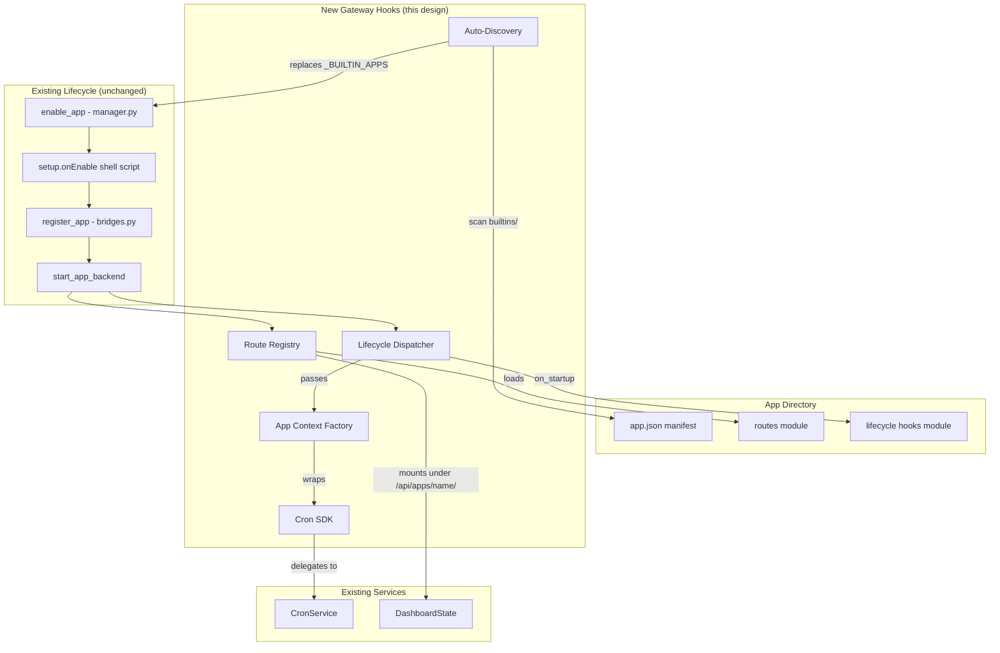

# Design Document: App SDK Gateway Hooks

## Overview

This design introduces a gateway-side hook system that allows KiroCrew apps to register HTTP routes, manage cron jobs, and participate in gateway lifecycle events through declarative manifest entries and Python entry points. The core principle is **convention over configuration**: apps declare capabilities in `app.json`, implement them in their own directory, and the gateway discovers and wires them up automatically.

**Integration with existing lifecycle**: This is NOT a replacement for the current app lifecycle (`install_app` → `enable_app` → `register_app` via bridges.py → `start_app_backend`). It extends that pipeline by adding new hook points within the existing flow:

- `enable_app()` already calls `register_app()` (bridges.py) for agents/skills/crons/MCP. The new Route Registry and Lifecycle Hooks are invoked **after** the existing bridge registration succeeds.
- `disable_app()` already calls `deregister_app()` and `stop_app_backend()`. The new system adds route deregistration and `on_shutdown` hook invocation **before** the existing teardown.
- The existing `setup.onEnable`/`setup.onDisable` shell scripts continue to run at their current position in the flow. Python lifecycle hooks run after shell scripts.

**Standalone app compatibility**: The system supports both `resources="gateway"` (KiroCrew-managed) and `resources="app"` (self-managed/standalone) apps:

- **Gateway-managed apps** (`resources="gateway"`): The Route Registry loads their route modules directly into the gateway process. The CronSDK wraps the gateway's CronService. This is the primary use case for builtin apps like Mimir.
- **Self-managed/standalone apps** (`resources="app"`): These apps run their own backend process (managed by `backend.py`). They can still declare `backend.hooks.routes` — the Route Registry will proxy requests to their backend port rather than loading Python modules directly. The CronSDK is still available via the App Context for programmatic cron management.
- **Migration path**: When a builtin app is migrated to standalone (via `migratedTo`), it transitions from in-process route loading to proxied routes. The manifest schema is the same — only the runtime behavior changes based on `resources` classification.

**Key difference from existing `backend.py`**: The existing backend management spawns a separate process and proxies all traffic to it via the reverse proxy (`/apps/{name}/api/*`). The new hooks system allows **in-process** route registration for gateway-managed apps (no separate process needed for simple API endpoints). This is more efficient for builtin apps that just need a few API routes without a full standalone server.

**Comparison of backend patterns**:

| Pattern | When to Use | How Routes Work |
|---------|-------------|-----------------|
| HTTP MCP Server (existing) | Agent tools + simple data | Separate process, reverse proxy |
| Dedicated Backend (existing) | Full REST API, WebSocket | Separate process, reverse proxy |
| **Gateway Hooks (this design)** | Builtin apps needing a few API routes | In-process, direct aiohttp routes |

The hooks system is specifically designed for the Mimir-like case: a builtin app that needs 2-3 API endpoints and cron management, but doesn't warrant a full separate process. Standalone/external apps continue using the existing reverse proxy pattern.

The design adds four new subsystems that plug into the existing lifecycle:

1. **Route Registry** — discovers and mounts app-provided aiohttp route handlers (called during enable, after bridge registration)
2. **App Context + Cron SDK** — provides scoped access to gateway services (replaces direct DashboardState access)
3. **Lifecycle Hook Dispatcher** — invokes app entry points at startup/shutdown/enable/disable (called after shell script hooks)
4. **Builtin Auto-Discovery** — replaces the hardcoded `_BUILTIN_APPS` list with filesystem scanning (called at gateway startup before `register_builtin_apps()`)

## Architecture



## Components and Interfaces

### 1. Manifest Extension (`backend.hooks`)

The `app.json` manifest gains a new `backend.hooks` section:

```json
{
  "backend": {
    "hooks": {
      "routes": "backend.routes:register_routes",
      "on_startup": "backend.hooks:on_startup",
      "on_shutdown": "backend.hooks:on_shutdown"
    }
  }
}
```

Each value is a Python dotted path in the format `module.path:callable_name`, resolved relative to the app's directory.

**Manifest Schema Version**: The manifest does not introduce a top-level `schemaVersion` field. Forward compatibility is handled by the existing `extra` dict in `AppManifest.from_dict()` — unknown fields are preserved on round-trip. If `backend.hooks` format changes in the future, a new field name (e.g. `backend.hooks_v2`) will be used rather than breaking the existing format.

### 2. Route Registry (`kiro_crew/apps/route_registry.py`)

**Implementation choice: Middleware-based soft routing**

aiohttp's `UrlDispatcher` does not support removing routes after registration. To support dynamic enable/disable, the Route Registry uses a **catch-all middleware + internal routing table** approach:

1. At gateway startup, a single catch-all route is registered: `/{app_name_pattern}/api/apps/{app_name}/{path:.*}`
2. The Route Registry maintains an internal `dict[str, dict[str, Callable]]` mapping `(app_name, method+path)` → handler
3. On enable: handlers are added to the internal table (O(1) enable)
4. On disable: handlers are removed from the internal table (O(1) disable, no aiohttp route mutation needed)
5. The catch-all middleware dispatches to the internal table, returning 404 if no match

This avoids the aiohttp limitation entirely and makes enable/disable instant without gateway restart.

```python
@dataclass
class AppRoute:
    method: str          # GET, POST, PUT, DELETE, PATCH
    path: str            # relative path (e.g. "/status")
    handler: Callable    # async def handler(request, ctx) -> Response

class RouteRegistry:
    def __init__(self, app: web.Application):
        self._app = app
        self._routes: dict[str, dict[str, Callable]] = {}  # app_name -> {method+path: handler}
        self._contexts: dict[str, AppContext] = {}  # app_name -> context

    async def register_app_routes(self, app_name: str, app_dir: Path, hook_path: str, ctx: AppContext) -> list[str]:
        """Load route module and add routes to internal table."""
        ...

    def deregister_app_routes(self, app_name: str) -> None:
        """Remove all routes for an app from internal table."""
        self._routes.pop(app_name, None)
        self._contexts.pop(app_name, None)

    async def dispatch(self, request: web.Request) -> web.Response:
        """Catch-all handler that dispatches to registered app routes.

        Supports both exact paths and path parameters:
        - Exact: "GET /status" matches only /api/apps/{name}/status
        - Parameterized: "GET /tasks/{task_id}/comments" matches /api/apps/{name}/tasks/123/comments

        Matching priority: exact match first, then pattern match (longest prefix wins).
        """
        app_name = request.match_info["app_name"]
        path = "/" + request.match_info.get("path", "")
        method = request.method
        app_routes = self._routes.get(app_name)
        if not app_routes:
            return web.json_response({"error": "not found"}, status=404)

        # Try exact match first
        key = f"{method} {path}"
        if key in app_routes:
            handler = app_routes[key]
            ctx = self._contexts[app_name]
            return await handler(request, ctx)

        # Try pattern match (path params like {task_id})
        for route_key, handler in app_routes.items():
            route_method, route_pattern = route_key.split(" ", 1)
            if route_method != method:
                continue
            match = _match_path_pattern(route_pattern, path)
            if match is not None:
                # Inject matched path params into request.match_info
                request.match_info.update(match)
                ctx = self._contexts[app_name]
                return await handler(request, ctx)

        return web.json_response({"error": "not found"}, status=404)
```

The route module must export a function matching this signature:

```python
def register_routes(ctx: AppContext) -> list[AppRoute]:
    """Return list of routes to mount for this app."""
    return [
        AppRoute("GET", "/status", handle_status),
        AppRoute("POST", "/setup", handle_setup),
    ]
```

**Route handler signature**: Handlers receive both the aiohttp `Request` and the `AppContext`:

```python
async def handle_status(request: web.Request, ctx: AppContext) -> web.Response:
    """App route handler with injected context."""
    jobs = ctx.cron.list_jobs()
    return web.json_response({"jobs": len(jobs)})
```

This avoids the need for `request.app["ctx_xxx"]` lookups or closure tricks — the context is explicitly passed by the dispatcher.

Routes are mounted at `/api/apps/{app_name}/{path}`. The registry enforces this prefix — apps cannot register routes outside their namespace.

**App enable status**: When route loading fails during enable, the app is marked as `enabled=True` with an additional `health_status="degraded"` field in `installed.json`. The dashboard displays this as a warning badge. The app's other resources (agents, skills, crons) remain functional — only the failed routes are unavailable.

### 3. Module Isolation (`kiro_crew/apps/module_loader.py`)

App modules are loaded in isolation to prevent namespace collisions and sys.path pollution:

```python
def load_app_module(app_name: str, app_dir: Path, module_path: str) -> ModuleType:
    """Load an app module using spec_from_file_location.

    Uses importlib.util.spec_from_file_location to load directly from
    the file path, avoiding sys.path manipulation entirely.

    Module is registered in sys.modules as `_kirocrew_app_{app_name}.{module_name}`
    to prevent collisions between apps that have identically-named modules
    (e.g. two apps both having `backend/routes.py`).
    """
    # Parse "backend.routes:register_routes" → file path + callable name
    dotted_path, callable_name = module_path.rsplit(":", 1)
    rel_path = dotted_path.replace(".", "/") + ".py"
    file_path = app_dir / rel_path

    if not file_path.is_file():
        raise ImportError(f"Module file not found: {file_path}")

    # Path containment check
    if not file_path.resolve().is_relative_to(app_dir.resolve()):
        raise ImportError(f"Module path escapes app directory: {file_path}")

    # Unique module name to avoid sys.modules collisions
    unique_name = f"_kirocrew_app_{app_name}.{dotted_path}"

    spec = importlib.util.spec_from_file_location(unique_name, file_path)
    module = importlib.util.module_from_spec(spec)
    sys.modules[unique_name] = module
    spec.loader.exec_module(module)

    return getattr(module, callable_name)


def unload_app_modules(app_name: str) -> None:
    """Remove all cached modules for an app from sys.modules.

    Called on app disable to ensure re-enable loads fresh code.
    """
    prefix = f"_kirocrew_app_{app_name}."
    to_remove = [k for k in sys.modules if k.startswith(prefix)]
    for k in to_remove:
        del sys.modules[k]
```

**Key isolation guarantees:**
- No `sys.path` modification — modules loaded by absolute file path
- Unique `sys.modules` keys — two apps with `backend.routes` don't collide
- Clean unload on disable — re-enable loads fresh code (no stale cache)
- Path containment — app modules cannot escape their directory

### 4. App Context (`kiro_crew/apps/context.py`)

```python
@dataclass
class AppContext:
    """Scoped context passed to app hooks and route handlers."""
    name: str
    data_dir: Path
    config: dict[str, Any]
    logger: logging.Logger
    cron: CronSDK | None         # None if permissions.cron is False
    events: EventBus | None      # None if permissions.events is empty
    storage: AppStorage | None   # None if permissions.storage is False
```

The context is created per-app at enable time and injected into route handlers and lifecycle hooks. It provides a controlled surface area — apps interact with gateway services only through this interface.

**Health status tracking**: AppContext creation records whether all subsystems initialized successfully. If route loading or hook invocation fails, the context's `health_status` is set to `"degraded"` and persisted to `installed.json`:

```python
@dataclass
class AppHealthStatus:
    status: str = "healthy"  # "healthy" | "degraded" | "error"
    issues: list[str] = field(default_factory=list)  # human-readable issue descriptions
    last_checked: str = ""  # ISO 8601
```

### 4a. EventBus (`kiro_crew/apps/event_bus.py`)

Thin wrapper over the existing gateway WebSocket broadcast mechanism. Apps publish events scoped to their declared `permissions.events` list.

```python
class EventBus:
    """App-scoped event publishing via the gateway's WebSocket broadcast."""

    def __init__(self, app_name: str, allowed_events: list[str], broadcast_fn: Callable):
        self._app_name = app_name
        self._allowed = set(allowed_events)
        self._broadcast = broadcast_fn  # state.broadcast() from DashboardState

    def publish(self, event_type: str, data: dict[str, Any] | None = None) -> None:
        """Broadcast an event to all connected WebSocket clients.

        Raises PermissionError if event_type is not in the app's declared events.
        The broadcast payload is: {"type": event_type, "app": app_name, "data": data}
        """
        if event_type not in self._allowed and "*" not in self._allowed:
            raise PermissionError(
                f"App {self._app_name!r} not permitted to publish event {event_type!r}. "
                f"Declared: {sorted(self._allowed)}"
            )
        self._broadcast({
            "type": event_type,
            "app": self._app_name,
            "data": data or {},
        })

    def publish_to_app(self, event_type: str, data: dict[str, Any] | None = None) -> None:
        """Publish event scoped to this app's subscribers.

        v1 behavior: equivalent to publish() (full broadcast). The gateway's
        existing WS handler does not support per-app filtering. The _scope field
        is included in the payload as a forward-compatible marker — when WS
        subscription filtering is added (future), clients already receiving
        _scope="app" payloads will automatically benefit without API changes.

        Future: gateway WS handler will filter recipients to only those with
        the app's page open (based on client subscription state).
        """
        if event_type not in self._allowed and "*" not in self._allowed:
            raise PermissionError(
                f"App {self._app_name!r} not permitted to publish event {event_type!r}"
            )
        self._broadcast({
            "type": event_type,
            "app": self._app_name,
            "data": data or {},
            "_scope": "app",  # forward-compatible marker for future filtering
        })
```

**Integration**: The `broadcast_fn` is `DashboardState.broadcast()` — the same function used by existing features (notifications, slot updates, etc.). No new WebSocket infrastructure needed.

### 4b. AppStorage (`kiro_crew/apps/app_storage.py`)

Simple key-value store backed by the app's `data_dir`. Provides a typed interface over file I/O with atomic writes and optional JSON serialization.

```python
class AppStorage:
    """App-scoped persistent key-value storage.

    Backed by files in the app's data directory:
    ~/.kirocrew/apps/{app_name}/data/kv/{key}.json

    Keys are validated to prevent path traversal.
    Values are JSON-serializable dicts or strings.
    """

    def __init__(self, app_name: str, data_dir: Path):
        self._app_name = app_name
        self._kv_dir = data_dir / "kv"
        self._kv_dir.mkdir(parents=True, exist_ok=True)

    def get(self, key: str) -> dict[str, Any] | str | None:
        """Read a value by key. Returns None if not found."""
        path = self._key_path(key)
        if not path.is_file():
            return None
        try:
            content = path.read_text(encoding="utf-8")
            return json.loads(content)
        except json.JSONDecodeError:
            return content  # raw string fallback

    def set(self, key: str, value: dict[str, Any] | str) -> None:
        """Write a value. Atomic write (tmp + rename)."""
        path = self._key_path(key)
        content = json.dumps(value, indent=2) if isinstance(value, dict) else value
        atomic_write(path, content)

    def delete(self, key: str) -> bool:
        """Delete a key. Returns True if existed."""
        path = self._key_path(key)
        if path.is_file():
            path.unlink()
            return True
        return False

    def list_keys(self) -> list[str]:
        """List all stored keys."""
        if not self._kv_dir.is_dir():
            return []
        return [p.stem for p in self._kv_dir.iterdir() if p.suffix == ".json"]

    def _key_path(self, key: str) -> Path:
        """Validate key and return file path."""
        if not key or ".." in key or "/" in key or "\\" in key:
            raise ValueError(f"Invalid storage key: {key!r}")
        return self._kv_dir / f"{key}.json"
```

**Design choices:**
- File-per-key (not a single JSON blob) — avoids contention, supports large values
- Atomic writes via `atomic_write` — no corruption on crash
- Key validation rejects path traversal — same pattern as `_check_path_safety`
- JSON serialization for structured data, raw string fallback for simple values
- No quota enforcement in v1 (future: add `max_keys` and `max_bytes` to permissions)

### 5. Cron SDK (`kiro_crew/apps/cron_sdk.py`)

```python
class CronSDK:
    """App-scoped cron job management. Wraps CronService with ownership enforcement.

    Concurrency safety:
    - CronService uses atomic_write (write-to-tmp + os.replace) for persistence
    - Within a single event loop, Python's GIL serializes in-memory mutations
    - Cross-process safety is handled by CronService's existing fcntl.flock
    - If a cron job is executing when remove_all() is called (e.g. on disable),
      the running job completes its current iteration but won't be scheduled again
    - For v1 this is sufficient; an asyncio.Lock can be added later if needed
    """

    def __init__(self, app_name: str, cron_service: CronService):
        self._app_name = app_name
        self._cron = cron_service
        self._owner_prefix = f"app:{app_name}"

    def add_job(
        self,
        name: str,
        message: str,
        *,
        every_secs: int | None = None,
        cron_expr: str | None = None,
        agent: str = "",
        agent_sequence: list[str] | None = None,
        env: dict[str, str] | None = None,
        persistent_session: bool = True,
        silent: bool = False,
    ) -> CronJob:
        """Create a cron job owned by this app."""
        job = self._cron.add_job(
            name=name,
            message=message,
            every_secs=every_secs,
            cron_expr=cron_expr,
            created_by=self._owner_prefix,
        )
        # Set extended fields
        if agent:
            job.agent_id = agent
        if agent_sequence:
            job.agent_sequence = agent_sequence
        if env:
            job.env = env
        job.persistent_session = persistent_session
        job.silent = silent
        self._cron._save()
        return job

    def list_jobs(self) -> list[CronJob]:
        """List only jobs owned by this app."""
        return [j for j in self._cron.list_jobs(include_disabled=True)
                if j.created_by == self._owner_prefix]

    def remove_job(self, job_id: str) -> bool:
        """Remove a job only if owned by this app."""
        job = self._find_owned_job(job_id)
        if not job:
            raise PermissionError(f"Job {job_id} not owned by app {self._app_name}")
        return self._cron.remove_job(job_id)

    def update_job(self, job_id: str, **kwargs: Any) -> CronJob | None:
        """Update a job only if owned by this app."""
        job = self._find_owned_job(job_id)
        if not job:
            raise PermissionError(f"Job {job_id} not owned by app {self._app_name}")
        return self._cron.update_job(job_id, **kwargs)

    def remove_all(self) -> int:
        """Remove all jobs owned by this app. Called on disable/uninstall."""
        count = 0
        for job in self.list_jobs():
            self._cron.remove_job(job.id)
            count += 1
        return count

    def _find_owned_job(self, job_id: str) -> CronJob | None:
        for job in self._cron.list_jobs(include_disabled=True):
            if job.id == job_id and job.created_by == self._owner_prefix:
                return job
        return None
```

### 6. Lifecycle Hook Dispatcher (`kiro_crew/apps/lifecycle.py`)

```python
class LifecycleDispatcher:
    """Invokes app lifecycle hooks in deterministic order."""

    async def dispatch_startup(self, enabled_apps: list[InstalledApp]) -> None:
        """Call on_startup hooks for all enabled apps with hooks declared."""
        for app_info in sorted(enabled_apps, key=lambda a: a.name):
            hook_path = self._get_hook(app_info, "on_startup")
            if hook_path:
                ctx = self._build_context(app_info)
                await self._invoke(app_info.name, hook_path, ctx)

    async def dispatch_shutdown(self, enabled_apps: list[InstalledApp]) -> None:
        """Call on_shutdown hooks for all enabled apps (reverse order)."""
        for app_info in sorted(enabled_apps, key=lambda a: a.name, reverse=True):
            hook_path = self._get_hook(app_info, "on_shutdown")
            if hook_path:
                ctx = self._build_context(app_info)
                await self._invoke(app_info.name, hook_path, ctx)

    async def _invoke(self, app_name: str, hook_path: str, ctx: AppContext) -> None:
        """Import and call a hook via module_loader (same isolation as routes)."""
        try:
            from kiro_crew.apps.module_loader import load_app_module
            app_root = app_dir(app_name)
            func = load_app_module(app_name, app_root, hook_path)
            result = func(ctx)
            if asyncio.iscoroutine(result):
                await result
        except Exception:
            logger.exception("Lifecycle hook %s failed for app %s", hook_path, app_name)
```

### 7. Builtin Auto-Discovery (`kiro_crew/apps/discovery.py`)

```python
def discover_builtin_apps(builtins_dir: Path) -> list[dict[str, Any]]:
    """Scan builtins/ directory for app.json manifests.

    Returns list of app metadata dicts compatible with the existing
    register_builtin_apps() function signature.
    """
    apps: list[dict[str, Any]] = []
    if not builtins_dir.is_dir():
        return apps

    for entry in sorted(builtins_dir.iterdir()):
        if not entry.is_dir():
            continue
        manifest_path = entry / "app.json"
        if not manifest_path.exists():
            continue
        try:
            manifest = AppManifest.from_json_file(manifest_path)
            errors = manifest.validate()
            if errors:
                logger.warning("Skipping builtin %s: %s", entry.name, errors)
                continue
            apps.append(_manifest_to_builtin_dict(manifest, entry))
        except Exception:
            logger.warning("Failed to load builtin manifest: %s", manifest_path, exc_info=True)

    return apps
```

### 8. Extended CronEntry Schema

The manifest `CronEntry` dataclass is extended:

```python
@dataclass
class CronEntry:
    name: str = ""
    every: int = 0
    cron_expr: str = ""
    agent: str = ""
    message: str = ""
    # New fields:
    agent_sequence: list[str] = field(default_factory=list)
    env: dict[str, str] = field(default_factory=dict)
    persistent_session: bool = True
    silent: bool = False
```

## Data Models

### Hook Path Format

Hook paths follow the pattern `module.path:callable_name`:
- `module.path` is a dotted Python module path resolved to a file path relative to the app directory (e.g. `backend.routes` → `backend/routes.py`)
- `callable_name` is the function/class to invoke
- Modules are loaded via `importlib.util.spec_from_file_location` (no sys.path modification)
- Registered in `sys.modules` as `_kirocrew_app_{app_name}.{module_path}` to prevent collisions

### Route Registration Return Type

```python
@dataclass
class AppRoute:
    method: str   # HTTP method (uppercase)
    path: str     # relative path starting with /
    handler: Callable[[web.Request, AppContext], Awaitable[web.Response]]
```

### Ownership Tag Format

Cron jobs created via the SDK are tagged with `created_by = "app:{app_name}"`. This enables:
- Filtering jobs by owner
- Permission enforcement on mutations
- Bulk cleanup on app disable/uninstall

### App Context Permissions Mapping

| Permission Field | Context Attribute | Service | v1 Status |
|---|---|---|---|
| `permissions.cron: true` | `ctx.cron` | CronSDK | ✅ Implemented |
| `permissions.storage: true` | `ctx.storage` | AppStorage | ✅ Implemented |
| `permissions.events` (non-empty) | `ctx.events` | EventBus | ✅ Implemented |


## Correctness Properties

*A property is a characteristic or behavior that should hold true across all valid executions of a system — essentially, a formal statement about what the system should do. Properties serve as the bridge between human-readable specifications and machine-verifiable correctness guarantees.*

### Property 1: Route prefix enforcement

*For any* app name and any set of route paths returned by a route registration function, all mounted absolute paths SHALL begin with `/api/apps/{app_name}/`, ensuring no app can register routes outside its namespace and no two distinct apps can produce colliding paths.

**Validates: Requirements 1.2, 1.5**

### Property 2: Route deregistration completeness

*For any* app that has registered N routes, after deregistration, the Route_Registry SHALL contain zero routes for that app name.

**Validates: Requirements 1.3**

### Property 3: Cron job creation preserves ownership and fields

*For any* app name and any valid job configuration (including agent_sequence, env, persistent_session, silent), creating a job via CronSDK SHALL produce a job where `created_by == "app:{app_name}"` and all provided fields match the input values.

**Validates: Requirements 2.1, 2.7**

### Property 4: Cron ownership enforcement on mutations

*For any* cron job with `created_by == "app:A"`, calling `remove_job` or `update_job` from CronSDK scoped to app B (where B ≠ A) SHALL raise a PermissionError, and the job SHALL remain unchanged.

**Validates: Requirements 2.2, 2.4, 2.5**

### Property 5: Cron list filtering by owner

*For any* set of cron jobs with mixed `created_by` values, calling `list_jobs()` on a CronSDK scoped to app A SHALL return exactly the subset where `created_by == "app:A"`.

**Validates: Requirements 2.3**

### Property 6: Cron remove_all completeness

*For any* app with N > 0 owned cron jobs, calling `remove_all()` SHALL result in `list_jobs()` returning an empty list for that app.

**Validates: Requirements 2.6**

### Property 7: Builtin discovery finds all valid manifests

*For any* directory structure where K subdirectories contain valid `app.json` files and M subdirectories do not, the discovery function SHALL return exactly K app entries.

**Validates: Requirements 3.1**

### Property 8: Discovered builtins have correct classification

*For any* app discovered via builtin auto-discovery, the resulting registration SHALL have `origin == "builtin"` and `lifecycle == "locked"`.

**Validates: Requirements 3.2**

### Property 9: Lifecycle hook invocation order is deterministic

*For any* set of app names with declared startup hooks, the invocation order SHALL be lexicographically sorted by app name.

**Validates: Requirements 4.5**

### Property 10: App context permission mapping

*For any* app permissions configuration, the App_Context SHALL have: `cron` set to a CronSDK instance if and only if `permissions.cron == True`; `events` set to an EventBus instance if and only if `permissions.events` is non-empty; `storage` set to an AppStorage instance if and only if `permissions.storage == True`. All other cases SHALL be `None`.

**Validates: Requirements 5.1, 5.2, 5.3**

### Property 11: App context base fields always present

*For any* app, the App_Context SHALL always have non-empty `name`, a valid `data_dir` path, and a `logger` whose name contains the app name.

**Validates: Requirements 5.4, 5.5**

### Property 12: Hook path validation

*For any* string in `backend.hooks.routes`, `backend.hooks.on_startup`, or `backend.hooks.on_shutdown`, manifest validation SHALL accept strings matching the pattern `module.path:callable_name` (dotted identifiers separated by a colon) and reject all other formats.

**Validates: Requirements 6.2, 6.3**

### Property 13: Manifest round-trip with hooks and extended crons

*For any* valid AppManifest containing `backend.hooks` declarations and extended cron entries (with agent_sequence, env, persistent_session, silent), serializing via `to_dict()` then deserializing via `from_dict()` SHALL produce an equivalent manifest.

**Validates: Requirements 6.4, 6.5**

### Property 14: Shell-before-Python hook ordering

*For any* app declaring both `setup.onEnable` (shell) and `backend.hooks.on_startup` (Python), the shell script SHALL complete execution before the Python hook is invoked.

**Validates: Requirements 7.4**

### Property 15: Module isolation prevents namespace collisions

*For any* two distinct app names A and B, both declaring a route module at the same relative path (e.g. `backend.routes:register_routes`), loading both modules SHALL succeed and produce distinct module objects registered under different `sys.modules` keys.

**Validates: Requirements 1.4 (error resilience), Module Isolation design**

### Property 16: Module unload cleans sys.modules

*For any* app that has been loaded (routes registered), calling `unload_app_modules(app_name)` SHALL remove all entries from `sys.modules` whose key starts with `_kirocrew_app_{app_name}.`.

**Validates: Requirements 1.3 (deregistration completeness)**

### Property 17: EventBus permission enforcement

*For any* app with a declared events list E, publishing an event with type T SHALL succeed if T ∈ E or "*" ∈ E, and SHALL raise PermissionError otherwise. The broadcast payload SHALL always include the app name.

**Validates: Requirements 5.2 (events permission scoping)**

### Property 18: AppStorage key isolation

*For any* valid key K and value V, calling `storage.set(K, V)` then `storage.get(K)` SHALL return a value equivalent to V. Calling `storage.delete(K)` then `storage.get(K)` SHALL return None.

**Validates: Requirements 5.1 (storage permission scoping)**

### Property 19: AppStorage key validation rejects traversal

*For any* key containing `..`, `/`, or `\`, calling any AppStorage method SHALL raise ValueError.

**Validates: Security (path traversal prevention)**

## Error Handling

| Scenario | Behavior | Dashboard UX |
|---|---|---|
| Route module import fails (syntax error, missing module) | Log error with traceback, mark app `health_status="degraded"`, skip routes, gateway continues | Warning badge on app card: "Routes failed to load" |
| Route registration function raises exception | Log error, mark `health_status="degraded"`, skip routes, gateway continues | Same as above |
| Route handler returns invalid type | aiohttp handles with 500; app-scoped — doesn't affect other apps | N/A (runtime error, visible in app logs) |
| Lifecycle hook raises exception | Log error, mark `health_status="degraded"`, continue startup/shutdown for remaining apps | Warning badge: "Startup hook failed" |
| CronSDK permission violation | Raise `PermissionError` — caller (route handler) converts to 403 response | N/A (API error response) |
| Invalid hook path format in manifest | Manifest validation returns error; app cannot be enabled | Enable button shows error toast with validation message |
| Builtin directory with corrupt app.json | Log warning, skip directory, continue scanning | App doesn't appear in list (invisible failure) |
| Module path escapes app directory | `ImportError` raised, route loading aborted, `health_status="error"` | Error badge: "Security violation in module path" |

**Health status lifecycle:**
- `"healthy"` — all hooks loaded, all routes mounted, all crons registered
- `"degraded"` — app is functional but some subsystems failed (routes missing, hook failed)
- `"error"` — critical failure (security violation, manifest corruption)

The `GET /api/apps` response includes `health_status` for each app, enabling the dashboard to show appropriate indicators without polling separate endpoints.

## Known Limitations and Future Directions

### 1. Storage quota enforcement

`AppStorage` in v1 has no size limits. Future: add `max_keys` and `max_total_bytes` to `permissions.storage` for quota enforcement.

### 2. EventBus `publish_to_app` scoping

In v1, `publish_to_app()` broadcasts to all connected WS clients (same as `publish()`). The `_scope: "app"` field is included as a forward-compatible marker. Future: add client-side subscription state tracking to the WS handler so only clients viewing the app's page receive scoped events.

### 3. App dependency ordering

v1 uses lexicographic ordering for startup hooks. If app A depends on app B's routes being available, this may not be sufficient. Future: add optional `depends_on: list[str]` to manifest for topological sort.

### 4. Hot reload for development

Developers must restart the gateway to pick up route handler changes. The `unload_app_modules()` function enables clean re-enable, but there's no file watcher. Future: add `--dev` flag to gateway that watches builtin app directories and auto-reloads on change.

### 5. Route middleware injection

Each app handles its own auth/rate-limiting/CORS in route handlers. Future: add optional `backend.hooks.middleware` list for per-app middleware that wraps all routes.

### 6. Metrics and observability

App route latency/error rates are not automatically tracked. The existing SEL audit system logs API access, but per-route metrics require explicit instrumentation. Future: the Route Registry dispatcher could inject timing middleware automatically.

### 7. Manifest schema evolution

No explicit `schemaVersion` field is added. Forward compatibility relies on:
- `AppManifest.extra` dict preserving unknown fields on round-trip
- New features using new field names (not modifying existing ones)
- The `minKiroCrewVersion` field gating features that require newer gateway versions

If a breaking change is ever needed, a new top-level field (e.g. `backend_v2`) will be introduced alongside the old one, with a deprecation period.

## Testing Strategy

### Property-Based Testing

Use `hypothesis` (Python property-based testing library) for all correctness properties. Each property test runs minimum 100 iterations.

**Library**: `hypothesis` with `pytest-hypothesis` integration

**Configuration**:
```python
from hypothesis import given, settings, strategies as st

@settings(max_examples=100)
```

**Tag format**: Each test is annotated with:
```python
# Feature: app-sdk-gateway-hooks, Property N: <property text>
```

### Unit Testing

Unit tests complement property tests for:
- Specific integration examples (Mimir migration produces identical behavior)
- Edge cases (empty directories, malformed manifests, exception-raising hooks)
- Backward compatibility (manifests without hooks work unchanged)
- Lifecycle ordering (shell scripts before Python hooks with mocked subprocess)

### Test Organization

```
test/
├── test_route_registry.py      # Properties 1, 2 + edge cases
├── test_cron_sdk.py            # Properties 3, 4, 5, 6
├── test_event_bus.py           # Property 17
├── test_app_storage.py         # Properties 18, 19
├── test_builtin_discovery.py   # Properties 7, 8
├── test_lifecycle_hooks.py     # Properties 9, 14
├── test_app_context.py         # Properties 10, 11
├── test_manifest_hooks.py      # Properties 12, 13
├── test_module_loader.py       # Properties 15, 16
├── test_backward_compat.py     # Integration examples for Req 7
└── test_integration_smoke.py   # End-to-end: gateway start → enable app → hit route → verify
```

### Integration / Smoke Tests

In addition to property and unit tests, one end-to-end smoke test validates the full flow:

1. Start a test gateway (using `aiohttp.test_utils.TestServer`)
2. Register a mock builtin app with `backend.hooks.routes` and a cron permission
3. Enable the app via `POST /api/apps/{name}/enable`
4. Hit the app's registered route and verify 200 response
5. Verify cron job was created via `GET /api/cron`
6. Disable the app and verify route returns 404 and cron job is removed

This test catches integration issues that property tests (which test components in isolation) would miss.
