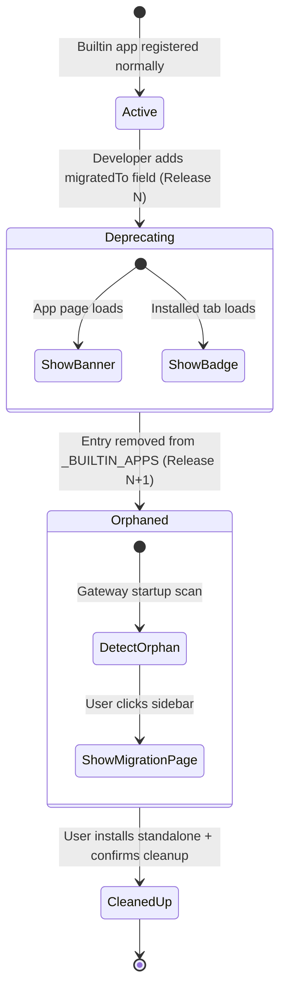

# Design Document: Builtin App Migration

## Overview

This feature implements a graceful two-phase migration mechanism for KiroCrew builtin apps being extracted to standalone packages. The design ensures users never experience a sudden loss of functionality — they receive advance warnings (Phase 1) and helpful guidance (Phase 2) throughout the transition.

The system leverages the existing `InstalledApp` metadata, `_BUILTIN_APPS` registration, and the dynamic app navigation system in the frontend to provide a seamless migration experience.

## Architecture



### Phase Flow

| Phase | Release | `_BUILTIN_APPS` entry | `installed.json` | Frontend Route | User Experience |
|-------|---------|----------------------|------------------|----------------|-----------------|
| Active | N-1 | Present, no `migratedTo` | `origin=builtin` | Hardcoded route | Normal usage |
| Deprecating | N | Present, `migratedTo` set | `origin=builtin`, `migratedTo` persisted | Hardcoded route + banner | Warning banner on app page |
| Orphaned | N+1 | Removed | `origin=builtin`, `orphaned=true` | Catch-all MigrationPage | Migration guidance page |
| Cleaned Up | N+1+ | Removed | Removed (data/ preserved) | None | Standalone app active |

## Components and Interfaces

### Backend Components

#### 1. InstalledApp Dataclass Extension

Add `migratedTo` field to the existing `InstalledApp` dataclass in `manager.py`:

```python
@dataclass
class InstalledApp:
    # ... existing fields ...
    migratedTo: str = ""  # e.g. "registry:app-name" or "standalone:app-name"
```

#### 2. Orphan Detection — Cached at Startup

Orphan detection scans the filesystem, which is O(n) over the apps directory. To avoid per-request disk scans, we compute the orphan set **once at gateway startup** (after `register_builtin_apps()`) and cache it in memory. The cache is invalidated via the `mc:apps-changed` event (which fires on install/uninstall/enable/disable).

```python
# Module-level cache
_orphaned_builtins_cache: set[str] | None = None

def detect_orphaned_builtins(*, force_refresh: bool = False) -> set[str]:
    """Return set of orphaned builtin app names.

    Scans apps_dir for builtin apps not in _BUILTIN_APPS list.
    Result is cached after first call; pass force_refresh=True to re-scan
    (called on mc:apps-changed events).
    """
    global _orphaned_builtins_cache
    if _orphaned_builtins_cache is not None and not force_refresh:
        return _orphaned_builtins_cache

    builtin_names = {app["name"] for app in _BUILTIN_APPS}
    orphaned: set[str] = set()
    root = apps_dir()
    if not root.is_dir():
        _orphaned_builtins_cache = orphaned
        return orphaned
    for entry in root.iterdir():
        if not entry.is_dir():
            continue
        meta = _read_installed(entry.name)
        if meta and meta.origin == "builtin" and entry.name not in builtin_names:
            orphaned.add(entry.name)
    _orphaned_builtins_cache = orphaned
    return orphaned

def invalidate_orphan_cache() -> None:
    """Called when apps change (install/uninstall/cleanup)."""
    global _orphaned_builtins_cache
    _orphaned_builtins_cache = None
```

The `list_apps()` function reads from this cache (no disk scan per call). The cache is refreshed at startup and on `mc:apps-changed`.

#### 3. Cleanup Endpoint

New API endpoint `DELETE /api/apps/{name}/migrate-cleanup`:

```python
async def handle_migrate_cleanup(request: web.Request) -> web.Response:
    """Remove orphaned builtin metadata after standalone is installed.

    Validates:
    1. Target app is an orphaned builtin
    2. The standalone replacement is installed

    Preserves data/ directory.
    """
```

#### 4. list_apps() Enhancement

The existing `list_apps()` function already returns all apps from disk. We enhance the response to include:
- `migratedTo` field from installed.json
- `orphaned: true` for detected orphaned builtins

### Frontend Components

#### 1. MigrationBanner Component

A persistent warning banner displayed on app pages during Phase 1:

```tsx
interface MigrationBannerProps {
  appName: string
  migratedTo: string  // "registry:app-name"
}

function MigrationBanner({ appName, migratedTo }: MigrationBannerProps) {
  // Renders amber warning banner with install button
}
```

#### 2. MigrationPage Component

A full-page fallback for Phase 2 orphaned apps:

```tsx
interface MigrationPageProps {
  appName: string
  migratedTo: string
  dataPreserved: boolean
  standaloneInstalled: boolean
}

function MigrationPage({ appName, migratedTo, dataPreserved, standaloneInstalled }: MigrationPageProps) {
  // Renders migration guidance with install/cleanup actions
}
```

#### 3. Dynamic Route Handling

The frontend already uses dynamic app navigation (`appNavItems` in `App.tsx`). For orphaned builtins:
- The sidebar entry comes from `list_apps()` API (installed.json still exists)
- The orphaned app's `app.json` manifest is still on disk, so `ui.pages[].route` is available in the API response
- BUT the React route for that path no longer exists in the code

The approach: in the `appNavItems` construction logic, when an app has `orphaned: true`, **override its route** to `/apps/migrate/{name}` regardless of what `manifest.ui.pages[].route` says. This is a frontend-only override — the API still returns the original route in the manifest.

```tsx
// In App.tsx appNavItems construction:
const navRoute = app.orphaned
  ? `/apps/migrate/${app.name}`   // Override: route to migration page
  : app.manifest?.ui?.pages?.[0]?.route  // Normal: use manifest route

// Add the migration page route
<Route path="/apps/migrate/:name" element={<MigrationPage />} />
```

This ensures:
- Sidebar shows the app with its original label and icon (from manifest)
- Clicking it navigates to the migration page (not a 404)
- No changes needed to the API response format

### API Interface

#### GET /api/apps (enhanced response)

```json
{
  "name": "agent-worlds",
  "version": "1.0.0",
  "displayName": "Agent Worlds",
  "enabled": true,
  "origin": "builtin",
  "lifecycle": "locked",
  "migratedTo": "registry:agent-worlds",
  "orphaned": false,
  "manifest": { ... }
}
```

For orphaned apps:
```json
{
  "name": "agent-worlds",
  "version": "1.0.0",
  "displayName": "Agent Worlds",
  "enabled": true,
  "origin": "builtin",
  "lifecycle": "locked",
  "migratedTo": "registry:agent-worlds",
  "orphaned": true,
  "manifest": { ... }
}
```

#### DELETE /api/apps/{name}/migrate-cleanup

Request: No body required.

Response (success):
```json
{
  "ok": true,
  "name": "agent-worlds",
  "message": "cleaned up orphaned builtin entry, data preserved"
}
```

Response (error — standalone not installed):
```json
{
  "ok": false,
  "error": "standalone replacement 'agent-worlds' is not installed"
}
```

## Data Models

### InstalledApp Extension

```python
@dataclass
class InstalledApp:
    name: str = ""
    version: str = ""
    displayName: str = ""
    enabled: bool = True
    installedAt: str = ""
    updatedAt: str = ""
    source: str = ""
    origin: str = "registry"
    resources: str = "gateway"
    lifecycle: str = "gateway"
    schemaVersion: int = 2
    migratedTo: str = ""  # NEW: target standalone app identifier
```

### Data Directory Sharing (Critical Design Decision)

**Problem**: If the standalone app has a different name than the builtin (e.g. builtin `agent-worlds` → standalone `agent-worlds-standalone`), their data directories differ (`~/.kirocrew/apps/agent-worlds/data/` vs `~/.kirocrew/apps/agent-worlds-standalone/data/`).

**Solution**: Enforce that the standalone app uses the **same name** as the builtin it replaces. The `migratedTo` field format is `"registry:{same-name}"` — the name after the colon MUST match the builtin's name.

This means:
- Builtin `agent-worlds` → standalone `agent-worlds` (same name, same data path)
- The standalone app installs to `~/.kirocrew/apps/agent-worlds/` — the same directory
- During cleanup, we only remove `installed.json` and `app.json`; the standalone installer writes its own
- The `data/` directory is shared by identity (same path), no symlinks needed

**Validation**: `_validate_builtin_app()` will reject (block registration of) any builtin entry where `migratedTo` references a different name than the builtin itself. This is enforced, not just warned, because different names silently break data directory sharing.

**Why not symlinks?** Symlinks add complexity (cross-platform issues, cleanup ordering, dangling links). Same-name is simpler and covers all practical cases — there's no reason a standalone version needs a different identifier.

### _BUILTIN_APPS Definition Extension

```python
{
    "name": "agent-worlds",
    "version": "1.0.0",
    "displayName": "Agent Worlds",
    "description": "...",
    "author": "kirocrew",
    "tags": ["visualization"],
    "migratedTo": "registry:agent-worlds",  # Same name — standalone replaces builtin in-place
    "ui": { ... },
}
```

### Frontend App Type Extension

```typescript
interface AppInfo {
  name: string
  version: string
  displayName: string
  enabled: boolean
  origin: string
  lifecycle: string
  migratedTo?: string   // NEW
  orphaned?: boolean    // NEW
  manifest: AppManifest
}
```


## Correctness Properties

*A property is a characteristic or behavior that should hold true across all valid executions of a system — essentially, a formal statement about what the system should do. Properties serve as the bridge between human-readable specifications and machine-verifiable correctness guarantees.*

### Property 1: migratedTo Field Validation

*For any* builtin app definition with a `migratedTo` field, the validation function SHALL accept it if and only if the value matches the format `"registry:{name}"` or `"standalone:{name}"` where `{name}` is a valid kebab-case app identifier.

**Validates: Requirements 1.1**

### Property 2: migratedTo Persistence Round-Trip

*For any* builtin app definition with a `migratedTo` field, after `register_builtin_apps()` executes, reading the corresponding `installed.json` SHALL return an `InstalledApp` with the same `migratedTo` value as the definition.

**Validates: Requirements 1.2, 1.3**

### Property 3: Registration Preserves Functionality

*For any* builtin app definition with `migratedTo` set, after registration the app's `enabled` state, `origin`, `lifecycle`, and all other existing fields SHALL remain identical to what they would be without `migratedTo` set.

**Validates: Requirements 1.4**

### Property 4: Orphan Detection Correctness

*For any* set of apps on disk with `origin=builtin` and any `_BUILTIN_APPS` list, `detect_orphaned_builtins()` SHALL return exactly those app names that exist on disk with `origin=builtin` but are NOT present in the `_BUILTIN_APPS` list.

**Validates: Requirements 3.2**

### Property 5: Orphaned Apps in API Response

*For any* orphaned builtin app, the `list_apps()` response SHALL include `orphaned: true` and the `migratedTo` field (if it was persisted in installed.json).

**Validates: Requirements 3.3, 8.2**

### Property 6: Data Directory Invariant

*For any* sequence of migration operations (registration, orphan detection, listing, cleanup), the contents of `~/.kirocrew/apps/{name}/data/` SHALL remain byte-for-byte identical before and after the operation.

**Validates: Requirements 3.4, 7.1**

### Property 7: Migration Banner Content

*For any* app name and valid `migratedTo` value, the rendered MigrationBanner component SHALL contain the app name string, the migration target identifier, and an install action element.

**Validates: Requirements 2.2**

### Property 8: Migration Page Content

*For any* orphaned app name and valid `migratedTo` value, the rendered MigrationPage component SHALL contain the app name, a migration explanation text, and an install button element.

**Validates: Requirements 4.2**

### Property 9: Sidebar Visibility for Enabled Orphaned Apps

*For any* orphaned builtin app with `enabled=true` in its `installed.json`, the app navigation items list SHALL include an entry for that app.

**Validates: Requirements 5.1**

### Property 10: Sidebar Removal on Disable

*For any* orphaned builtin app, after calling `disable_app(name)`, the app navigation items list SHALL NOT include an entry for that app.

**Validates: Requirements 5.3**

### Property 11: Cleanup Removes Metadata Only

*For any* valid orphaned builtin app where the standalone replacement is installed, calling the cleanup function SHALL result in `installed.json` and `app.json` being removed, while `data/` directory remains intact.

**Validates: Requirements 6.1, 6.2, 7.3**

### Property 12: Cleanup Failure Atomicity

*For any* cleanup operation that encounters an I/O error, the state of all files (`installed.json`, `app.json`, `data/`) SHALL remain identical to their state before the cleanup attempt.

**Validates: Requirements 6.4**

### Property 13: Cleanup Validation

*For any* app that is NOT an orphaned builtin, or for any orphaned builtin whose standalone replacement is NOT installed, the cleanup endpoint SHALL reject the request and not modify any files.

**Validates: Requirements 8.4**

### Property 14: migratedTo in API Response

*For any* app (orphaned or not) that has a non-empty `migratedTo` value in its `installed.json`, the `list_apps()` response for that app SHALL include the `migratedTo` field with the same value.

**Validates: Requirements 8.1**

## Error Handling

| Scenario | Behavior |
|----------|----------|
| Invalid `migratedTo` format in `_BUILTIN_APPS` | Log warning, skip the `migratedTo` field (app still registers normally) |
| Orphaned app with corrupted `installed.json` | Skip the entry, log warning, do not crash gateway startup |
| Cleanup called on non-orphaned app | Return 400 with descriptive error message |
| Cleanup called when standalone not installed | Return 409 with message indicating standalone must be installed first |
| I/O error during cleanup (e.g. permission denied) | Return 500, preserve all files unchanged |
| `data/` directory missing for orphaned app | Migration page still renders, notes that no data was found |
| Standalone app name in `migratedTo` doesn't exist in registry | Migration page shows "Coming soon — this app is not yet available in the App Store. Check back after the next update." with a Refresh button. Do NOT show a broken Install button. |
| Phase 2 reached but standalone not published yet | This is a developer error. The migration page gracefully handles it (see above). Platform developers MUST publish the standalone app to the registry BEFORE removing the builtin entry from `_BUILTIN_APPS`. |

## Testing Strategy

### Unit Tests

- `test_validate_builtin_app()` — validates migratedTo format acceptance/rejection
- `test_register_builtin_apps_with_migrated_to()` — verifies persistence
- `test_detect_orphaned_builtins()` — various disk/list combinations
- `test_cleanup_migrated_builtin()` — success and failure paths
- `test_cleanup_rejects_non_orphan()` — validation guard
- `test_list_apps_includes_orphaned_field()` — API response format
- Frontend: `MigrationBanner.test.tsx` — renders correct content
- Frontend: `MigrationPage.test.tsx` — renders correct content and handles states

### Property-Based Tests

Library: **pytest + Hypothesis** (backend), **fast-check** (frontend)

Configuration: Minimum 100 iterations per property test.

Each property test references its design document property with a comment tag:
```python
# Feature: builtin-app-migration, Property N: {property_text}
```

Key property tests:
1. **Property 4** (Orphan Detection): Generate random sets of apps on disk and in list, verify detection is the set difference.
2. **Property 6** (Data Invariant): Generate random data directory contents, run operations, verify byte-for-byte preservation.
3. **Property 11** (Cleanup Removes Metadata Only): Generate random app states, run cleanup, verify only metadata removed.
4. **Property 13** (Cleanup Validation): Generate random app states (some orphaned, some not), verify cleanup is correctly gated.

### Integration Tests

- End-to-end Phase 1 flow: register app with migratedTo → verify API response → verify banner renders
- End-to-end Phase 2 flow: set up orphaned app → verify sidebar shows entry → verify migration page renders → install standalone → verify cleanup works
