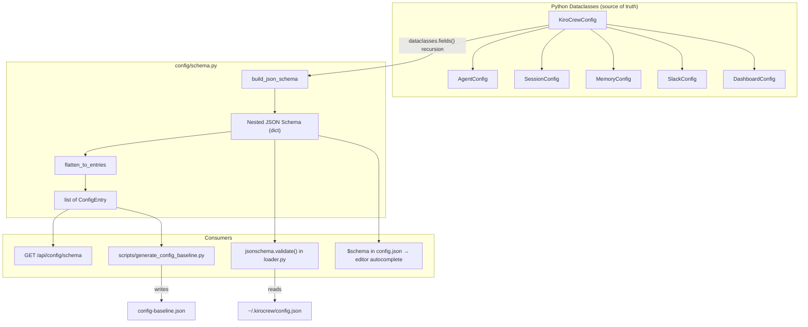

# Design Document: Config Schema

## Overview

This feature formalizes KiroCrew's configuration by making the Python dataclass hierarchy the single source of truth for all config keys. Today, several keys (`workspaces`, `default_workspace`, `slack.*`) are parsed ad-hoc in `KiroCrewConfig.load()` outside the dataclass structure. This design eliminates that gap by:

1. Adding structured field metadata (`label`, `help`, `tags`, `sensitive`, `deprecated`, `enum`) to every dataclass field.
2. Introducing `SlackConfig` and `DashboardConfig` dataclasses and pulling workspace fields into `KiroCrewConfig` as proper typed fields.
3. Building a Schema Registry that walks `dataclasses.fields()` recursively to produce a flat list of `ConfigEntry` records.
4. Exposing the registry via `GET /api/config/schema` for dashboard consumption.
5. Adding a build-time baseline generator script that serializes the registry to `config-baseline.json`.
6. Adding runtime validation with graceful degradation (type checks, enum checks, unknown-key warnings).

The design preserves full backward compatibility — existing `config.json` files continue to load without errors.

## Architecture

Three-layer schema system (same pattern as OpenClaw, adapted for Python):

```
Python dataclasses with field(metadata={...})     ← source of truth (like Zod in OpenClaw)
  ↓ build_json_schema()
Nested JSON Schema (in-memory + optionally persisted)  ← validation + editor autocomplete
  ↓ flatten_to_entries()
Flat ConfigEntry list (in-memory)                      ← API endpoint + dashboard
  ↓ scripts/generate_config_baseline.py
Flat path list (config-baseline.json, committed)       ← CI drift detection + docs
```



### Key Design Decisions

1. **Three-layer schema (like OpenClaw)**: Python dataclasses → nested JSON Schema → flat entry list. The nested JSON Schema enables `jsonschema.validate()` for runtime validation and `$schema` for editor autocomplete. The flat list enables diff-friendly CI drift detection and dashboard path-based field lookup. This mirrors OpenClaw's Zod → JSON Schema → flat baseline pipeline.

2. **Flat entry format inspired by OpenClaw**: The `ConfigEntry` record mirrors OpenClaw's `config-baseline.json` entry shape (`path`, `type`, `required`, `deprecated`, `sensitive`, `tags`, `label`, `help`, `hasChildren`, `enumValues`, `defaultValue`, `kind`). KiroCrew's config surface is smaller (~50-80 entries today), but the format is compatible for tooling reuse.

3. **Schema built at import time**: Both the JSON Schema and the flat registry are constructed once when `config/schema.py` is imported. No runtime cost per request. Module-level singletons.

4. **Validation via jsonschema**: Runtime validation uses `jsonschema.validate()` against the nested JSON Schema, rather than hand-rolled type checks. This is cleaner, handles nested objects correctly, and is a well-tested stdlib-friendly library. Validation errors are caught and logged as warnings — never fatal.

5. **Plugin extensibility (future)**: The architecture supports future plugin schema injection. Plugins would contribute JSON Schema fragments that get merged into the root schema at runtime, and the flat entry list would be regenerated to include plugin entries. The `kind` field on `ConfigEntry` (`"core"` vs `"plugin"`) already supports this distinction. Not implemented now, but the design doesn't block it.

6. **No new heavy dependencies**: `jsonschema` is the only addition (well-established, pure Python, no C extensions). Everything else uses stdlib `dataclasses`, `typing`, `json`, and `logging`. Python 3.9+ compatible.

## Components and Interfaces

### 1. Field Metadata Convention

Each dataclass field uses `dataclasses.field(metadata={...})` with these keys:

| Key | Type | Required | Default | Description |
|-----|------|----------|---------|-------------|
| `label` | `str` | yes | — | Human-readable label for UI |
| `help` | `str` | yes | — | Description / help text |
| `tags` | `list[str]` | no | `[]` | Categorization tags (e.g. `["advanced"]`, `["slack"]`) |
| `sensitive` | `bool` | no | `False` | Mask value in logs and API |
| `deprecated` | `bool` | no | `False` | Field is deprecated |
| `enum` | `list` | no | `None` | Allowed values |

### 2. Schema Module (`config/schema.py`)

The schema module generates both the nested JSON Schema and the flat entry list from the dataclass hierarchy.

```python
@dataclass
class ConfigEntry:
    path: str           # dot-separated, e.g. "agent.provider"
    kind: str           # "core" (future: "plugin")
    type: str           # "string" | "integer" | "number" | "boolean" | "array" | "object"
    required: bool
    deprecated: bool
    sensitive: bool
    tags: list[str]
    label: str
    help: str
    hasChildren: bool
    enumValues: list | None
    defaultValue: object  # JSON-serializable or None
```

**Public API:**

- `JSON_SCHEMA: dict` — module-level nested JSON Schema (Draft-07 compatible) built at import time.
- `SCHEMA_REGISTRY: list[ConfigEntry]` — module-level flat entry list built at import time.
- `build_json_schema(root_cls: type) -> dict` — walks `dataclasses.fields()` recursively, produces a nested JSON Schema dict with `properties`, `type`, `default`, `enum`, and custom `x-meta` extensions for label/help/tags/sensitive/deprecated.
- `flatten_to_entries(json_schema: dict, prefix: str = "") -> list[ConfigEntry]` — DFS flattens a nested JSON Schema into flat `ConfigEntry` records (same approach as OpenClaw's `collectConfigDocBaselineEntries`).
- `config_entry_to_dict(entry: ConfigEntry) -> dict` — serializes a `ConfigEntry` to a JSON-compatible dict.

**JSON Schema generation** (`build_json_schema`):

The generated JSON Schema is a standard Draft-07 schema with custom extensions:
```json
{
  "$schema": "http://json-schema.org/draft-07/schema#",
  "type": "object",
  "properties": {
    "agent": {
      "type": "object",
      "x-meta": { "label": "Agent", "help": "Agent runtime configuration.", "tags": [] },
      "properties": {
        "provider": {
          "type": "string",
          "default": "acp",
          "enum": ["acp", "bedrock"],
          "x-meta": { "label": "Provider", "help": "LLM provider backend.", "tags": ["advanced"] }
        }
      }
    }
  }
}
```

This JSON Schema is used for:
- `jsonschema.validate()` in `KiroCrewConfig.load()` for runtime validation
- Persisted as `config-schema.json` for `$schema` reference in user's `config.json` (editor autocomplete)
- Future: plugin schema fragments merged into this root schema at runtime

**Flattening** (`flatten_to_entries`):

Same DFS approach as OpenClaw's `collectConfigDocBaselineEntries`:

| JSON Schema construct | Path handling |
|----------------------|---------------|
| `properties.key` | append `.key` |
| `additionalProperties` (dynamic keys) | append `.*` |
| `items` (array elements) | append `.*` |

**Type mapping logic:**

| Python type | JSON Schema type | ConfigEntry type | `hasChildren` |
|-------------|-----------------|-----------------|---------------|
| `str` | `"string"` | `"string"` | `False` |
| `int` | `"integer"` | `"integer"` | `False` |
| `float` | `"number"` | `"number"` | `False` |
| `bool` | `"boolean"` | `"boolean"` | `False` |
| `list[...]` | `"array"` | `"array"` | `True` |
| `dict[...]` | `"object"` | `"object"` | `True` |
| dataclass | `"object"` | `"object"` | `True` |

### 3. Baseline Generator (`scripts/generate_config_baseline.py`)

A standalone script that:
1. Imports `SCHEMA_REGISTRY` from `config/schema.py`.
2. Serializes to JSON with `generatedBy`, `generatedAt`, and `entries` keys.
3. Writes to `config-baseline.json` in the repo root.

Output format (matching OpenClaw's structure):
```json
{
  "generatedBy": "scripts/generate_config_baseline.py",
  "generatedAt": "2026-01-15T12:00:00Z",
  "entries": [
    {
      "path": "agent",
      "kind": "core",
      "type": "object",
      "required": false,
      "deprecated": false,
      "sensitive": false,
      "tags": [],
      "label": "Agent",
      "help": "Agent runtime configuration.",
      "hasChildren": true,
      "enumValues": null,
      "defaultValue": null
    }
  ]
}
```

### 4. Schema API Endpoint

**Route:** `GET /api/config/schema`

**Handler:** `api_config_schema` in `dashboard/handlers.py`

**Query parameters:**
- `tags` (optional, comma-separated): filter entries by tag intersection.
- `deprecated` (optional, `true`/`false`): when `false`, exclude deprecated entries.

**Response:** `200 OK`, `Content-Type: application/json`
```json
{
  "entries": [ ... ConfigEntry dicts ... ]
}
```

Sensitive entries have `defaultValue` set to `null`.

### 5. Validation Logic (in `config/loader.py`)

Added to `KiroCrewConfig.load()`:

1. **Type validation**: For each recognized key, check the JSON value type against the schema's expected type. On mismatch, log warning with dot-path, expected type, actual type; use field default.
2. **Enum validation**: If field has `enum` metadata, check value is in the allowed set. On mismatch, log warning; use field default.
3. **Unknown key detection**: Top-level keys not in the schema produce a warning listing them.
4. **Deprecated key warning**: Keys marked `deprecated=True` produce a deprecation warning with the help text.
5. **Sensitive masking**: Validation warnings for sensitive fields replace the actual value with `"***"`.
6. **Malformed JSON**: Caught by existing `json.JSONDecodeError` handler; returns default `KiroCrewConfig`.

## Data Models

### Complete Python Dataclass Hierarchy

```python
from __future__ import annotations
from dataclasses import dataclass, field

def _meta(label: str, help: str, **kwargs) -> dict:
    """Helper to build field metadata dicts with safe defaults."""
    return {"label": label, "help": help, **kwargs}


@dataclass
class AgentConfig:
    approval_mode: str = field(
        default="auto",
        metadata=_meta("Approval Mode", "Tool approval mode.", enum=["auto", "interactive"]),
    )
    streaming: bool = field(
        default=True,
        metadata=_meta("Streaming", "Enable streaming responses."),
    )
    model: str = field(
        default="auto",
        metadata=_meta("Model", "LLM model identifier. 'auto' resolves from agent config."),
    )
    provider: str = field(
        default="acp",
        metadata=_meta("Provider", "LLM provider backend.", enum=["acp", "bedrock"]),
    )
    bedrock_model_id: str = field(
        default="anthropic.claude-sonnet-4-20250514",
        metadata=_meta("Bedrock Model ID", "AWS Bedrock model identifier."),
    )
    bedrock_region: str = field(
        default="us-west-2",
        metadata=_meta("Bedrock Region", "AWS region for Bedrock API calls."),
    )
    default_agent: str = field(
        default="",
        metadata=_meta("Default Agent", "Default agent name for new sessions."),
    )
    sandbox: str = field(
        default="auto",
        metadata=_meta("Sandbox", "Sandbox mode for ACP provider.", enum=["auto", "off"]),
    )


@dataclass
class SessionConfig:
    timeout_secs: int = field(
        default=1800,
        metadata=_meta("Session Timeout", "Idle session timeout in seconds."),
    )


@dataclass
class MemoryConfig:
    embedding_provider: str = field(
        default="none",
        metadata=_meta("Embedding Provider", "Vector embedding backend.", enum=["none", "ollama"]),
    )
    embedding_url: str = field(
        default="http://localhost:11434",
        metadata=_meta("Embedding URL", "URL for the embedding service."),
    )
    allow_remote_embedding: bool = field(
        default=False,
        metadata=_meta("Allow Remote Embedding", "Allow non-localhost embedding endpoints."),
    )
    embedding_dim: int = field(
        default=1024,
        metadata=_meta("Embedding Dimension", "Dimensionality of embedding vectors."),
    )
    embedding_timeout_secs: float = field(
        default=5.0,
        metadata=_meta("Embedding Timeout", "Timeout in seconds for embedding requests."),
    )
    semantic_confidence_threshold: float = field(
        default=0.8,
        metadata=_meta("Semantic Confidence Threshold", "Minimum similarity score for semantic search results."),
    )
    episodic_dedup_threshold: float = field(
        default=0.88,
        metadata=_meta("Episodic Dedup Threshold", "Similarity threshold for deduplicating episodic memories."),
    )
    episodic_max_results: int = field(
        default=8,
        metadata=_meta("Episodic Max Results", "Maximum episodic memory results per query."),
    )
    episodic_max_count: int = field(
        default=10000,
        metadata=_meta("Episodic Max Count", "Maximum total episodic memories stored."),
    )
    semantic_keys: list[str] = field(
        default_factory=list,
        metadata=_meta("Semantic Keys", "Keys to index for semantic search."),
    )
    history_idle_hours: float = field(
        default=3.0,
        metadata=_meta("History Idle Hours", "Hours of inactivity before history consolidation."),
    )
    history_max_days: int = field(
        default=90,
        metadata=_meta("History Max Days", "Maximum days of history to retain."),
    )
    migrated: bool = field(
        default=False,
        metadata=_meta("Migrated", "Whether memory has been migrated to vector store."),
    )


@dataclass
class SlackConfig:
    allowed_users: list[dict] = field(
        default_factory=list,
        metadata=_meta("Allowed Users", "List of Slack users allowed to interact. Each entry: {slack_id, name}."),
    )
    tracking_channels: list[dict] = field(
        default_factory=list,
        metadata=_meta("Tracking Channels", "Slack channels to monitor. Each entry: {channel_id, name}."),
    )
    command: str = field(
        default="kirocrew",
        metadata=_meta("Command", "Slack slash command trigger word."),
    )


@dataclass
class DashboardConfig:
    url: str = field(
        default="",
        metadata=_meta("Dashboard URL", "Public URL for the dashboard (used in Slack links)."),
    )


@dataclass
class KiroCrewConfig:
    agent: AgentConfig = field(
        default_factory=AgentConfig,
        metadata=_meta("Agent", "Agent runtime configuration."),
    )
    session: SessionConfig = field(
        default_factory=SessionConfig,
        metadata=_meta("Session", "Session management settings."),
    )
    memory: MemoryConfig = field(
        default_factory=MemoryConfig,
        metadata=_meta("Memory", "Memory and embedding configuration."),
    )
    slack: SlackConfig = field(
        default_factory=SlackConfig,
        metadata=_meta("Slack", "Slack integration settings.", tags=["slack"]),
    )
    dashboard: DashboardConfig = field(
        default_factory=DashboardConfig,
        metadata=_meta("Dashboard", "Dashboard UI settings."),
    )
    hooks: dict = field(
        default_factory=dict,
        metadata=_meta("Hooks", "Script hook definitions keyed by hook ID."),
    )
    workspaces: dict[str, str] = field(
        default_factory=dict,
        metadata=_meta("Workspaces", "Named workspace directory mappings."),
    )
    default_workspace: str = field(
        default="default",
        metadata=_meta("Default Workspace", "Active workspace name."),
    )
    auto_update: bool = field(
        default=True,
        metadata=_meta("Auto Update", "Enable automatic update checks."),
    )
```

### Complete Target `config.json` Structure

This is what users see and edit. All keys use `snake_case` matching the Python field names:

```json
{
  "agent": {
    "approval_mode": "auto",
    "streaming": true,
    "model": "auto",
    "provider": "acp",
    "bedrock_model_id": "anthropic.claude-sonnet-4-20250514",
    "bedrock_region": "us-west-2",
    "default_agent": "",
    "sandbox": "auto"
  },
  "session": {
    "timeout_secs": 1800
  },
  "memory": {
    "embedding_provider": "none",
    "embedding_url": "http://localhost:11434",
    "allow_remote_embedding": false,
    "embedding_dim": 1024,
    "embedding_timeout_secs": 5.0,
    "semantic_confidence_threshold": 0.8,
    "episodic_dedup_threshold": 0.88,
    "episodic_max_results": 8,
    "episodic_max_count": 10000,
    "semantic_keys": [],
    "history_idle_hours": 3.0,
    "history_max_days": 365,
    "migrated": false
  },
  "slack": {
    "allowed_users": [
      { "slack_id": "U12345", "name": "alice" }
    ],
    "tracking_channels": [
      { "channel_id": "C12345", "name": "general" }
    ],
    "command": "kirocrew"
  },
  "dashboard": {
    "url": ""
  },
  "hooks": {},
  "workspaces": {
    "default": "workspace",
    "oncall": "workspace-oncall"
  },
  "default_workspace": "default",
  "auto_update": true
}
```

### Backward Compatibility

The `load()` method reads the same JSON paths as before. The key change is structural: `slack.*` keys are now parsed into `SlackConfig`, `dashboard.url` into `DashboardConfig`, and `workspaces`/`default_workspace` are proper fields. The `to_dict()` method serializes back to the identical JSON shape, so existing configs round-trip without modification.

### OpenClaw Prior Art Reference

The baseline entry format is modeled after OpenClaw's `config-baseline.json` (at `src/KiroCrew/config-baseline.json`). OpenClaw uses a flat `entries` array where each entry has: `path`, `type`, `required`, `deprecated`, `sensitive`, `tags`, `label`, `help`, `hasChildren`, `enumValues`, `defaultValue`, `kind`. KiroCrew adopts the same field set in its `ConfigEntry` dataclass, keeping the format compatible for shared tooling while tailoring the actual entries to KiroCrew's simpler config surface.

OpenClaw's full config structure (36 top-level keys, ~5518 entries) is documented in `openclaw-config-structure.txt` for reference. KiroCrew currently covers ~8 of those top-level sections. The architecture is designed so new sections (plugins, channels, tools, models, etc.) can be added as the product grows without breaking changes.

### Design Decisions Summary

Decisions made during the spec session:

1. **Source of truth: Python dataclasses** — not JSON Schema, not Zod. The config only lives on the customer's machine (`~/.kirocrew/config.json`), so the code that reads it (Python) should own the schema definition. Everything else is derived.

2. **Three-layer schema (like OpenClaw)** — dataclasses → nested JSON Schema (in-memory) → flat entry list (persisted). OpenClaw does Zod → JSON Schema → flat baseline. Same pattern, different source language.

3. **Nested JSON Schema is generated** — used for `jsonschema.validate()` at load time, `$schema` reference for editor autocomplete, and future plugin schema merging. Persisted as `config-schema.json`.

4. **Flat baseline for CI drift detection** — `config-baseline.json` committed to git, checked in CI. Same snapshot-test pattern as OpenClaw's `pnpm config:docs:gen --check`.

5. **Dashboard gets schema via REST API** — `GET /api/config/schema` returns the flat `ConfigEntry` list. OpenClaw uses WebSocket RPC (`config.schema`) returning nested JSON Schema + separate `uiHints`. KiroCrew uses REST because the dashboard already uses REST for all data fetching. UI metadata lives in `x-meta` extensions inside the JSON Schema (non-standard but common), avoiding the need for a separate uiHints lookup table.

6. **No ad-hoc keys** — `workspaces`, `default_workspace`, and `slack.*` are pulled into proper dataclasses (`SlackConfig`, workspace fields on `KiroCrewConfig`). The schema registry derives everything purely from `dataclasses.fields()` recursion.

7. **Plugin extensibility (future)** — the `kind` field on `ConfigEntry` supports `"core"` vs `"plugin"`. Plugins will contribute JSON Schema fragments merged into the root schema at runtime. Not implemented now, but the architecture doesn't block it.

8. **Validation is advisory** — `jsonschema.validate()` errors are caught and logged as warnings. The loader always returns a valid `KiroCrewConfig` by falling back to defaults. Never crashes on bad config.

9. **`jsonschema` is the only new dependency** — pure Python, well-established, no C extensions. Everything else is stdlib.


## Correctness Properties

*A property is a characteristic or behavior that should hold true across all valid executions of a system — essentially, a formal statement about what the system should do. Properties serve as the bridge between human-readable specifications and machine-verifiable correctness guarantees.*

### Property 1: All config fields carry required metadata

*For any* dataclass in the config hierarchy (`AgentConfig`, `SessionConfig`, `MemoryConfig`, `SlackConfig`, `DashboardConfig`, `KiroCrewConfig`), and *for any* field in that dataclass, the field's `metadata` dict must contain both `"label"` (str) and `"help"` (str) keys.

**Validates: Requirements 1.1**

### Property 2: Safe defaults for missing optional metadata

*For any* dataclass field whose metadata omits `tags`, `sensitive`, `deprecated`, or `enum`, the corresponding `ConfigEntry` produced by the Schema Registry must have `tags=[]`, `sensitive=False`, `deprecated=False`, and `enumValues=None`.

**Validates: Requirements 1.5**

### Property 3: Registry entries are structurally complete

*For any* `ConfigEntry` in the Schema Registry, it must have all required fields (`path`, `kind`, `type`, `required`, `deprecated`, `sensitive`, `tags`, `label`, `help`, `hasChildren`, `enumValues`, `defaultValue`), and every entry's `path` must correspond to a reachable field via `dataclasses.fields()` recursion on `KiroCrewConfig`.

**Validates: Requirements 3.2, 2.6**

### Property 4: Python-to-schema type mapping is correct

*For any* field in the config dataclass hierarchy, the Schema Registry must map `str` → `"string"`, `int` → `"integer"`, `float` → `"number"`, `bool` → `"boolean"`, `list` → `"array"`, `dict` → `"object"`, and dataclass → `"object"` with `hasChildren=True`.

**Validates: Requirements 3.3, 3.4**

### Property 5: ConfigEntry serialization round-trip

*For any* `ConfigEntry` in the Schema Registry, serializing it to a JSON-compatible dict via `config_entry_to_dict()` and reconstructing a `ConfigEntry` from that dict must produce an equivalent entry.

**Validates: Requirements 4.4**

### Property 6: KiroCrewConfig load/to_dict round-trip

*For any* valid `KiroCrewConfig` instance, calling `to_dict()` to produce JSON, then constructing a new `KiroCrewConfig` via `load()` from that JSON, must yield an equivalent `KiroCrewConfig` instance (all field values equal).

**Validates: Requirements 2.4, 2.5, 9.4, 9.6**

### Property 7: Tag filtering returns only matching entries

*For any* set of requested tags and *for any* Schema Registry, filtering by those tags must return only entries whose `tags` list has at least one element in common with the requested tags.

**Validates: Requirements 5.2**

### Property 8: Deprecated filtering excludes deprecated entries

*For any* Schema Registry containing both deprecated and non-deprecated entries, filtering with `deprecated=false` must return zero entries where `deprecated` is `True`.

**Validates: Requirements 5.3**

### Property 9: Type mismatch falls back to default

*For any* config key with a known expected type, and *for any* JSON value whose type does not match, `KiroCrewConfig.load()` must use the field's default value for that key (not the invalid value) and the resulting config must be valid.

**Validates: Requirements 6.1, 6.2**

### Property 10: Enum violation falls back to default

*For any* config field with an `enum` constraint, and *for any* value not in the allowed set, `KiroCrewConfig.load()` must use the field's default value for that key and the resulting config must be valid.

**Validates: Requirements 6.3**

### Property 11: Unrecognized keys are detected

*For any* config JSON dict containing top-level keys not present in the Schema Registry, `KiroCrewConfig.load()` must detect and report all unrecognized keys.

**Validates: Requirements 6.4**

### Property 12: load() always returns valid KiroCrewConfig

*For any* input string (valid JSON, invalid JSON, empty string, random bytes), `KiroCrewConfig.load()` must return a `KiroCrewConfig` instance without raising an exception, and all fields must have values matching their declared types.

**Validates: Requirements 6.6**

### Property 13: Sensitive entries have null defaultValue in API

*For any* `ConfigEntry` with `sensitive=True`, the API response dict must have `defaultValue` set to `null`.

**Validates: Requirements 7.1**

### Property 14: Deprecated fields are accepted during loading

*For any* config field marked `deprecated=True` and *for any* valid value for that field, `KiroCrewConfig.load()` must apply the provided value (not the default) to the resulting config instance.

**Validates: Requirements 8.2**

### Property 15: All config paths use snake_case

*For any* `ConfigEntry` in the Schema Registry, every segment of the dot-separated `path` must match the pattern `[a-z][a-z0-9_]*`.

**Validates: Requirements 9.3**

## Error Handling

| Scenario | Behavior |
|----------|----------|
| Malformed JSON in `config.json` | Log warning, return default `KiroCrewConfig` |
| Type mismatch on a field | Log warning with dot-path + expected/actual types, use field default |
| Enum violation | Log warning with dot-path + allowed/actual values, use field default |
| Unrecognized top-level key | Log warning listing all unrecognized keys |
| Deprecated field present | Log deprecation warning with dot-path + help text, apply value normally |
| Sensitive field validation error | Mask actual value as `"***"` in log message |
| `config.json` missing | Return default `KiroCrewConfig` (existing behavior, unchanged) |
| Schema endpoint internal error | Return HTTP 500 with JSON `{"error": "..."}` |

All validation is advisory. The loader never raises exceptions to callers — it always returns a usable `KiroCrewConfig` instance.

## Testing Strategy

### Dual Testing Approach

Both unit tests and property-based tests are required for comprehensive coverage.

**Property-based testing library:** `hypothesis` (Python, stdlib-compatible, well-supported on Python 3.9+).

**Configuration:** Each property test runs a minimum of 100 iterations via `@settings(max_examples=100)`.

**Tagging:** Each property test includes a comment referencing its design property:
```python
# Feature: config-schema, Property 6: KiroCrewConfig load/to_dict round-trip
```

Each correctness property above maps to a single property-based test.

### Unit Tests

Unit tests cover specific examples, edge cases, and integration points:

- `SlackConfig` dataclass exists with correct fields and defaults (Req 2.1)
- `KiroCrewConfig` has `slack`, `dashboard`, `workspaces`, `default_workspace` fields (Req 2.2, 2.3)
- Known enum fields (`approval_mode`, `provider`, `sandbox`, `embedding_provider`) have `enum` in metadata (Req 1.2)
- Schema registry is populated after import (Req 3.1)
- `GET /api/config/schema` returns 200 with `Content-Type: application/json` (Req 5.1, 5.4)
- Baseline generator script produces valid JSON with `generatedBy` and `generatedAt` (Req 4.1, 4.2, 4.5)
- Sensitive field validation warning masks value as `"***"` (Req 7.2)
- Deprecated field produces deprecation warning with help text (Req 8.1)
- Malformed JSON input returns default config (Req 6.5, edge case)

### Property Tests

Each correctness property (1–15) is implemented as a single `hypothesis` property-based test:

| Property | Generator Strategy |
|----------|-------------------|
| P1: Field metadata | Enumerate all dataclass fields via `dataclasses.fields()` recursion |
| P2: Safe defaults | Generate partial metadata dicts missing optional keys |
| P3: Structural completeness | Iterate all registry entries, verify fields and path reachability |
| P4: Type mapping | Enumerate all fields, compare Python type to schema type |
| P5: ConfigEntry round-trip | Generate `ConfigEntry` instances with random valid values |
| P6: KiroCrewConfig round-trip | Generate `KiroCrewConfig` instances with random field values |
| P7: Tag filtering | Generate random tag sets and registry subsets |
| P8: Deprecated filtering | Generate registries with random deprecated flags |
| P9: Type mismatch fallback | Generate config dicts with random wrong-type values |
| P10: Enum violation fallback | Generate config dicts with random invalid enum values |
| P11: Unrecognized keys | Generate config dicts with random extra top-level keys |
| P12: load() always valid | Generate arbitrary strings/bytes as config input |
| P13: Sensitive null default | Iterate sensitive entries, verify null defaultValue |
| P14: Deprecated acceptance | Generate configs with deprecated field values |
| P15: Snake_case paths | Iterate all registry entry paths, regex-check each segment |

### Test File Organization

```
test/
  test_config_schema.py       # Schema registry unit + property tests
  test_config_loader.py       # Loader validation unit + property tests
  test_config_baseline.py     # Baseline generator tests
  test_config_api.py          # Schema API endpoint tests
```
