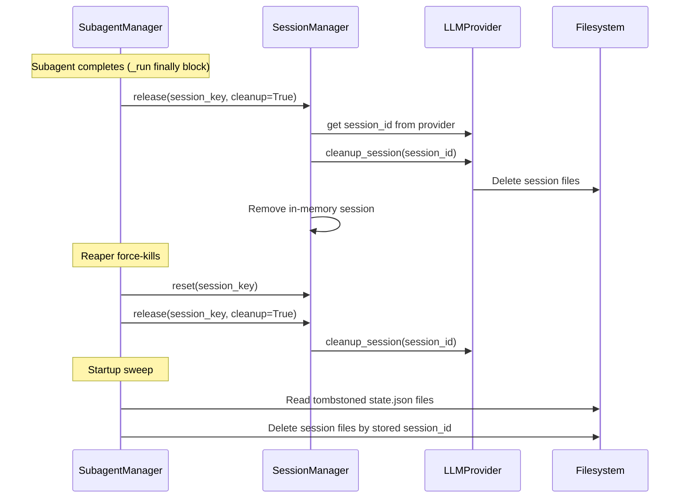

# Design Document: Subagent Session Cleanup

## Overview

This feature adds a provider-agnostic session file cleanup mechanism to the KiroCrew gateway. Each LLM provider backend stores session data differently on disk — the ACP provider uses `~/.kiro/sessions/cli/{session_id}.json` and `{session_id}.jsonl` files, while the removed standalone provider and Bedrock had different (or no) persistence. The cleanup mechanism integrates with the existing subagent lifecycle at three points: normal completion, reaper force-kill, and tombstone pruning.

The design adds a `session_id` property and a `cleanup_session` method to `LLMProvider`, a `cleanup` parameter to `SessionManager.release()`, session ID tracking in subagent persistence, and a startup sweep that runs during orphan reconciliation.

## Architecture



The cleanup is always best-effort — failures are logged but never propagate. This ensures the subagent lifecycle is never disrupted by filesystem errors.

## Components and Interfaces

### 1. LLMProvider ABC Extension (`providers/base.py`)

Add a `session_id` property and a default no-op `cleanup_session` method:

```python
@property
def session_id(self) -> str:
    """Provider-specific session identifier for file cleanup.

    Returns empty string if the provider has no persistent session files.
    Each provider overrides to return its own session_id.
    """
    return ""

async def cleanup_session(self, session_id: str) -> None:
    """Delete on-disk session files for the given session ID.

    Default implementation is a no-op. Providers with persistent
    session files override this to perform actual deletion.

    cleanup_session only operates on the filesystem (Path.unlink,
    shutil.rmtree). It does NOT depend on the provider process being
    alive. This makes fire-and-forget via asyncio.ensure_future safe —
    the cleanup task only needs the session_id string, not a live process.
    """
```

Both are concrete default methods (not abstract) so existing providers that don't need cleanup (Bedrock) work without modification. The `session_id` property replaces the need for `getattr` chains to access private attributes — `SessionManager` uses `provider.session_id` directly.

### 2. AcpProvider Implementation (`providers/acp.py`)

```python
@property
def session_id(self) -> str:
    """Return the kiro-cli session UUID."""
    return self._client._session_id if self._client and self._client._session_id else ""

async def cleanup_session(self, session_id: str) -> None:
    """Delete kiro-cli session files (.json + .jsonl)."""
    if not session_id:
        return
    sessions_dir = Path.home() / ".kiro" / "sessions" / "cli"
    for suffix in (".json", ".jsonl"):
        target = sessions_dir / f"{session_id}{suffix}"
        if not _is_safe_path(target, sessions_dir):
            logger.error("cleanup_session: path traversal blocked for %s", target)
            return
        try:
            target.unlink(missing_ok=True)
        except OSError:
            logger.warning("cleanup_session: failed to delete %s", target, exc_info=True)
```

ACP sessions are stored as individual files: `~/.kiro/sessions/cli/{session_id}.json` (session state) and `~/.kiro/sessions/cli/{session_id}.jsonl` (conversation log). These are flat files, not directories.

### 3. ClaudeCodeProvider Implementation (`providers/claude_code.py`)

```python
@property
def session_id(self) -> str:
    """Return the removed provider's session ID."""
    return self._session_id if hasattr(self, "_session_id") and self._session_id else ""

async def cleanup_session(self, session_id: str) -> None:
    """Clean up the removed provider's session state.

    Ephemeral mode: no-op (subprocess already cleaned up).
    Per-session mode: delete session state directory.
    """
    if self.connection_mode == "ephemeral" or not session_id:
        return
    # The removed provider stored session state in ~/.claude/sessions/{session_id}/
    sessions_dir = Path.home() / ".claude" / "sessions"
    target = sessions_dir / session_id
    if not _is_safe_path(target, sessions_dir):
        logger.error("cleanup_session: path traversal blocked for %s", target)
        return
    if target.is_dir():
        shutil.rmtree(target, ignore_errors=True)
```

### 4. SessionManager Changes (`session.py`)

Extend `release()` with an optional `cleanup` parameter:

```python
def release(self, key: str, *, cleanup: bool = False) -> None:
    """Release the per-session semaphore. If cleanup=True, delete session files."""
    session = self._sessions.get(key)
    if session:
        if cleanup:
            session_id = session.provider.session_id
            if session_id:
                asyncio.ensure_future(self._safe_cleanup(session.provider, session_id))
        session.semaphore.release()

async def _safe_cleanup(self, provider: LLMProvider, session_id: str) -> None:
    """Best-effort session file cleanup."""
    try:
        await provider.cleanup_session(session_id)
        logger.debug("Cleaned up session files for %s", session_id)
    except Exception:
        logger.warning("Failed to clean up session files for %s", session_id, exc_info=True)
```

Note: `SessionManager` uses `provider.session_id` directly — no `_get_provider_session_id` helper needed. The `session_id` property on `LLMProvider` encapsulates provider-specific access patterns, eliminating `getattr` chains into private attributes.

### 5. SubagentManager Changes (`subagent.py`)

In the `_run()` finally block, pass `cleanup=True`:

```python
# Before (current):
self._sessions.release(session_key)

# After:
self._sessions.release(session_key, cleanup=True)
```

In `_force_reap()`, also pass `cleanup=True`:

```python
# Before (current):
self._sessions.release(session_key)

# After:
self._sessions.release(session_key, cleanup=True)
```

### 6. Session ID Tracking in Persistence (`subagent_persistence.py`)

Add a `session_id` field to `state.json`:

```python
def update_session_id(agent_id: str, session_id: str) -> None:
    """Record the LLM provider session ID in state.json."""
    update_state(agent_id, session_id=session_id)
```

Called from `SubagentManager._run_inner()` after the session is created and the provider's session ID is available. Uses `provider.session_id` to get the value.

### 7. Startup Sweep Enhancement (`subagent.py`)

Extend `_reconcile_orphans()` to also clean up session files:

```python
# After writing tombstone for an orphan:
session_id = state.get("session_id", "")
if session_id:
    await _cleanup_session_files(session_id, state.get("provider", "acp"))
```

**Rate limiting**: When the gateway restarts with many tombstoned entries, the startup sweep processes entries in batches of 50 with `await asyncio.sleep(0)` between batches. This yields to the event loop between batches, preventing event loop starvation during startup when thousands of entries need processing.

### 8. Tombstone Pruning Enhancement (`subagent_persistence.py`)

Extend `prune_stale_tombstones()` to clean up session files before deleting the folder:

```python
def prune_stale_tombstones(max_age_days: int = 7) -> int:
    # ... existing logic ...
    # Before shutil.rmtree:
    session_id = ts.get("session_id") or state.get("session_id", "")
    if session_id:
        _cleanup_session_files_sync(session_id)
    shutil.rmtree(d, ignore_errors=True)
```

### 9. Path Safety Utility

A shared helper to validate paths before deletion:

```python
def _is_safe_path(target: Path, expected_root: Path) -> bool:
    """Validate target is under expected_root (no traversal)."""
    try:
        resolved = target.resolve()
        root = expected_root.resolve()
        return resolved == root or str(resolved).startswith(str(root) + os.sep)
    except (OSError, ValueError):
        return False
```

## Data Models

### state.json (updated)

```json
{
    "id": "abc123",
    "task": "...",
    "agent": "kirocrew",
    "parent_session": "dashboard:chat-1",
    "started": 1700000000.0,
    "max_turns": 100,
    "status": "running",
    "pid": 12345,
    "turns": 5,
    "last_tool": "read_file",
    "updated_at": 1700000010.0,
    "session_id": "kiro-session-uuid-here",
    "provider": "acp"
}
```

New fields:
- `session_id` (string): The LLM provider's session identifier used to locate session files on disk. Empty string if the provider has no persistent files.
- `provider` (string): The provider type (`"acp"`, `"claude_code"`, `"bedrock"`). Used during startup sweep and tombstone pruning to determine which cleanup logic to apply. The `provider` field is stored directly in state.json rather than derived from the agent name via config lookup. This avoids requiring a full config load during startup sweep and tombstone pruning, which may run before the config is fully initialized or when the agent config has changed since the subagent was spawned.

> **TODO**: Add counters for cleanup operations (files_deleted, cleanup_failures) for operational observability. Not required for initial implementation.


## Correctness Properties

*A property is a characteristic or behavior that should hold true across all valid executions of a system — essentially, a formal statement about what the system should do. Properties serve as the bridge between human-readable specifications and machine-verifiable correctness guarantees.*

### Property 1: ACP cleanup deletes all session files

*For any* valid session ID, when `cleanup_session` is called on an AcpProvider and the corresponding `.json` and `.jsonl` files exist under `~/.kiro/sessions/cli/`, both files shall be deleted after the call completes.

**Validates: Requirements 1.2**

### Property 2: Removed-provider per_session cleanup deletes session directory

*For any* valid session ID, when `cleanup_session` is called on a ClaudeCodeProvider in `per_session` mode and the corresponding session directory exists, the directory shall be deleted after the call completes.

**Validates: Requirements 1.4**

### Property 3: Cleanup never raises exceptions

*For any* session ID (including empty strings, non-existent paths, and paths with permission errors), calling `cleanup_session` on any provider shall return without raising an exception.

**Validates: Requirements 1.6**

### Property 4: Cleanup is idempotent

*For any* session ID, calling `cleanup_session` multiple times (including when files have already been deleted) shall succeed without error on every invocation.

**Validates: Requirements 7.4**

### Property 5: Path traversal is blocked

*For any* session ID containing path traversal sequences (`../`, absolute paths, null bytes, or other special characters), `cleanup_session` shall refuse to delete any files and the filesystem shall remain unchanged.

**Validates: Requirements 7.2**

### Property 6: Cleanup restricted to subagent sessions

*For any* session key that does not start with `subagent:`, the `SessionManager.release()` method with `cleanup=True` shall not invoke `cleanup_session` on the provider.

**Validates: Requirements 2.4, 7.1**

### Property 7: Session ID correctly persisted

*For any* subagent spawn where the provider reports a non-empty session ID, the subagent's `state.json` shall contain a `session_id` field matching the provider's reported session ID.

**Validates: Requirements 6.1, 6.2**

### Property 8: Tombstone pruning cleans session files

*For any* tombstoned subagent folder older than the max age that contains a `session_id` in its state, when `prune_stale_tombstones` runs, the corresponding session files shall be deleted along with the subagent folder.

**Validates: Requirements 4.1**

### Property 9: Startup sweep processes all tombstoned entries

*For any* set of tombstoned subagent folders with recorded session IDs, the startup sweep shall attempt cleanup for each entry, and failures on individual entries shall not prevent processing of remaining entries.

**Validates: Requirements 5.2, 5.4**

## Error Handling

| Scenario | Behavior |
|----------|----------|
| Session files already deleted | No-op, no error logged |
| Permission denied on file deletion | Log warning, continue |
| Path traversal in session_id | Log error, refuse deletion |
| Provider has no session_id (None/empty) | Skip cleanup silently |
| Cleanup fails during subagent completion | Log warning, continue completion flow |
| Cleanup fails during reaping | Log warning, continue reaping flow |
| Corrupt/missing state.json during pruning | Skip entry, continue pruning |
| Startup sweep encounters I/O error | Log warning per entry, continue sweep |

All error handling follows the principle: cleanup is best-effort and must never disrupt the primary subagent lifecycle. The `_safe_cleanup` wrapper in SessionManager catches all exceptions and logs them as warnings.

## Testing Strategy

### Property-Based Testing

Use **Hypothesis** for property-based tests. Each property test runs a minimum of 100 iterations.

Properties to implement as PBT:
- Property 1: Generate random valid UUIDs as session IDs, create files, call cleanup, verify deletion
- Property 3: Generate arbitrary strings (including edge cases) as session IDs, verify no exception
- Property 4: Generate session IDs, call cleanup twice, verify both succeed
- Property 5: Generate strings with `../`, `/`, `\0`, absolute paths — verify no deletion occurs
- Property 6: Generate random non-subagent session keys, verify cleanup_session is never called

### Unit Tests

- ACP cleanup happy path: create `.json` + `.jsonl`, call cleanup, verify gone
- ACP cleanup with missing files: call cleanup when files don't exist
- Removed-provider ephemeral no-op: verify no filesystem calls in ephemeral mode
- Removed-provider per_session cleanup: create directory, call cleanup, verify removed
- Bedrock no-op: verify no filesystem calls
- SubagentManager completion flow: mock provider, verify cleanup called
- SubagentManager error completion: mock provider, verify cleanup still called
- Reaper cleanup: mock provider, verify cleanup called during force-reap
- Tombstone pruning with session_id: create tombstoned folder + session files, prune, verify both gone
- Tombstone pruning without session_id: verify pruning still works
- Startup sweep: create tombstoned folders with session files, run reconciliation, verify cleanup
- Session ID tracking: spawn subagent, verify state.json contains session_id

### Test Configuration

```python
# Property test settings
from hypothesis import settings, given
from hypothesis import strategies as st

@settings(max_examples=100)
@given(session_id=st.text(min_size=1, max_size=64, alphabet=st.characters(whitelist_categories=('L', 'N', 'P'))))
def test_cleanup_never_raises(session_id):
    ...
```

Each property test is tagged with:
```python
# Feature: subagent-session-cleanup, Property N: <property_text>
```
