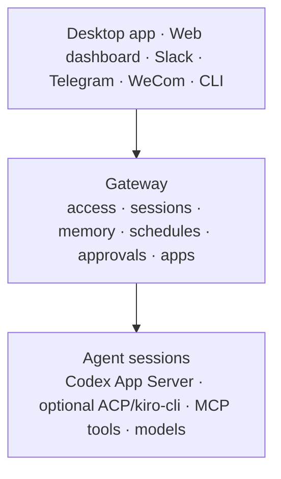

<!-- Modified 2026 by Sereja Ris for VibecodersCrew (based on Kiro Crew). See NOTICE and CHANGELOG.md. -->

<p align="center">
  
</p>

<h1 align="center">VibecodersCrew</h1>

<p align="center">
  <strong>Local AI agent workspace.</strong> Persistent sessions, skills, schedules,
  and a dashboard: on hardware you control.
</p>

<p align="center">
  <a href="https://github.com/serejaris/vibecoderscrew/releases"></a>
  <a href="docs/getting-started.md"></a>
  <a href="LICENSE"></a>
</p>

<p align="center">
  <a href="#download">Source release</a> ·
  <a href="#run-from-source">Run from source</a> ·
  <a href="#requirements">Requirements</a> ·
  <a href="#desktop-app">Desktop app</a> ·
  <a href="#what-it-does">What it does</a> ·
  <a href="#docs">Docs</a>
</p>

## Download

The v1.0.1 candidate is a source-only release. The GitHub release page provides
the repository source archive and release notes; desktop installers and update
feeds are outside this fork's distribution boundary.

Use the source archive from the [v1.0.1 release page](https://github.com/serejaris/vibecoderscrew/releases/tag/v1.0.1),
or clone the repository and follow [Run from source](#run-from-source) below.

## Run from source

### Requirements

- macOS or Linux (Windows: [docs/windows-install.md](docs/windows-install.md))
- Python 3.10–3.13
- Node.js 18+ and npm
- A working [Codex](https://github.com/openai/codex) login (CLI or ChatGPT desktop app on macOS)

### 1. Clone and build

```bash
git clone https://github.com/serejaris/vibecoderscrew.git
cd vibecoderscrew
make build
source .venv/bin/activate
```

`make build` builds the web dashboard and installs the Python package into `.venv`.

### 2. Point the agent at Codex

```bash
vibecoderscrew config set agent.provider codex
vibecoderscrew config set agent.model auto
vibecoderscrew doctor
```

`doctor` checks that Codex is on the path / discoverable and that you are logged in.

### 3. Start the gateway

```bash
vibecoderscrew gateway
```

Open the dashboard URL printed in the terminal (default `http://127.0.0.1:5476`).

Useful commands after install:

```bash
vibecoderscrew --version
vibecoderscrew setup          # optional wizard
vibecoderscrew doctor         # health check
vibecoderscrew gateway        # API + dashboard
vibecoderscrew chat           # CLI chat against the same gateway
```

The package also installs a `kirocrew` command as a compatibility alias of `vibecoderscrew`.

### Desktop app

For local development only, you can build a desktop app with the backend bundled
(no system Python needed at runtime):

```bash
UNIVERSAL=0 make desktop
```

The local build lands under `website/electron/dist/`; it is not attached to source
releases. Details: [docs/desktop-app.md](docs/desktop-app.md).

### Optional: embeddings for semantic memory

By default there is **no** automatic model download. Memory falls back to keyword/FTS search until you set one of:

```bash
export KIROCREW_EMBED_MODEL_URL='https://…/your-model.gguf'   # https only
# or in config: memory.embed_model_url = https://…/your-model.gguf
# or in config: memory.embed_model_path = /absolute/path/to/model.gguf
```

Then restart the gateway.

## Why Vibecoders Crew

Most agent sessions end when the chat closes. Vibecoders Crew runs continuously on
hardware you control and keeps working between conversations.

**Persistent.** Sessions, memory, schedules, and task checkpoints survive
Gateway restarts, and scheduled or reactive work continues without someone at
the terminal.

**Self-learning.** Corrections and task failures become durable lessons.
Preferences and project context carry into new sessions.

**Self-evolving.** Repeated patterns become reusable skills. Memory, lessons,
and skills stay visible and editable, so each Vibecoders Crew grows more tailored to
the person and work around it.

**Runs where you choose.** Your Mac, a local container, or a remote machine
you control.

**One Gateway, many surfaces.** Work directly in the desktop app or web dashboard,
or continue the same work from the CLI and messaging surfaces like Slack and
Discord.

## What it does

| Capability | What it gives you |
|---|---|
| **Persistent sessions** | Run concurrent, isolated conversations, resume them after Gateway restarts, search prior sessions, and carry recent context into new work. |
| **Self-learning** | Turn corrections and task failures into durable lessons that change later behavior. Keep preferences, active-project context, and history scoped to the relevant workspace. Say *"no, always run the frontend checks before calling a change done"* and it becomes a workspace-scoped lesson applied in future sessions. |
| **Self-evolving skills** | Synthesize reusable skills from repeated patterns, then inspect, refine, or remove them as your work changes. |
| **Long-running tasks** | Give Vibecoders Crew a task spec and walk away. It plans steps, executes them, validates results, retries failures, and resumes from checkpoints. *"Implement this migration plan and stop if the tests fail"* runs as a checkpointed task with validation at each step. |
| **Unattended autonomy** | Run scheduled agent work or deterministic scripts and commands without a model call. Monitor work until it is done, or react to messaging events and authenticated webhooks without someone at the terminal. *"Every weekday at 9, summarize the open work I should review"* becomes a timezone-aware recurring job delivered to the surface you choose. |
| **Delegation** | Spawn isolated subagents for parallel work and bring their results back into the parent conversation. *"Research these three options in parallel and recommend one"* fans out to isolated subagents and synthesizes the tradeoffs. |
| **Work where you choose** | Work directly in the desktop app or web dashboard, or continue through the CLI and any connected messaging surface without moving the agent runtime or its state. |
| **Installable apps** | Add focused interfaces and domain workflows through dashboard pages, scoped Gateway APIs, events, and lifecycle hooks. |
| **Extensible tools** | Add MCP servers, markdown skills, and hooks without changing the core runtime. |
| **Visible execution** | Watch tool calls, subagent progress, context usage, approvals, schedules, memory, and logs from the dashboard. |
| **Defense in depth** | Combine tool approvals, OS sandboxing, sensitive-path checks, credential redaction, deny rules, audit events, and governance profiles. |

You can also paste a screenshot and ask what is causing an error. Vibecoders Crew sends
the image to the active provider model and keeps the diagnosis in the conversation
history.

The complete inventory is in [Features](docs/features.md) and
[What's New](CHANGELOG.md).

## How it works



The Gateway separates where the agent runs from where you work with it. In the
desktop app or web dashboard, you can work directly through parallel conversations,
files, task runs, approvals, memory, and apps. From Slack, Telegram, WeCom, or
the CLI, the Gateway routes your work to managed agent sessions under the same
memory, tool, approval, and policy services. Apps extend the dashboard and
Gateway APIs with focused workflows.

Each active conversation or background task uses an agent session. Its session
provider drives Codex App Server or the optional `kiro-cli` ACP runtime, streams
model and tool events, and preserves conversation state. Depending on the provider
and workload, a session is backed by its own process or by a session handle on a
shared multiplexed runtime. The Gateway manages these sessions along with
scheduling, approvals, memory, security policy, messaging connections, and the
dashboard.

The current runtime places the Gateway, agent sessions, provider processes, and state
on the same host. Run Vibecoders Crew on your Mac, inside a container on your machine,
or on a remote Linux host you control. Conversation history, memory, and
knowledge indexes remain on that host. Model requests are handled by the active
provider and follow the account and model configuration used by Codex or Kiro.

**Gateway.** The Gateway is the long-running Vibecoders Crew process. It routes
messages from the desktop app, web, CLI, and the messaging surfaces listed below. It persists
session state, injects memory and skills, starts scheduled work, coordinates
subagents, brokers approvals, enforces runtime policy, and exposes activity in
the dashboard.

**Agent sessions.** A dashboard conversation or Slack thread maps to an isolated
agent session. Scheduled jobs, task runs, Telegram and WeCom conversations, and
subagents also use managed sessions. These sessions preserve conversation
context and can run concurrently before returning results to a parent session or
configured surface.

**Provider runtimes and turns.** Vibecoders Crew supports the official Codex App
Server and the optional `kiro-cli` ACP runtime. During each turn, the session
sends a prompt, streams model and tool events, resolves approvals, and returns
the final result. An agent session is a logical isolation boundary, not
necessarily one OS process.

**Use the surface that fits the moment.**

| Surface | Best for |
|---|---|
| **Desktop app** | The simplest local experience, with a bundled Gateway plus multi-tab connections to local or remote Gateways. |
| **Web dashboard** | Parallel conversations, files, approvals, activity, memory, schedules, apps, settings, and system status at `localhost:5476`. |
| **Slack** | Work from DMs and threads with streaming replies, approvals, notifications, and session links back to the dashboard. |
| **Telegram** | Reach your agent from private DMs on your phone or laptop, with streaming replies, inline approvals, and commands. |
| **Discord** | Work from DMs with streaming replies and approvals delivered as message buttons. |
| **Teams** | Reach your agent from Microsoft Teams chats with streaming replies and approvals. |
| **Webex** | Work from Webex direct messages with streaming replies and inline approvals. |
| **WeCom** | Chat through an outbound-connected WeCom AI bot with configured user access and streaming replies. |
| **WeChat (Weixin)** | Reach your agent from WeChat with configured user access and streaming replies. |
| **CLI** | Fast interactive chat and direct automation with `kirocrew chat`, `run`, `cron`, `spawn`, and `security`. |

**Choose how work starts.**

| Mode | Use it for | Entry point |
|---|---|---|
| **Scheduled** | Briefings, audits, backups, and recurring maintenance | `kirocrew cron` or a natural-language request |
| **Proactive** | Goals that need another pass without waiting for a new user message | AutoNudge and goal-loop skills |
| **Reactive** | CI alerts, external automation, Slack activity, and other events | Authenticated agent webhooks and messaging events |
| **Task runner** | Bounded projects with explicit steps, tests, review, and checkpoint resume | `kirocrew run TASK.md` |
| **Subagents** | Independent workstreams that can run concurrently | `kirocrew spawn run "task"` |

**Memory, learning, and evolution.** Vibecoders Crew maintains preferences, active
project context, decaying history summaries, and durable lessons. Corrections
and task failures can change later behavior, while repeated patterns can become
reusable skills. In-process embeddings add semantic retrieval for memory and
the knowledge library. The stored state remains inspectable and editable
from the dashboard. Incognito and temporary session modes let you opt out when
a conversation should not persist.

**Skills, MCP, and apps.** Markdown skills supply reusable workflows and can be
loaded only when relevant. The built-in `kirocrew-core` and `kirocrew-cron` MCP
servers expose task, subagent, learning, messaging, and scheduling tools. You
can discover additional MCP servers from Kiro or Vibecoders Crew configuration. The
App Kit adds installable interfaces and domain workflows. Apps can add dashboard
pages, use scoped Gateway APIs, subscribe to events, and register lifecycle
hooks.

## Security and control

Vibecoders Crew gives an AI agent real tool access, so the controls are enforced at
the runtime boundary instead of relying only on prompt instructions.

- **Local by default.** The dashboard binds to loopback unless you explicitly
  configure a network URL. Remote dashboards require token authentication.
- **Interactive approvals.** Review tool requests in the dashboard, Slack, or
  Telegram. Session-scoped trust can reduce repeated prompts without changing
  the underlying deny and sensitive-path controls.
- **OS sandbox.** Codex sessions use the native Codex workspace sandbox. On Linux
  and macOS, the optional `kiro-cli` provider can also run inside namespace or
  Seatbelt isolation. Standard, strict, and off modes make the tradeoff explicit
  for that ACP runtime. Windows does not currently provide the additional
  KiroCrew namespace/Seatbelt layer.
- **Sensitive data guards.** Vibecoders Crew blocks direct access to protected paths,
  strips sensitive environment variables, and redacts credential patterns from
  output before it reaches a chat surface.
- **Denied operations.** 137 bundled deny patterns block destructive commands and
  common exfiltration paths even when a session has broad approval.
- **Auditability.** Security events and tool activity are recorded for review.
  Use `kirocrew security events`, `audit`, and `verify` to inspect them.
- **Governance ceiling.** Optional policy and profile files compose with a
  tightest-wins model. A running app or agent can narrow the allowed scope but
  cannot loosen the enterprise ceiling. Inspect it with `kirocrew policy show`,
  `validate`, and `explain`.

No agent security layer removes the need to protect credentials and review
high-impact actions. Avoid pasting secrets or sensitive personal data into a
chat. Read the [security architecture](docs/security-deep-dive.md) and use
[SECURITY.md](SECURITY.md) for private vulnerability reporting.

## Install, configure, and operate

**Source release.** Clone a tagged GitHub source archive for a reproducible
checkout, then build locally. The project publishes no installer, package feed,
container image, or signed desktop binary. A local wheel can be produced and
inspected with:

```bash
make wheel
python -m pip install dist/vibecoderscrew-*.whl
```

**Semantic memory.** Embeddings run in-process when a model is available. The Gateway
does not fetch a default model: configure an explicit HTTPS model URL or an absolute
local GGUF path. URL downloads are sha256-verified and stored under
`~/.kiro/crew/models`; until a model is available, memory search uses keyword/FTS
fallback and picks up embeddings automatically without a restart.

See [Installing and Building](docs/install.md) for wheels, desktop builds,
Windows, optional voice dependencies, and manual setup.

**Choose where Vibecoders Crew runs.** The current deployment model keeps the Gateway,
agent session runtime, ACP processes, and state together on one host. Your apps
and chat surfaces connect to that Gateway.

| Deployment | How to run it | Where Vibecoders Crew and its state live |
|---|---|---|
| **Mac app, local** | Build the desktop app locally with `make desktop` | The app starts its bundled Gateway. Agent sessions, ACP processes, and `~/.kiro/crew` stay on your Mac. |
| **Native local** | `make build`, or install a wheel from `make wheel` | The Gateway and agent runtime run directly on your macOS, Linux, or Windows machine. |
| **Remote hardware** | Follow the [remote host guide](docs/remote-desktop-setup.md) and install the service | The Gateway, agent sessions, and state run continuously on your Linux server, home lab, or cloud instance. Connect the desktop app or browser through an SSH tunnel. |
| **Windows source install** | Follow [the Windows guide](docs/windows-install.md) | The Gateway, agent sessions, chat, cron, and dashboard run natively with documented feature limits. |

**Keep it running.** Install a systemd service on Linux or a launchd agent on
macOS:

```bash
kirocrew service install
kirocrew service status
kirocrew logs
```

The desktop app can use this local Gateway or connect to a remote one. For an
always-on VPS, home server, or cloud VM in your account, follow the
[remote host guide](docs/remote-desktop-setup.md). Vibecoders Crew does not require a
Vibecoders Crew-hosted control plane.

**Configure it.** User data lives under `~/.kiro/crew` by default. Manage the
main configuration with `kirocrew config get`, `set`, and `edit`.

```json
{
  "agent": {
    "provider": "codex",
    "approval_mode": "interactive",
    "sandbox": "auto"
  },
  "session": {
    "timeout_secs": 1800,
    "pool_size": 2
  },
  "dashboard": {
    "bot_name": "Vibecoders Crew"
  }
}
```

`agent.provider` accepts `acp` and `codex`. The `codex` provider drives the
official Codex App Server and reuses `codex login` / the ChatGPT desktop login;
it does not require a Kiro account. Set the dashboard port with `KIROCREW_PORT` or
`kirocrew gateway --port <n>`. Slack credentials live in `~/.kiro/crew/.env`
rather than the JSON config.

```bash
kirocrew config set agent.provider codex
kirocrew config set agent.model gpt-5.6-sol
codex login status
```

**Troubleshoot quickly.** Start with `kirocrew doctor`. For an ACP timeout,
confirm `kiro-cli` is on `PATH` and logged in, then allow extra time for the
first MCP startup. For memory search, check that the embedding
model is present under `~/.kiro/crew/models` or configure `memory.embed_model_path` / a
model URL. For a stale MCP configuration, run
`kirocrew setup --agent-only`, or add `--clean` to rebuild it.

## Telemetry

VibecodersCrew collects and sends no product telemetry.

Outbound beacon, install receipts, local OpenTelemetry/JSONL product metrics,
OTLP export, and Electron profiling are hard-disabled. Legacy config values and
environment variables cannot turn them back on.

Embedding models are not fetched from any default CDN on first install. Configure
`KIROCREW_EMBED_MODEL_URL`, `memory.embed_model_url` (https), or a local
`memory.embed_model_path` if you want semantic memory; otherwise search stays on
keyword/FTS.

## Docs

| Topic | Start here |
|---|---|
| Install and packaging | [Getting started](docs/getting-started.md), [Installing and Building](docs/install.md), [Windows](docs/windows-install.md), [Desktop](docs/desktop-app.md), [Remote host](docs/remote-desktop-setup.md), [Release process](docs/release-process.md) |
| Product capabilities | [Features](docs/features.md), [Skills](skills/README.md) |
| Channels | [Slack](docs/slack-setup.md), [Discord](src/kiro_crew/docs/discord-integration.md), [Telegram](src/kiro_crew/docs/telegram-integration.md), [Teams](src/kiro_crew/docs/teams-integration.md), [Webex](src/kiro_crew/docs/webex-integration.md), [WeCom](src/kiro_crew/docs/wecom-integration.md), [WeChat (Weixin)](src/kiro_crew/docs/weixin-integration.md) |
| Architecture | [System architecture](docs/project-architecture.md), [Memory](docs/memory-architecture.md), [MCP](docs/mcp-architecture.md), [App Kit](docs/app-kit/getting-started.md) |
| Trust and dependencies | [Security](docs/security-deep-dive.md), [Security policy](SECURITY.md) |
| Project work | [Contributing](CONTRIBUTING.md), [Tenets](TENETS.md), [Governance](GOVERNANCE.md), [Maintainers](MAINTAINERS.md), [AI assistant rules](AGENTS.md), [Changelog](CHANGELOG.md) |

Contributions are welcome. Create a branch from `codex-main`, keep changes focused,
and run the relevant checks before opening a pull request:

```bash
# Backend
pip install -e ".[voice]" --group dev
pytest

# Frontend
cd website
npm ci
npm run check
npm run build
```

Use [GitHub Issues](https://github.com/serejaris/vibecoderscrew/issues) for bugs and
feature requests. Do not file security vulnerabilities publicly.


## Contributors

Vibecoders Crew was made possible by its internal community, the people who supported the
project and shipped its code, together with everyone who has since opened a pull
request in the open. This is that founding group; as Vibecoders Crew grows in the open, we
look forward to many more contributors joining them. Thank you to everyone who helped
make this tool possible:

<a href="https://github.com/0618" title="MJ Zhang"></a>
<a href="https://github.com/0V" title="G2"></a>
<a href="https://github.com/aahei" title="Ahei"></a>
<a href="https://github.com/abe238" title="Abe Diaz (@abe238)"></a>
<a href="https://github.com/abhishekdhameja" title="Abhishek Dhameja"></a>
<a href="https://github.com/Abhishekmitra-slg" title="Abhishek Mitra"></a>
<a href="https://github.com/acdoussan" title="acdoussan"></a>
<a href="https://github.com/adam-dunc" title="Adam Duncan"></a>
<a href="https://github.com/AddisonTustin" title="AddisonTustin"></a>
<a href="https://github.com/adunuthulan" title="Nirav Adunuthula"></a>
<a href="https://github.com/Aiden-Gaines" title="Aiden Gaines"></a>
<a href="https://github.com/akhjones" title="Alexander Jones"></a>
<a href="https://github.com/akshitdesai" title="Akshit Desai"></a>
<a href="https://github.com/Albisourous" title="Albin Shrestha"></a>
<a href="https://github.com/alecgdouglas" title="Alec Douglas"></a>
<a href="https://github.com/AlexShen101" title="Alex Shen"></a>
<a href="https://github.com/amadsalmon" title="Amad Salmon"></a>
<a href="https://github.com/amulya349" title="Amulya Kumar Sahoo"></a>
<a href="https://github.com/anant-kaushik" title="Anant Kaushik"></a>
<a href="https://github.com/andrewtakeshi" title="Andrew Golightly"></a>
<a href="https://github.com/angeloyu" title="angeloyu"></a>
<a href="https://github.com/anjn98" title="anjn98"></a>
<a href="https://github.com/anmolsaxena10" title="Anmol Saxena"></a>
<a href="https://github.com/Anthony-dominianni" title="Anthony-dominianni"></a>
<a href="https://github.com/Anurag461" title="Anurag Kashyap"></a>
<a href="https://github.com/apoorv06s" title="apoorv06s"></a>
<a href="https://github.com/aqiaojoe08" title="aqiaojoe08"></a>
<a href="https://github.com/aravance" title="Alex Avance"></a>
<a href="https://github.com/architect4dj" title="architect4dj"></a>
<a href="https://github.com/arjunsoota" title="Arjun Soota"></a>
<a href="https://github.com/arpan98" title="Arpan Banerjee"></a>
<a href="https://github.com/arvindsrinathus-tech" title="arvindsrinathus-tech"></a>
<a href="https://github.com/AryPathania" title="Ary Pathania"></a>
<a href="https://github.com/asaifuddin18" title="Aziz Saifuddin"></a>
<a href="https://github.com/ashtnemi448" title="ashtnemi448"></a>
<a href="https://github.com/aswindjs" title="Aswin Damodar"></a>
<a href="https://github.com/av-writes-code" title="av-writes-code"></a>
<a href="https://github.com/avmikhli1" title="avmikhli1"></a>
<a href="https://github.com/beau-bright" title="beau-bright"></a>
<a href="https://github.com/berylqliu1122" title="berylqliu1122"></a>
<a href="https://github.com/bgrubin-amzn" title="bgrubin-amzn"></a>
<a href="https://github.com/bhargav5000" title="bhargav5000"></a>
<a href="https://github.com/bigchkn" title="bigchkn"></a>
<a href="https://github.com/bkarson" title="bkarson"></a>
<a href="https://github.com/BlumenthalJD" title="Joel Blumenthal"></a>
<a href="https://github.com/bobbyearl" title="Bobby Earl"></a>
<a href="https://github.com/bolichen97" title="Bolin Chen"></a>
<a href="https://github.com/brantai" title="Brent Naylor"></a>
<a href="https://github.com/buluoray" title="Ray Xu"></a>
<a href="https://github.com/caribbeansteve" title="George Coll"></a>
<a href="https://github.com/carttrp" title="carttrp"></a>
<a href="https://github.com/cathar" title="cathar"></a>
<a href="https://github.com/chancepants" title="Chance"></a>
<a href="https://github.com/ChaonengQuan" title="ChaonengQuan"></a>
<a href="https://github.com/chenmingwei23" title="Raymond Chen"></a>
<a href="https://github.com/chenyjade" title="Yu Cheng"></a>
<a href="https://github.com/chrispaton" title="Chris Paton"></a>
<a href="https://github.com/cixuuz" title="cixuuuuuuuuz"></a>
<a href="https://github.com/cohilla" title="Cody Hill"></a>
<a href="https://github.com/colewhitley" title="Cole Whitley"></a>
<a href="https://github.com/ConnorLoP" title="Connor LoPresti"></a>
<a href="https://github.com/ConstantineWang" title="Jiacheng Wang"></a>
<a href="https://github.com/cruisercohen" title="Matt Cohen"></a>
<a href="https://github.com/CrysisDeu" title="Zezhen Xu"></a>
<a href="https://github.com/Csan25" title="Csan25"></a>
<a href="https://github.com/ctyndall" title="ctyndall"></a>
<a href="https://github.com/dagayev1" title="Dagadansbot"></a>
<a href="https://github.com/darko-mesaros" title="Darko Mesaros"></a>
<a href="https://github.com/davidtlee-amzn" title="davidtlee-amzn"></a>
<a href="https://github.com/derrick0714" title="Xu Deng"></a>
<a href="https://github.com/desaip05" title="Parikshit Desai"></a>
<a href="https://github.com/DFayerman" title="DFayerman"></a>
<a href="https://github.com/dgomesbr" title="Diego Magalhães"></a>
<a href="https://github.com/Dhaivat717" title="Dhaivat Patel"></a>
<a href="https://github.com/doc88129" title="Doc"></a>
<a href="https://github.com/dougclauson" title="dougclauson"></a>
<a href="https://github.com/dsm0709" title="Siming Deng"></a>
<a href="https://github.com/dwu96" title="Di Wu"></a>
<a href="https://github.com/echorubisco" title="echorubisco"></a>
<a href="https://github.com/EllaRed" title="Emmanuella Dasilva-Domingos"></a>
<a href="https://github.com/em-sec" title="Eric M"></a>
<a href="https://github.com/Eng-Ahmd" title="Ahmed Hassanin"></a>
<a href="https://github.com/envyN" title="Naveen Adarsh"></a>
<a href="https://github.com/erichays" title="Eric Hays"></a>
<a href="https://github.com/erikbomb" title="Erik Schweiss"></a>
<a href="https://github.com/estenger" title="Evan Stenger"></a>
<a href="https://github.com/EzzatQ" title="Ezzat Qupty"></a>
<a href="https://github.com/felipeb" title="Felipe"></a>
<a href="https://github.com/filipgodina" title="filipgodina"></a>
<a href="https://github.com/finnhad" title="Finn H"></a>
<a href="https://github.com/FlameFrost" title="FlameFrost"></a>
<a href="https://github.com/FlowTable0" title="FlowTable0"></a>
<a href="https://github.com/fo2rist" title="Dmitry Sitnikov"></a>
<a href="https://github.com/Garnethil" title="Gabriel Sanchez"></a>
<a href="https://github.com/geetsawhney" title="geet sawhney"></a>
<a href="https://github.com/gmealy1" title="Gavin Mealy"></a>
<a href="https://github.com/Godivamasterpiece" title="Vivek Teja Sayyaparaju"></a> <!-- wokeignore:rule=master -->
<a href="https://github.com/GouthamHM" title="Goutham"></a>
<a href="https://github.com/gragollier" title="Grant Gollier"></a>
<a href="https://github.com/greatfighter" title="Spencer"></a>
<a href="https://github.com/gregory-chapman" title="Gregory Chapman"></a>
<a href="https://github.com/haozihong" title="haozihong"></a>
<a href="https://github.com/hchy0422" title="Kathy Han"></a>
<a href="https://github.com/helenastafford" title="helenastafford"></a>
<a href="https://github.com/hhllii" title="hhllii"></a>
<a href="https://github.com/hoang-phan98" title="Hoang "></a>
<a href="https://github.com/hugoncosta" title="Hugo Costa"></a>
<a href="https://github.com/hungtnvu" title="Hung Vu"></a>
<a href="https://github.com/iamwhatever" title="Zejiang Guo (Joe)"></a>
<a href="https://github.com/inaoy" title="inaoy"></a>
<a href="https://github.com/IngridMorstrad" title="IngridMorstrad"></a>
<a href="https://github.com/ishansmishra" title="Ishan Mishra"></a>
<a href="https://github.com/j20120307" title="j20120307"></a>
<a href="https://github.com/JainSid96" title="Siddhant Jain"></a>
<a href="https://github.com/jakeg0615" title="jakeg0615"></a>
<a href="https://github.com/jakeinater" title="Jake Zhao"></a>
<a href="https://github.com/jakenoc" title="Jacob Nocentino"></a>
<a href="https://github.com/JasonZhang1993" title="Jason Zhang's Git"></a>
<a href="https://github.com/jayaprakashreddy007" title="jayaprakashreddy007"></a>
<a href="https://github.com/jbandon" title="Jack Bandon"></a>
<a href="https://github.com/jeffn12" title="Jeff Neuberger"></a>
<a href="https://github.com/jianwenl" title="jianwenl"></a>
<a href="https://github.com/jkasiraj" title="jkasiraj"></a>
<a href="https://github.com/jodoyodo" title="David Qian"></a>
<a href="https://github.com/JohnEspenhahn" title="John Espenhahn"></a>
<a href="https://github.com/johnnymastin" title="Johnny Mastin"></a>
<a href="https://github.com/johnnynaught" title="johnnynaught"></a>
<a href="https://github.com/Jpontone" title="JPontone"></a>
<a href="https://github.com/Jus973" title="Justin Z"></a>
<a href="https://github.com/jyuros" title="Jaden Yuros"></a>
<a href="https://github.com/KaiqueGovani" title="Kaique Govani"></a>
<a href="https://github.com/kaizawa97" title="Kai Mitsuzawa"></a>
<a href="https://github.com/kesh97-hub" title="kesh97-hub"></a>
<a href="https://github.com/keyejia" title="Kellen Jia"></a>
<a href="https://github.com/kiavashsamadi" title="Kiavash"></a>
<a href="https://github.com/kishoreb95" title="Kishore Baskar"></a>
<a href="https://github.com/Kive1ru" title="Jiahao Guo"></a>
<a href="https://github.com/kondisettyravi" title="Ravi Teja Kondisetty"></a>
<a href="https://github.com/krishdhasmana" title="Krish Dhasmana"></a>
<a href="https://github.com/krunalpa-amzn" title="krunalpa-amzn"></a>
<a href="https://github.com/ktreharrison" title="Ken Harrison"></a>
<a href="https://github.com/Kyle-Helmick" title="Kyle Helmick"></a>
<a href="https://github.com/kyleseaman" title="Kyle Seaman"></a>
<a href="https://github.com/LachlanLindsay" title="Lachlan Lindsay"></a>
<a href="https://github.com/lagrider" title="Bojin Li"></a>
<a href="https://github.com/LandonCoe" title="LandonCoe"></a>
<a href="https://github.com/lcplcy" title="Lho Chen Yang"></a>
<a href="https://github.com/LeonardALQ" title="Leonard"></a>
<a href="https://github.com/leozhad" title="Leo Zhadanovsky"></a>
<a href="https://github.com/LeTeutz" title="Teodor Oprescu"></a>
<a href="https://github.com/LiptonJumboTeaBag" title="John Li"></a>
<a href="https://github.com/lmambr2" title="lmambr2"></a>
<a href="https://github.com/Lock128" title="Johannes Koch"></a>
<a href="https://github.com/logesh4v" title="LOGESH S"></a>
<a href="https://github.com/LucaButBoring" title="Luca Chang"></a>
<a href="https://github.com/luisgabriel" title="Luís Gabriel Lima"></a>
<a href="https://github.com/lukehjung" title="Luke Jung"></a>
<a href="https://github.com/Lunchb0ne" title="Abhishek Aryan"></a>
<a href="https://github.com/luokaiwei" title="Kaiwei Luo"></a>
<a href="https://github.com/luudtran" title="luudtran"></a>
<a href="https://github.com/MacintoshPlus89" title="MacintoshPlus89"></a>
<a href="https://github.com/maitianqcc" title="maitianqcc"></a>
<a href="https://github.com/mamaiti" title="mamaiti"></a>
<a href="https://github.com/mannitrkl2006" title="manish.gupta"></a>
<a href="https://github.com/mariamalaidi" title="mariamalaidi"></a>
<a href="https://github.com/martchellop" title="Marcello Pagano"></a>
<a href="https://github.com/MarvellousCodes" title="Marvellous Adedapo"></a>
<a href="https://github.com/MattMCloudy" title="Matthew McLeod"></a>
<a href="https://github.com/maufee" title="maufee"></a>
<a href="https://github.com/mbajaj92" title="Madhur Bajaj"></a>
<a href="https://github.com/mchaloupka" title="Milos Chaloupka"></a>
<a href="https://github.com/mclawben" title="mclawben"></a>
<a href="https://github.com/mcryan77" title="mcryan"></a>
<a href="https://github.com/Mdkar" title="Mihir Dhamankar"></a>
<a href="https://github.com/mdwyer223" title="Matthew Dwyer"></a>
<a href="https://github.com/michellemxm" title="Michelle Ma"></a>
<a href="https://github.com/MikeMayer" title="Mike Mayer"></a>
<a href="https://github.com/mikkuzne" title="Mikhail Kuznetsov"></a>
<a href="https://github.com/mkbarnum" title="mkbarnum"></a>
<a href="https://github.com/molladair" title="Molly Adair"></a>
<a href="https://github.com/musaprg" title="Kotaro Inoue"></a>
<a href="https://github.com/mustafaonuraydin" title="Mustafa Onur AYDIN"></a>
<a href="https://github.com/nadetastic" title="Dan Kiuna"></a>
<a href="https://github.com/nagabharann" title="Nagabharan Nagendran"></a>
<a href="https://github.com/namrasaheba" title="Namra Saheba"></a>
<a href="https://github.com/nateeklund" title="Nate Eklund"></a>
<a href="https://github.com/nathanyi96" title="Nathan"></a>
<a href="https://github.com/NDNey" title="David Ney"></a>
<a href="https://github.com/NguyenMatthew" title="Matthew Nguyen"></a>
<a href="https://github.com/NicholasRBowers" title="Nicholas Bowers"></a>
<a href="https://github.com/nihal111" title="Nihal Singh"></a>
<a href="https://github.com/nikhil-m-amazon" title="Nikhil Menon"></a>
<a href="https://github.com/nikithajain888" title="nikithajain888"></a>
<a href="https://github.com/NikolasPpd" title="Nick Papadopoulos"></a>
<a href="https://github.com/nishi7409" title="Nishant Srivastava"></a>
<a href="https://github.com/nitan2k" title="nitan2k"></a>
<a href="https://github.com/NovaPlasm" title="Beau Taylor"></a>
<a href="https://github.com/nyclord" title="Mark Lord"></a>
<a href="https://github.com/officialprosingh" title="Parwinder Singh"></a>
<a href="https://github.com/OnlyOneByte" title="Rengang (Angelo) Yang"></a>
<a href="https://github.com/parimaldeshmukh" title="Parimal Deshmukh"></a>
<a href="https://github.com/patrigao" title="patrigao"></a>
<a href="https://github.com/pbcoder" title="pbcoder"></a>
<a href="https://github.com/pepmach" title="Stan Tian"></a>
<a href="https://github.com/peterhieuvu" title="peterhieuvu"></a>
<a href="https://github.com/philipjk" title="philipjk"></a>
<a href="https://github.com/pierrms" title="pierrms"></a>
<a href="https://github.com/pilami" title="Sai Chaitanya Manchikatla"></a>
<a href="https://github.com/PNg-HA" title="PNg HA"></a>
<a href="https://github.com/popematt" title="Matthew Pope"></a>
<a href="https://github.com/poyea" title="John Law"></a>
<a href="https://github.com/pramod-123" title="Pramod Dudhi"></a>
<a href="https://github.com/presidentarrow" title="presidentarrow"></a>
<a href="https://github.com/ptomooka" title="ptomooka"></a>
<a href="https://github.com/qh2244" title="Qifeng Huang"></a>
<a href="https://github.com/qinghua" title="qinghua"></a>
<a href="https://github.com/Qusai1201" title="Qusai Hussein"></a>
<a href="https://github.com/r331" title="Roman Ivanov"></a>
<a href="https://github.com/rabinarayanpatra" title="Rabinarayan Patra"></a>
<a href="https://github.com/radical-beard" title="radical-beard"></a>
<a href="https://github.com/Rajnita" title="Rajnita Leichombam"></a>
<a href="https://github.com/rajpuram09" title="Raj Puram"></a>
<a href="https://github.com/raleycs" title="Christopher Raley"></a>
<a href="https://github.com/ramdavid" title="ramdavid"></a>
<a href="https://github.com/randallwc" title="William Randall"></a>
<a href="https://github.com/rbcommits" title="Raghav Bhardwaj"></a>
<a href="https://github.com/rcidadef" title="Roberto Cidade Fonseca"></a>
<a href="https://github.com/Remicks1" title="Jimmy Kilpatrick"></a>
<a href="https://github.com/rishabhagrawal1" title="Rishabh Agrawal"></a>
<a href="https://github.com/rittikg-amazon" title="rittikg-amazon"></a>
<a href="https://github.com/robchahin" title="robchahin"></a>
<a href="https://github.com/rochakgupta" title="Rochak Gupta"></a>
<a href="https://github.com/Rocketpoodle" title="Austin Goddard"></a>
<a href="https://github.com/RohanK6" title="RohanK6"></a>
<a href="https://github.com/rohit-mehra" title="Rohit Mehra"></a>
<a href="https://github.com/ronyjacobjohn-tech" title="ronyjacobjohn-tech"></a>
<a href="https://github.com/rpranshu" title="Pranshu Ranakoti"></a>
<a href="https://github.com/rstomasalberto" title="Tomas Rodriguez"></a>
<a href="https://github.com/rvinitra" title="rvinitra"></a>
<a href="https://github.com/ryancormack" title="Ryan Cormack"></a>
<a href="https://github.com/sandlerr" title="Roman Sandler"></a>
<a href="https://github.com/Sapientia-PT" title="João Miguel"></a>
<a href="https://github.com/sarankota" title="Saran Kota"></a>
<a href="https://github.com/sauravgpt" title="Saurav Kumar Gupta"></a>
<a href="https://github.com/scuthbert" title="Sam Cuthbertson"></a>
<a href="https://github.com/SebastianYuSun" title="Sebastian (Yu) Sun"></a>
<a href="https://github.com/Setul0712" title="Setul0712"></a>
<a href="https://github.com/shaochew" title="shaochew"></a>
<a href="https://github.com/shawnxli" title="Shawn Li"></a>
<a href="https://github.com/ShayanYaseen" title="Shayan"></a>
<a href="https://github.com/ShelbyZ" title="Shelby Hagman"></a>
<a href="https://github.com/Ship-Loop" title="Siddartha "></a>
<a href="https://github.com/shortbloke" title="Martin Rowan"></a>
<a href="https://github.com/ShotaroKataoka" title="Shotaro Kataoka"></a>
<a href="https://github.com/skagraw16" title="skagraw16"></a>
<a href="https://github.com/smeyffret" title="smeyffret"></a>
<a href="https://github.com/snoldak924" title="Sam Oldak"></a>
<a href="https://github.com/snowoody" title="snowoody"></a>
<a href="https://github.com/solnikhil" title="Nikhil Solanki"></a>
<a href="https://github.com/Soneji" title="Dhaval Soneji"></a>
<a href="https://github.com/spandanagrawal" title="Spandan Gopal Agrawal"></a>
<a href="https://github.com/stifspear" title="stifspear"></a>
<a href="https://github.com/sudhamsu" title="Sudhamsu Manne"></a>
<a href="https://github.com/sugavaneshb" title="Sugavanesh B"></a>
<a href="https://github.com/sujoydc" title="Sujoy Datta Choudhury"></a>
<a href="https://github.com/SungjinYoo" title="Sungjin Yoo"></a>
<a href="https://github.com/SwapDixit" title="Swapnil Dixit"></a>
<a href="https://github.com/sxhmilyoyo" title="sxhmilyoyo"></a>
<a href="https://github.com/syedmujahedalih" title="Mujahed Syed"></a>
<a href="https://github.com/t-jones" title="Tim Jones"></a>
<a href="https://github.com/TakahiroIshii" title="Takahiro Ishii"></a>
<a href="https://github.com/the-mann" title="Marcus Mann"></a>
<a href="https://github.com/therohan21" title="Rohan Rajeev"></a>
<a href="https://github.com/thethomaslane" title="Thomas Lane"></a>
<a href="https://github.com/thiagoh" title="thiagoh"></a>
<a href="https://github.com/think-imbaig" title="think-imbaig"></a>
<a href="https://github.com/ThR3742" title="ThR3742"></a>
<a href="https://github.com/tlauda" title="Tomasz Lauda"></a>
<a href="https://github.com/tlobinger" title="Thomas Lobinger"></a>
<a href="https://github.com/toby-wong" title="Toby Wong"></a>
<a href="https://github.com/trekie86" title="Rob Wolinski"></a>
<a href="https://github.com/tudit" title="Udit Tumuluri"></a>
<a href="https://github.com/uatemycookie22" title="uatemycookie22"></a>
<a href="https://github.com/udayprakash" title="Uday Prakash"></a>
<a href="https://github.com/unstablebrainiac" title="Sajal Narang"></a>
<a href="https://github.com/uzumakichillu" title="uzumakichillu"></a>
<a href="https://github.com/vaibhavbhatiadev" title="Vaibhav Bhatia"></a>
<a href="https://github.com/vamgan" title="Vamil Gandhi"></a>
<a href="https://github.com/vdurante" title="Vitor Durante"></a>
<a href="https://github.com/venkatvb" title="Venkatesh Babu AR"></a>
<a href="https://github.com/vishal-sahoo" title="Vishal Sahoo"></a>
<a href="https://github.com/vishalvignesh" title="Vishal Vignesh"></a>
<a href="https://github.com/w-wei105" title="w-wei105"></a>
<a href="https://github.com/wang-shihao" title="Arthur, Shihao Wang"></a>
<a href="https://github.com/wannaFlyKa" title="Yao"></a>
<a href="https://github.com/wbowditch" title="Will Bowditch"></a>
<a href="https://github.com/weinansi" title="weinansi"></a>
<a href="https://github.com/werainkhatri" title="Viren Khatri"></a>
<a href="https://github.com/wu5bocheng" title="wu5bocheng"></a>
<a href="https://github.com/wundram" title="wundram"></a>
<a href="https://github.com/xiaochao17" title="xiaochao17"></a>
<a href="https://github.com/XTX-TXT" title="XTX-TXT"></a>
<a href="https://github.com/xuejinT" title="Serena Tan"></a>
<a href="https://github.com/Xyand" title="Albert"></a>
<a href="https://github.com/yashwanthkorla" title="Yashwanth Korla"></a>
<a href="https://github.com/yehuizhang" title="Yehui"></a>
<a href="https://github.com/YifanL9" title="Yifan"></a>
<a href="https://github.com/yohanesss" title="Yohanes Setiawan"></a>
<a href="https://github.com/yuwesu" title="Sypher Su"></a>
<a href="https://github.com/yytdfc" title="yytdfc"></a>
<a href="https://github.com/zach-herridge" title="Zach Herridge"></a>
<a href="https://github.com/zachakin" title="Zach Akin-Amland"></a>
<a href="https://github.com/zander8807" title="zander8807"></a>
<a href="https://github.com/Zedmor" title="Akim Akimov"></a>
<a href="https://github.com/zeiadzaf" title="Zeiad"></a>
<a href="https://github.com/Zhang-Zhaolong" title="Zhaolong Zhang"></a>
<a href="https://github.com/ZheLyu" title="Zhe Lyu"></a>
<a href="https://github.com/ZhengfeiJi" title="Ji"></a>
<a href="https://github.com/ZhongkaiLiu" title="Zhongkai Liu"></a>
<a href="https://github.com/zhulinn" title="Lin Zhu"></a>
<a href="https://github.com/zifengxiazx" title="zifengxiazx"></a>

Listed alphabetically by GitHub username. Internal contributors appear here if they
consented to public recognition in the contributor survey; open-source contributors are
included from this repository's pull request history. If you contributed and would like
to be added, corrected, or removed, please open an issue or a pull request.

## License

Vibecoders Crew is licensed under the [Apache License 2.0](LICENSE). See
[NOTICE](NOTICE) for upstream attribution and the modification
notice.

## Credits

VibecodersCrew is based on [Kiro Crew](https://github.com/kirodotdev/KiroCrew)
(Apache-2.0). See [NOTICE](NOTICE) and [MODIFICATIONS.md](MODIFICATIONS.md).
