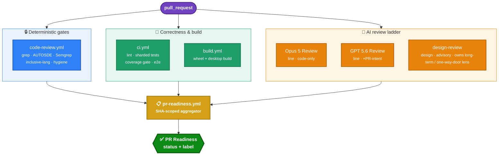
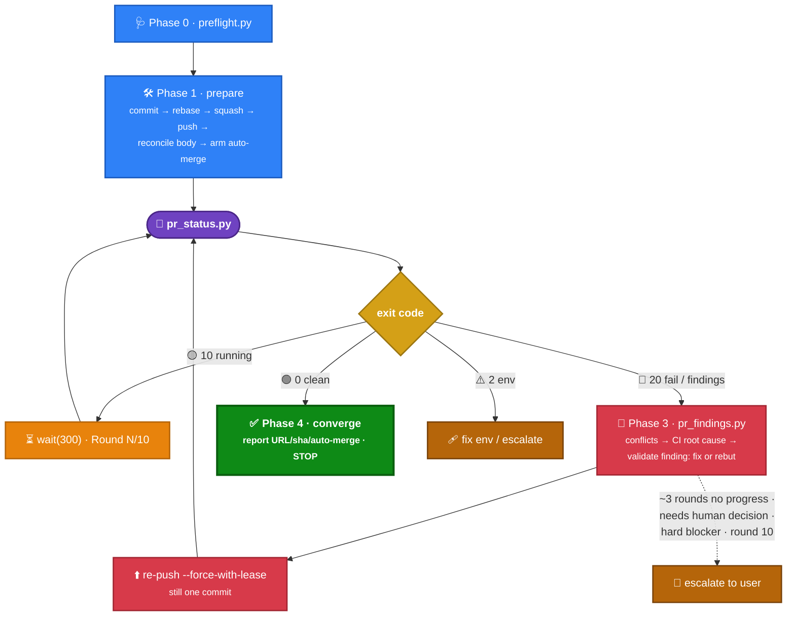

# KiroCrew CI & Prepare-PR — How It Works

_Source of truth: `.github/workflows/*` on `main` (@ `9dd99f97`, incl. PR #549's AI-review de-noise) and the `prepare-pr` skill._

This doc explains (1) the overall shape of KiroCrew's CI, (2) the purpose and design of each workflow — with emphasis on the four AI reviewers — and (3) how the `prepare-pr` skill drives a change to review-ready by working *with* CI, including how the whole system resists over-engineering.

---

## 1. Overall structure

CI is a **fan-out of many independent workflows that a single aggregator folds into one verdict.** There are five layers:



Plus two out-of-band layers not on the PR path:
- **Release / publish** (`release`, `build-wheel`, `build-desktop`, `publish-cli`, `publish-linux`, `sign-and-notarize`, `nightly`, `pages`) — triggered by tags/schedules, never gate a PR.
- **Maintenance** (`ship-report`, `cleanup-temp-screenshots`, `test-durations`) — scheduled housekeeping.

Two structural facts that explain everything else:
- **`main` has ZERO required status checks.** Every gate can go red, but nothing GitHub-*blocks* a merge. The real gate is **human approval + armed auto-merge**. Red checks are strong signals a human can override.
- **Fork PRs run no secret-bearing workflow.** The AI reviewers + CodeQL need OIDC/Bedrock creds, so fork PRs fail closed on those. Because CI + Build + Code Review alone are not full validation, a fork PR does **not** pass readiness — it terminates at a dedicated red `readiness: maintainer review` (`PR Readiness` = failure), which (as a required check) blocks an accidental merge until a maintainer reviews manually or re-runs validation from a trusted in-repo branch.

---

## 2. Purpose & design of each workflow

### 2a. Deterministic pre-gate — `code-review.yml` ("Code Review")

The grep-based half of the AUTOSDE rules — no model, no secrets, so it's safe on forks and always runs.

- **`autosde-rules`** — blocks unambiguous frontend violations (inline `<svg viewBox>` except brand-mark files like `KiroGhost.tsx`/`*Logo.tsx` — the PR #511 exception; `onClick` without `role`; `.innerHTML =`; Mermaid `securityLevel:'loose'`; oversized page wrappers) and backend keystones (sensitive-path reads not routed through `is_sensitive_path()`; `denied_commands.json` floor; bare `bool()` on opt-out fields — `bool("false")` is truthy).
- **`inclusive-language`** — `woke` (SHA-pinned) on added lines, fails only on `(error)` severity.
- **`sast`** — Semgrep `1.78`, diff-only, `p/python p/typescript p/security-audit p/secrets`, `--error` (**blocking**).
- **`dep-audit`** — pip-audit + npm audit, `continue-on-error` (advisory).
- **`pr-hygiene`** — Conventional-Commits title regex + single-commit enforcement (`rev-list --count == 1`), both blocking.

The semantic cases a grep can't express are delegated to the Opus line reviewer.

### 2b. Correctness — `ci.yml` ("CI")

Primary correctness gate. Blocking jobs:
- **`scrub-lint`** — fails on any Amazon-internal marker in the public tree (this is a public repo).
- **`backend-lint`** — `isort`/`flake8`/`mypy` on Python 3.10 + 3.12 (`black --check` currently disabled).
- **`backend-test`** — 3.10×3.12 × 4 shards (8 jobs), pytest-split duration-balanced via `.test_durations`, coverage collected only on 3.12. Plus **`backend-test-windows`** (windows-latest, 4 shards, `--no-cov`).
- **`backend-test-sandbox`** (added in **PR #549**) — runs the two suites the sharded matrix *deselects* because they need unprivileged user namespaces (`unshare` `NEWNS`): `test_script_hooks.py` + `test_cron_script.py`. It enables `kernel.apparmor_restrict_unprivileged_userns=0`, then **fails loudly** (`unshare --mount --map-root-user true`) if the runner ever stops allowing the namespace — rather than letting the suite silently skip and the gate go green having asserted nothing. This is what gives the `hooks.py` sensitive-path keystone real CI coverage. (`test_run_aim_path` stays deselected everywhere — it needs the Amazon-internal `aim` CLI absent from this fork.)
- **`coverage-combine` → `coverage-gate`** — combines shard coverage, then enforces **backend ≥ 70%, frontend ≥ 60%** on raw line-rate. Runs `if: always()` and fails unless both upstreams succeeded, so a skipped required check can't count as satisfied (fail-closed).
- **`frontend-lint`** — `tsc -b`, `eslint --max-warnings 1116` (a ratchet baseline — do not raise), `jscpd`.
- **`frontend-test`** — `vitest run --coverage`.
- **`e2e`** — offline Playwright run against a stubbed ACP backend (`KIROCREW_E2E_REQUIRE=1`), no model cost.
- **`cfn-lint`** ("CloudFormation Lint") — lints the artifact-deploy templates; #549 SHA-pinned its actions and pinned `cfn-lint==1.22.3` so an unpinned lint tool can't silently shift the gate's behaviour on each upstream release.

_CodeQL is not a checked-in workflow — it runs via GitHub default-setup and is referenced only by pr-readiness._

### 2c. Build — `build.yml` ("Build")

PR-time proof the artifacts still build (no publishing): **`build-wheel`** (build → `pip install dist/*.whl` → `kirocrew --version` smoke) and **`build-desktop`** (macOS + Linux Electron build, unsigned).

### 2d. The AI review ladder

Four reviewers, each with a distinct question and a distinct trust posture. The key design axis is **what each is allowed to read** (prompt-injection surface) and **whether it can block**.

| Reviewer | Model / harness | Reads | Question it answers | Can block? | Fail posture |
|---|---|---|---|---|---|
| **Opus 5 Review** | Opus 5, agentic (makes its own tool calls), 1 pass (2nd only for security/data-integrity paths); `--max-turns 60`, 30-min timeout | **CODE ONLY** — `Read/Grep/Glob/gh pr diff`; **no `gh pr view`/`gh api`**, and (since #549) **no `gh pr comment`** | Line-level correctness/security/AUTOSDE | Yes | **Fail-closed** |
| **GPT 5.6 Review** | GPT 5.6, non-agentic single-shot, **2-pass** (discovery → authoritative **falsification**); `reasoning_effort: medium` | Code + **PR title/description as nonce-wrapped UNTRUSTED context** (no prior-round context — removed in #549) | Line-level (2nd perspective) **+ description↔diff consistency** (advisory) | Yes | **Fail-closed** |
| **Design Review** (`design-review`) | Fable 5, agentic | Code + `gh pr view` (must judge intent) | **Should we build this? Is it the right *shape*?** | No (advisory) | **Fail-open/neutral**, red only on genuine BLOCK |

Cross-cutting design details:

- **Why Opus 5 is code-only:** it's the *write-capable agentic* reviewer, so pulling attacker-controllable PR title/description/comments into its context is a prompt-injection surface. That responsibility (PR-intent + description-vs-diff mismatch) is deliberately handed to the **read-only, non-agentic** GPT 5.6 reviewer, which treats that prose as **UNTRUSTED evidence, never authority to waive a code finding.**
- **One shared binary contract (reworked in #549):** both line reviewers now run the *same* review contract — **DIVISION OF LABOUR → FINDING BAR → WHAT BLOCKS → FIX BAR → BUDGET → CALIBRATION** — and severity encodes exactly one thing: *does this block the merge*, **never confidence**. There is **no "possible issue" tier** — a finding must state (a) a concrete input/condition that occurs in practice, (b) the call path to the changed line, (c) an observable wrong outcome; anything "could / might / if a caller were to" is **NOT A FINDING** (silence is the correct output). Only two labels exist: **BLOCKING** (on the closed **WHAT BLOCKS** list — a `blocking:true` AUTOSDE violation on a changed file, or a reachable+concrete residual-class defect) and **FINDING** (advisory, never blocks). The **FIX BAR** kills over-engineering demands at the source (see §4), and a **BUDGET** caps each review at ≤2 BLOCKING findings; "No findings." is the expected output for a typical PR.
- **De-noise (#549):** Opus 5 no longer posts inline line comments — the agent lost `gh pr comment`, and a *CI step* upserts a **single** hidden-marker-keyed summary captured from the run transcript. The gate blocks solely on the SHA-scoped `[BLOCK-MERGE]` marker, with **no text backstop**. This trades scattered inline chatter for one terse, punchline-first summary plus a binary gate.
- **Asymmetric multi-pass is intentional, not inconsistent:** the agentic Opus 5 reviewer runs ONE pass over the diff with two internal phases — DISCOVER (generous candidate collection) then FALSIFY (kill each candidate against code it opened; extra falsification effort only on security/data-integrity paths). The lean single-shot GPT 5.6 reviewer runs **two** real invocations — a **discovery** pass that generates candidates, then an **authoritative falsification** pass whose primary job is to *kill* those candidates (a candidate survives only if pass 2 re-derives input + call path + observable outcome from code it opened itself). #549 replaced the old third "find what pass 1 missed" pass — a recall ratchet that only ever *added* candidates — with this falsification pass; pass 2 is the only gated verdict.
- **Verdicts are structured markers, not free prose:** both line reviewers emit SHA-scoped text markers — Opus 5 `[OPUS-REVIEWED] <sha>` always and `[BLOCK-MERGE] <sha>` only when a blocking finding exists (captured from the action's `execution_file` transcript; the old `--json-schema` `structured_output` path was retired because claude-code's StructuredOutput tool refuses to fire when other tools are enabled, failing the gate on healthy reviews), and GPT 5.6 `[GPT-REVIEWED] <sha>` / `[BLOCK-MERGE] <sha>` — **the markers are the only gate**; #549 downgraded the old "`Severity: HIGH` without `[BLOCK-MERGE]`" coherence check from fail-closed to a non-gating **advisory warning** (it mis-fired whenever the model quoted prior text). Design emits `Design-Verdict: PASS|CONCERNS|BLOCK`.
- **Security guards:** explicit fork guards (`head.repo.full_name == github.repository`), `persist-credentials:false`, least-privilege Bedrock roles assumed *late* (after npm install so it never sees creds), read-only network-unshared sandboxes, and post-run redaction of AWS key/ARN/account shapes before any public comment.
- **Human override** (`ai-review-human-override.yml`): a repo writer can post `/ai-review override <fable|gpt|all> <head-sha>: <reason>`. It runs from the trusted default branch, validates target + 7-40-hex sha + writer permission + **commit freshness** (sha must be current head), then records a bot-authored marker the reviewers trust. Scope is **this commit only** — a new push needs a new judgment.

### 2e. Long-term / one-way-door judgment (now in Design Review)

The separate `longterm-arbiter` (and its fork mirror `fork-arbiter`) have been **retired**. A second-order reviewer that re-judged the other reviewers' *comments* over a `workflow_run` chain was low-yield (it blocked almost nothing) and structurally could not work for fork PRs -- the fork head SHA does not survive the extra `workflow_run` hop, so it never resolved which PR it was for (it only ever skipped or self-cancelled). Its one lens -- *is a sub-threshold finding a one-way door we'll regret?* -- now lives **directly in Design Review** as gate **8. LONG-TERM REVERSIBILITY** (in both `design-review.yml` and `fork-design-review.yml`), where the reviewer already has full diff context. It stays **advisory**: Design Review flags an unsafe one-way door prominently (its primary BLOCK trigger) but, like all of Design Review, does **not** hard-block the merge -- a human decides. This covers same-repo and fork PRs identically with no cross-workflow head-passing.

### 2f. The aggregator — `pr-readiness.yml` ("PR Readiness")

Executes no tests. It resolves the PR's current head SHA, **drops stale events**, collects the latest run per required workflow, and folds them into **one `PR Readiness` commit status + one `readiness:` label** (`passed` / `checking` / `action required`).

- **Always required:** CI, Build, Code Review.
- **Non-fork also required:** CodeQL, Opus 5, GPT 5.6.
- **Design Review is completion-required but advisory** — its verdict/infra failures score as `"(advisory)"` and never independently block (it owns the advisory long-term / one-way-door lens).
- **Forks skip** CodeQL + all four bots.
- **Refreshes on re-run (#549):** it now triggers on `workflow_run` `requested` / `in_progress` / `completed` (was `completed` only). When a monitored workflow flips *back* to running — most commonly a reviewer re-run after a human override — the job re-evaluates *while* that workflow runs: the live-queried workflow buckets into `pending`, so the label honestly drops from a stale `action required` (red) back to `checking` (yellow) instead of freezing on the previous commit's verdict. It stays cheap: the `pr+sha` concurrency group (`cancel-in-progress`) collapses the burst of near-simultaneous fires into one live evaluation.

---

## 3. Prepare-PR — and how it rides CI

The `prepare-pr` skill drives whatever is in the working tree to **review-ready** (one clean commit, PR open, all required checks green, no open legitimate Critical/High findings). It **never merges** — it only *arms* GitHub auto-merge so the PR lands after a human approves and checks are green.

### 3a. Phase flow

- **Phase 0 — Preflight** (`preflight.py`): repo/branch/base/auth/dirty/divergence/existing-PR. `0` proceed · `30` blocker (usually: on protected branch → `git switch -c <type>/<slug>`) · `2` env.
- **Phase 1 — Prepare:** commit (specific files, Conventional-Commits subject) → `git rebase origin/<base>` → **squash to one commit** (`git reset --soft origin/<base> && git commit`) → **mandatory pre-submit review** (fan the diff to two independent read-only subagents, fix verified Critical/High locally, one focused verifier) → push (`-u` first, `--force-with-lease` after own squash) → **reconcile the description with the diff (mandatory)** → create/update PR → arm auto-merge.
- **Phase 2 — Poll** (full loop only, max 10 rounds ~5 min): loop on `pr_status.py`.
- **Phase 3 — Triage & fix** (on exit 20): `pr_findings.py`, then fix in order — conflicts → CI/build/test root cause → review findings — re-push (still one commit), and **record GPT dispositions before the next push** (§3d).
- **Phase 4 — Converge or escalate:** on `pr_status.py`=0 report URL/sha/auto-merge state and stop; escalate early if convergence stalls.

> **Which skill version:** the authoritative `prepare-pr` skill lives in-repo at `skills/kirocrew-dev/prepare-pr/` with **Python** scripts (`preflight.py`, `pr_status.py`, …). The pre-submit-review and disposition steps below were added in **PR #528**; **#549 later removed the reviewer-side consumption of the disposition record** (see §3d — the comment is now a human-only audit trail). An older Bash (`.sh`) copy may still be installed under `~/.kiro/crew/skills/prepare-pr/` — treat the in-repo Python skill as source of truth.

### 3b. How it integrates with CI — the exit-code contract

The skill's design principle is **script-first / deterministic exit codes** — *"decisions come from script exit codes, not eyeballing."* The AI only engages on a red signal; yes/no gates ("round complete? clean? blocked?") are decided by scripts, not model judgment. `pr_status.py` is the loop driver:

```
0  → FINISHED and CLEAN  (all checks green, no unresolved threads)   → Phase 4 converge
10 → still RUNNING       (a required check queued/in_progress)       → wait(300) & re-poll
20 → FINISHED with FAILURES or unresolved review findings            → Phase 3 drill in & fix
2  → env error           (gh missing / not authed / no PR)           → fix env or escalate
```

`pr_status.py` makes one `gh pr view … --json statusCheckRollup,reviewDecision,…` call and normalizes the mixed CheckRun/StatusContext rollup **in Python** (`json.loads`, no `jq`) into `running` / `failing` counts, plus a `gh api graphql` `reviewThreads` query counting `isResolved==false`. Its ordered logic — *any running → 10; else any failing → 20; else any unresolved thread → 20; else 0* — is exactly what maps CI's fan-out (§1) back to a single agent action. This is the client-side mirror of what `pr-readiness.yml` does server-side.



A **round is only complete when every required check has finished AND every bot has posted** — acting on a half-finished round means fixing a moving target. On exit 20, `pr_findings.py` pulls failing-log tails (`gh run view <run-id> --log-failed`) and unresolved threads as `path:line [author] body`.

**Auto-merge** (`enable_automerge.py`, default `--squash`, matching the single-commit invariant) is idempotent and does *not* merge now — GitHub completes the merge only after required checks are green **and** `reviewDecision=APPROVED`, so the human gate is preserved. Exit `20` (auto-merge disabled / no branch-protection rule / no permission) is a non-blocking note.

**Round cap = 10** (unconditional backstop), but **escalate early** the moment convergence stalls: ~3 rounds with no drop in failing-check / open-Critical-High count, a finding needing a human/product/design decision, or a hard external blocker (infra/permissions, a check that never runs).

### 3c. The PR description contract

Reconciled against the diff before **every** publish (Phase 1.5), driven by `diff_signals.py` (flags deps/lockfiles/migrations/CI/deletions/config as `⚠`). Five sections — body must be **complete** (covers every `⚠`) and **accurate** (no claim the diff doesn't support):

1. **Problem** — the concrete symptom.
2. **Why it matters** — impact if unfixed.
3. **Fix (symptom → root cause → change)** — chain of thought, so the reader sees *why this is the right fix*.
4. **Tests** — what each added/updated test locks in.
5. **Manual verification** — steps where unit tests fall short, or "N/A — unit coverage sufficient" with a one-liner.

This contract is not busywork: it's the exact input the **GPT 5.6 reviewer** and **Design Review** read to judge description↔diff fidelity and scope. A body that overclaims triggers a real finding.

### 3d. Reducing repeat findings — shift-left review (PR #528, simplified in #549)

The most expensive failure mode is not a *wrong* review — it's a review that keeps **re-litigating settled points** round after round. #528 first attacked this with a three-mechanism *cross-round convergence* design; **#549 then removed the two GPT 5.6-side mechanisms**, leaving the cheaper and more robust half. Model the cost of the review loop as `rounds × (CI latency + model latency + human attention)`.

**The surviving lever — pre-submit dual-subagent review (shift-left), which cuts the round *count*.** Before the *first* push, `prepare-pr` fans the finished diff out to **two independent read-only subagents** that review under the *same* severity/blocking contract as the GitHub reviewers; verified Critical/High are fixed locally, then **one focused verifier** confirms. A GitHub round costs CI spin-up + model latency + a re-push (~5+ min); every blocker caught locally is a round never paid for, so round 1 on GitHub starts from an already-cleaned diff — collapsing `push → wait → findings → fix → push → wait` into `local-review → fix → push → (likely green)`. Medium/Low advice is deliberately *not* acted on here, so pre-review can't become scope growth. This mechanism lives entirely in the skill and is unaffected by #549.

**What #549 removed — GPT 5.6's cross-round memory.** #528 had also added two GPT 5.6-side pieces: (2) `prepare-pr` posted a `<!-- ai-review-disposition target=gpt -->` comment recording each finding as `fixed`/`rebutted`/`accepted`, and (3) a **third GPT 5.6 pass** ingested a ~24KB bounded bundle of prior-round review + writer dispositions and reconciled it under a "a new SHA is not a delta" rule. #549 **deleted both the 24KB prior-context injection and the third pass** (GPT 5.6 is now the stateless 2-pass discovery→falsification reviewer of §2d). The rationale: carrying prior-round prose back into the reviewer was a standing prompt-injection surface for little gain, and the new **falsification pass** raises precision *within a single run* rather than needing round-to-round state. GPT 5.6 is now stateless like Opus 5 — every review judges only the current SHA's code.

> **Skill/workflow drift to watch:** the in-repo `prepare-pr` skill still emits the `ai-review-disposition` comment (Phase 3). With #549, **no reviewer consumes it anymore** — it survives only as a human-readable audit trail of how each finding was handled, not as machine-read continuity evidence. Treat that skill step accordingly until it's reconciled.

**Why the simplified design still converges.** The heavy lifting was always the shift-left pre-submit review (fewer rounds to begin with) plus `prepare-pr`'s own severity gate — validate each finding, fix true Critical/High, rebut false positives with evidence, never silently appease — and its **escalate-on-stall** circuit-breaker (~3 rounds without progress → hand off). Stateless per-SHA reviewers can't contradict themselves across rounds *because they hold no cross-round state to contradict*; a rebutted-but-correct point simply won't recur unless the *code* changes to reopen it. The single **`PR Readiness`** status (§2f) closes the loop with one trustworthy "is this SHA done?" answer — now also honestly reverting to `checking` on a reviewer re-run — so nobody eyeballs 35 checks to decide when to stop.

---

## 4. Special topic: how the system avoids over-engineering

AI-native coding skews toward over-engineering — extra layers, abstractions, config knobs, defensive scaffolding — and naïve AI reviewers *compound* it by demanding still more mechanisms, creating infinite review loops. KiroCrew counters this at every layer:

- **Line reviewers (Opus 5 + GPT 5.6) share an identical FIX BAR:** *"every finding must carry a fix expressible as an edit to lines THIS PR changed. If the fix would need a new function, module, abstraction, config knob, dependency, or an edit to untouched code, it is out of scope for this bot: DROP THE FINDING. The absence of a mechanism is never a finding. Prefer deleting or simplifying code over adding anything."* This makes "add mechanism X" structurally un-reportable — the demand fails the FIX BAR before it can become a finding. A scope cap complements it — **Opus 5** stays within "the evident scope of *this diff*" (code-only), **GPT 5.6** within "the PR's stated purpose" (it reads the description and flags a description↔diff mismatch as an **advisory FINDING**, never a block).
- **A strict, closed WHAT BLOCKS list:** *"exhaustive — never extend it, never reason by analogy, there is no 'and other serious issues' clause."* A finding blocks *only* if it is (1) a `blocking:true` AUTOSDE-rule violation on a changed file (or this PR weakening/removing such a rule), or (2) a **reachable and concrete** residual-class defect — a security hole with a named trigger, a crash/data-loss/corruption on a path this diff changes, or a removed guard with no compensating replacement. There is **no "possible issue" tier**: severity answers only *does this block the merge* and never encodes confidence, so anything "could / might / if a caller were to" is **NOT A FINDING**. A per-review **BUDGET of ≤2 BLOCKING findings** and a **CALIBRATION** note ("No findings." is the expected output for a typical PR) further resist manufactured escalation. Style / naming / speculative-perf / hypotheticals never block.
- **Design Review's Suggestions must be proportionate:** *"NEVER recommend extra layers, abstractions, or future-proofing the problem does not require (over-engineered suggestions become new surface a later review flags)."* It also carries the **Design-Simpler-Alternative** ethos — actively flag when a materially simpler solution exists — but always **advisory**, never raising the verdict to BLOCK. Its tie-breaker: *"when torn between BLOCK and CONCERNS, choose CONCERNS… Only reach for BLOCK when the DESIGN is wrong — never merely because the change is large."*
- **Design Review's long-term lens enforces it by omission:** everything reversible (architectural erosion, maintainability, "should eventually be refactored") is advice / non-blocking follow-ups; it flags one-way doors and concrete long-term harm prominently, but advisory. *"The author does NOT need a perfect or complete solution in THIS PR."*
- **prepare-pr's severity gate closes the loop:** it validates each finding's legitimacy first — fix true Critical/High, **rebut false positives with evidence rather than appeasing them by changing correct code**, defer Low/nits. Combined with single-commit + description reconciliation, this keeps a PR converging on its stated purpose instead of accreting scope round over round.

Net: expensive/irreversible risk blocks; everything else is advice a human can take or defer — the design deliberately refuses to let "more mechanism" be a blocking demand.
