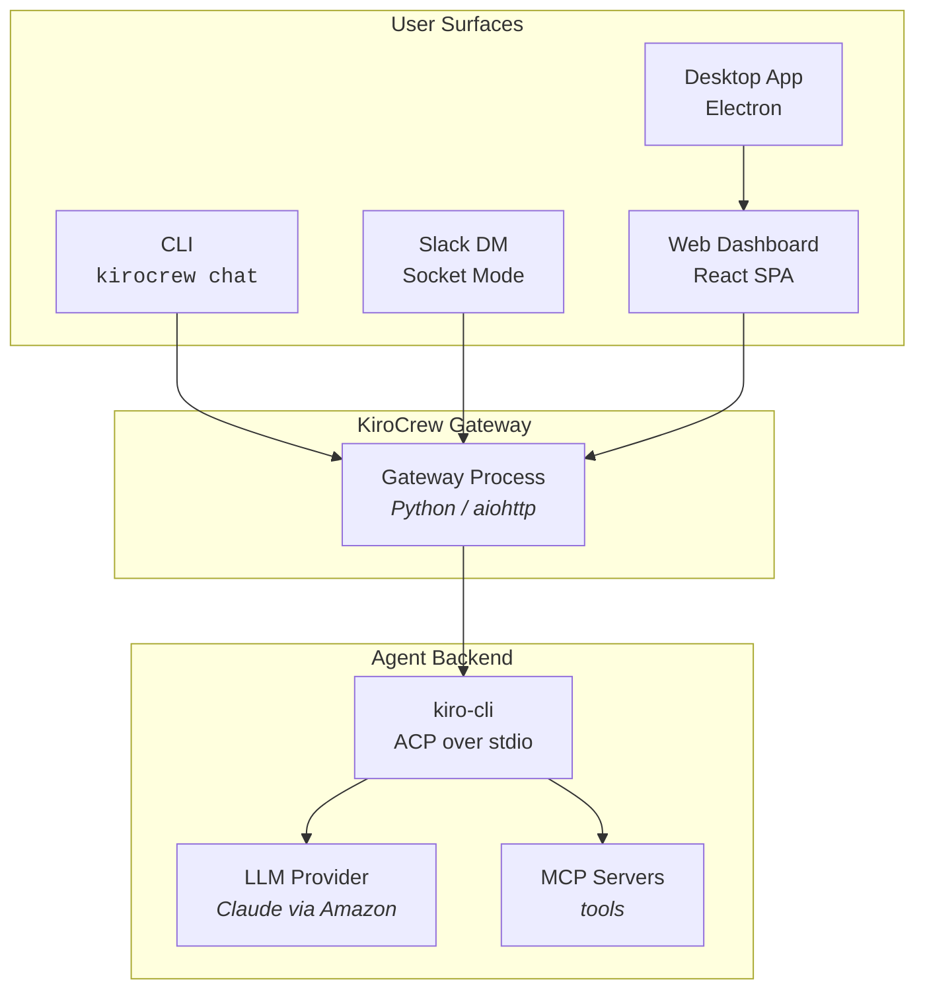
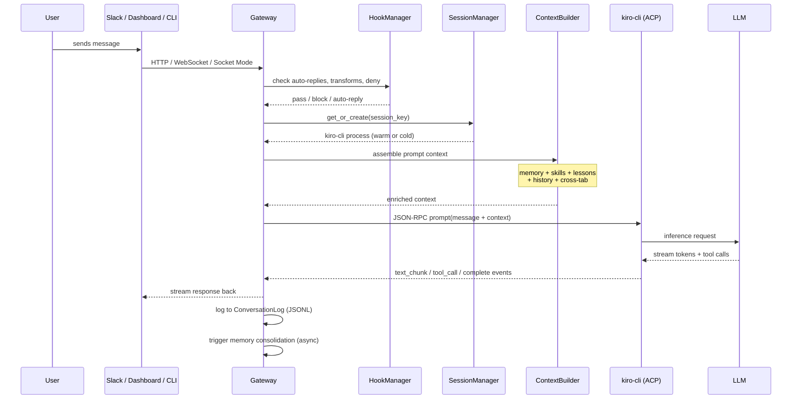
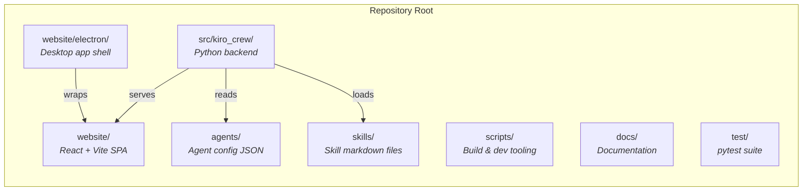
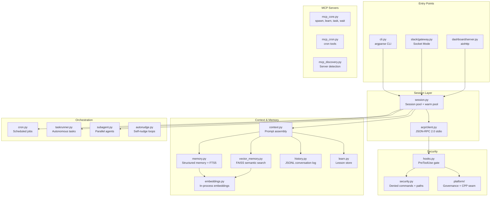
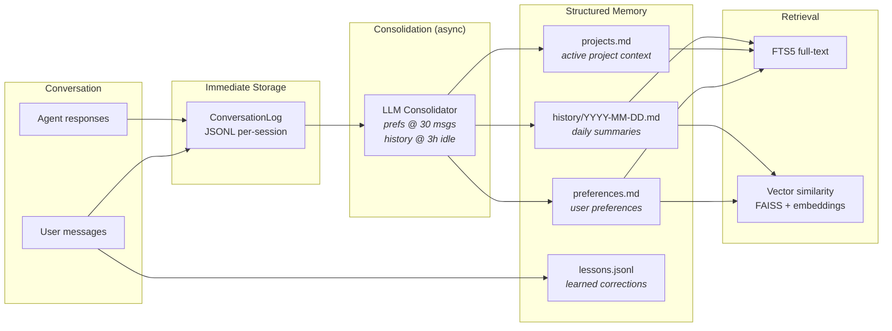
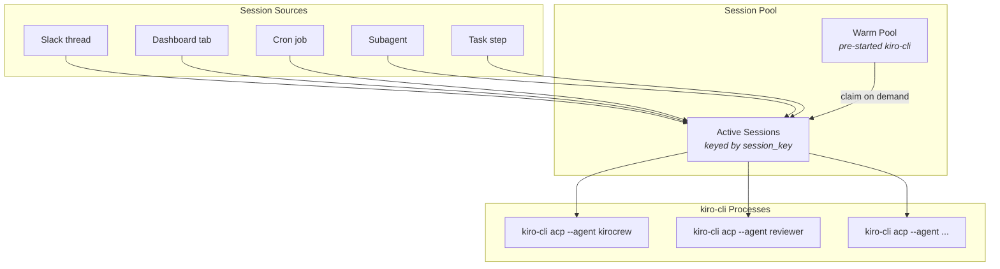
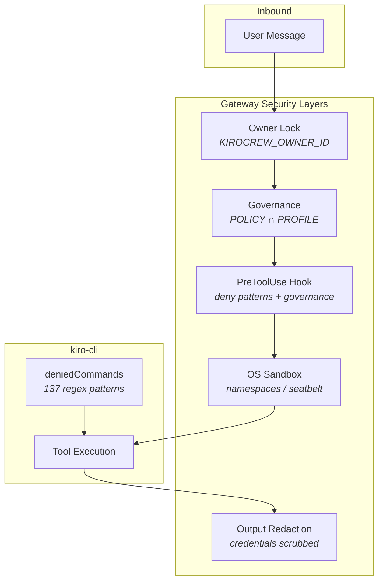
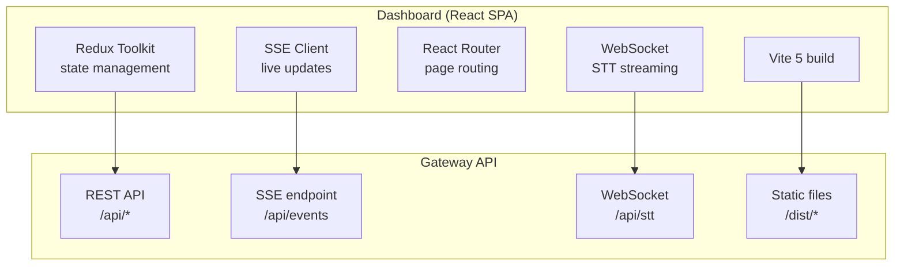
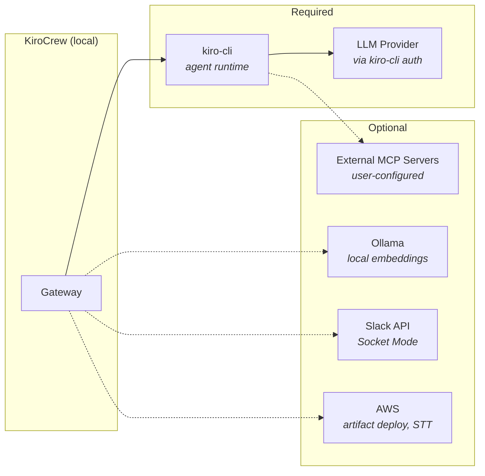
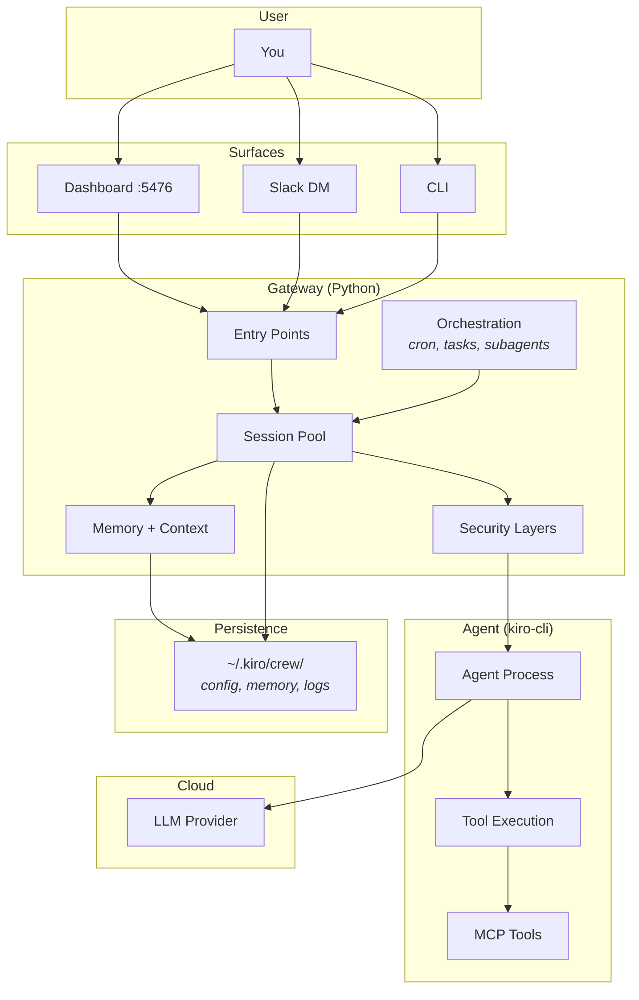

# Project Architecture

This document describes how KiroCrew is structured, how its components interact,
and where external dependencies live. For the feature list, see
[features.md](features.md). For getting started, see
[getting-started.md](getting-started.md).

---

## High-Level Overview

KiroCrew is a gateway that sits between user-facing surfaces (CLI, Slack, web
dashboard) and the kiro-cli agent backend. It adds session management, memory,
scheduling, and a web UI on top of kiro-cli's raw agent capabilities.



## Message Flow

A user message travels through the gateway, gets enriched with context (memory,
skills, lessons), is forwarded to kiro-cli, and the streamed response flows back
to the user surface.



## Repository Layout



| Directory | Purpose |
|-----------|---------|
| `src/kiro_crew/` | Python backend — gateway, sessions, memory, cron, MCP servers |
| `website/` | React + TypeScript + Tailwind dashboard (Vite 5) |
| `website/electron/` | Electron desktop app wrapper |
| `agents/` | Agent configuration (`defaults.json`, `prompt.md`) |
| `skills/` | Skill definitions (markdown, editable without rebuild) |
| `scripts/` | Build tooling, linters, and dev-helper scripts |
| `docs/` | User and developer documentation |
| `test/` | pytest test suite |
| `packages/` | Standalone SDK packages (`kirocrew-client-py`) |

## Backend Component Map

The Python backend (`src/kiro_crew/`) is organized around these core subsystems:



## Data Flow: Memory Lifecycle

Memory is KiroCrew's persistence layer — it lets new sessions benefit from past
conversations without replaying them.



**Decay schedule:** 3 days full → 30 days summary → 90 days marker → pruned.

## Session Management

The gateway manages a pool of kiro-cli processes. Each session is an independent
ACP connection with its own context and conversation history.



- **Warm pool** — pre-spawned sessions for instant response (configurable `session.pool_size`)
- **Idle timeout** — sessions reclaimed after `session.timeout_secs` (default 1800s)
- **Circuit breaker** — 5 consecutive failures → auto-reset
- **Crash recovery** — kiro-cli dies → auto-recreate with state

## Security Architecture



Layers (outer to inner):
1. **Owner lock** — Slack gateway rejects non-owner messages
2. **Governance** — two-level policy ceiling (`POLICY ∩ PROFILE`, tightest-wins)
3. **PreToolUse hook** — denied commands + sensitive path blocking
4. **OS sandbox** — filesystem isolation of credential directories
5. **Denied commands** — 137 regex patterns in kiro-cli config (tamper-resistant)
6. **Output redaction** — credential patterns scrubbed before delivery

## Frontend Architecture



- **Build:** Vite 5, React 18, TypeScript, Tailwind CSS
- **State:** Redux Toolkit with SSE-driven updates
- **Bundled:** production build staged into `src/kiro_crew/static/dist/` and served by the Python backend
- **Desktop:** Electron wraps the same SPA with multi-tab WebContentsView

## External Dependencies



| Dependency | Required? | Purpose |
|-----------|-----------|---------|
| **kiro-cli** | Yes | Agent runtime — LLM inference + tool execution |
| **LLM Provider** | Yes | Claude (via kiro-cli's authenticated connection) |
| **Ollama** | No | Local embeddings for memory/knowledge search (bundled runtime available as fallback) |
| **Slack** | No | Slack bot gateway (dashboard works without it) |
| **AWS** | No | Artifact deploy, optional cloud STT |
| **External MCP servers** | No | Additional tools (user-configured) |

## Data Home

All persistent state lives under `~/.kiro/crew/` (or `KIROCREW_HOME`):

```
~/.kiro/crew/
├── config.json          # user configuration
├── .env                 # Slack tokens, owner ID
├── workspace/
│   ├── memory/          # preferences.md, projects.md, history/
│   ├── lessons.jsonl    # learned corrections
│   └── knowledge/       # ingested documents (FTS5 + vectors)
├── conversations/       # JSONL session logs
├── crons.json           # scheduled jobs
├── instances.json       # remote instance registry
├── hooks.json           # webhook workflow context
├── audit.log            # bash command audit trail
└── agents/              # generated kiro-cli agent configs
```

## How It All Fits Together



---

## Further Reading

- [features.md](features.md) — complete feature list
- [getting-started.md](getting-started.md) — installation and first steps
- [security-deep-dive.md](security-deep-dive.md) — security model in depth
- [memory-architecture.md](memory-architecture.md) — memory system design
- [mcp-architecture.md](mcp-architecture.md) — MCP server management
- [design-doc-kirocrew.md](design-doc-kirocrew.md) — historical design narrative
