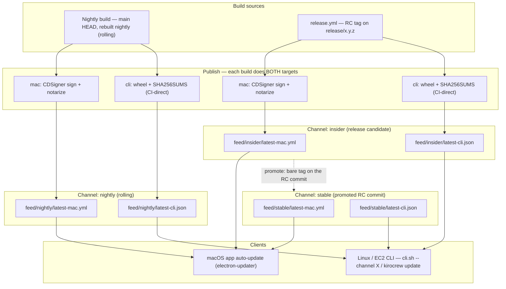

<!-- Modified 2026 by Sereja Ris for VibecodersCrew (community fork of Kiro Crew). See NOTICE and CHANGELOG.md. -->
# KiroCrew Release Automation

> **Upstream reference only.** The community Codex fork does not run these
> Amazon signing/CDN workflows. It publishes source-only GitHub prereleases as
> documented in [CONTRIBUTING.md](../CONTRIBUTING.md#releasing-new-versions),
> and its desktop auto-updater is disabled.

Operational reference for the three-channel release pipeline:
nightly → insider → stable.

Companion docs: **CONTRIBUTING.md → "Releasing New Versions"** owns the
human process (release branches, RC numbering, promotion, back-merge);
**docs/release-process-design.md** records the design rationale and the
platform-lane contract. This file documents what the pipeline does.

## As built (authoritative, 2026-08-01)

This section is the contract. An earlier revision of this file carried a
~440-line original design below it — a release-branch automation model
(`beta-cut.yml`, `beta-hotfix.yml`, `promote-stable.yml`, `rollback.yml`), a
Feed Lambda writing `latest-*.json` on S3 PUT, a `blocked-versions.json`
force-update gate, and an `updates.kirocrew.dev` hostname. **None of it was
built, and parts of it are now contradicted by product decision** (see
"Superseded design" at the end). It was removed rather than left in place:
readers were finding those workflow names and that rollback procedure and
taking them for the process.

**Channels and triggers (as built):**

| Channel | Trigger | Workflow |
|---------|---------|----------|
| nightly | schedule (06:00 UTC) + manual dispatch on `main` | `nightly.yml` |
| insider | push of a prerelease tag (`v0.2.0-insider.1`, `-rc.N`, …) | `release.yml` |
| stable  | push of a bare semver tag (`v0.2.0`) | `release.yml` |

Channel is derived from the tag; versions are stamped with seconds
precision on nightly (`0.1.0-nightly.YYYYMMDDHHMMSS`) so no published key
is ever overwritten.

**The release branch and RC promotion are human process, not automation.**
Feature releases are cut as a `release/x.y.z` branch off `main` on 0.1
increments; fixes for that release land on the branch (not `main`) and each
is tagged as a new RC to insider; stable is the last good RC **promoted by
tagging its commit**, never rebuilt; hot patches bump the patch digit from
the same branch. After a stable cut, `main` is bumped by 0.1 and the
branch's fixes are merged back. The pipeline has no knowledge of any of
this — it only reacts to a pushed tag, which is why there is no
`beta-cut.yml`, `beta-hotfix.yml`, or `promote-stable.yml`. See
CONTRIBUTING.md → "Releasing New Versions" for the process itself.

There is no `rollback.yml` and no rollback mechanism: **we roll forward by
cutting a new version.**

**Buckets (as built) — two, not one:**

- `kirocrew-signing-artifacts-…` (PRIVATE, signing trust domain only):
  `pre-signed/` → `signed/` (CDSigner output) → `notarized/` (archive)
- `kirocrew-updates-…` (private + CloudFront OAC, public trust domain):
  `cli/{channel}/{version}/`, `desktop/{channel}/{version}/`,
  `feed/{channel}/latest-mac.yml` (+ `latest-linux.yml`), served at
  `https://updates.crew.kiro.dev` (pointers: feeds, pip index) and
  `https://download.crew.kiro.dev` (artifact bytes) -- aliases of the
  same distribution; the auto-assigned
  `https://d28nxu9if70cmc.cloudfront.net` keeps working

**Feed (as built) — static electron-updater channel files, no Lambda:**
`sign-and-notarize.yml` writes `feed/{channel}/latest-mac.yml` directly
after the spctl gate, and the Linux lane writes
`feed/{channel}/latest-linux.yml` for the AppImage. There is still no
Feed Lambda, no S3-event trigger, no 200/204 endpoint, and no CloudFront
Function query routing: the client (`auto-update.js`, electron-updater)
fetches the static YAML and compares versions CLIENT-SIDE
(difference-based, so a feed repointed at an older version is offered),
engaging the platform installer (Squirrel.Mac on macOS, AppImage
replacement on Linux) only on a version delta. Schema (electron-updater
metadata):

```yaml
version: 0.1.0-nightly.20260721061155
files:
  - url: https://download.crew.kiro.dev/desktop/nightly/0.1.0-nightly.20260721061155/KiroCrew.zip
    sha512: <base64>
path: https://download.crew.kiro.dev/desktop/nightly/0.1.0-nightly.20260721061155/KiroCrew.zip
sha512: <base64>
releaseDate: '2026-07-21T06:22:13Z'
```

The yml is served from the pointer host (`updates.crew.kiro.dev`) while
`files[].url` points absolutely at the byte host
(`download.crew.kiro.dev`), preserving the pointer/bytes split. The file
URL is the update payload (zip on macOS, AppImage on Linux);
electron-updater verifies its base64 `sha512` fail-closed before
install. The first-install DMG for humans/website links is not part of
the feed — it has its own `desktop/{channel}/latest/KiroCrew.dmg`
permalink.

**The feed object MUST carry `Cache-Control: public, max-age=300`** (asserted
fail-closed right after the write by `curl -I` through the public CDN — not
`s3api head-object`, since the publish role is Put-only on `feed/*`; same
convention as `publish-linux.yml`'s byte compare). The `feed/*`
CloudFront behavior is `CACHING_DISABLED` (KiroCrewPublishCDK,
`lib/distribution-stack.ts`), so the **edge** never caches a feed — but a
cache policy governs CloudFront's own storage and does **not** add a
`Cache-Control` response header, and nothing else in the distribution injects
one. A feed written without it therefore reaches clients with no freshness
metadata at all, and CFNetwork applies *heuristic* caching (roughly 10% of
the object's age, so a day-old feed earns itself hours of "fresh").
Squirrel.Mac fetches the feed through `NSURLCache`, so a header-less feed let
the desktop app resolve a ~22h-old entry and offer to "update" to the version
already installed, while the app's own cacheless fetch saw the new one — a
purely client-side staleness bug, with the edge always going to origin.

`max-age=300` is the release-feed norm (Signal Desktop's `latest-mac.yml`, on
the same S3+CloudFront shape, uses exactly this) and bounds client-side
staleness on a mutable pointer at 5 minutes. The CLI feed
(`latest-cli.json`) uses `no-cache` instead — it is polled far less often, so
revalidating every time costs nothing there.

`auto-update.js` additionally appends a unique `?_=<stamp>-<n>` cache-bust
per check, which defeats `NSURLCache`. That is not for the 5-minute window;
it exists because Squirrel offers no way to set a cache policy on its
request, so an already-shipped build with a poisoned cache entry has no
other escape.

**macOS artifact flow (as built), all channels via `sign-and-notarize.yml`** (which folds the CDSigner sign job and the notarize job into one reusable workflow shared by `nightly.yml` and `release.yml`; the trigger files carry only version derivation and `uses:` calls)**:**

1. CDSigner signs the .app (dynamic manifest covering every nested Mach-O)
2. `notarytool` submit (app) → staple → `spctl` fail-closed gate
3. Notarized zip → `notarized/` (signing bucket) + `desktop/{channel}/{version}/`
   (distribution bucket, conditional write, immutable cache)
4. **DMG rebuilt from the STAPLED app** (`hdiutil`, /Applications symlink) —
   the electron-builder DMG wraps the unsigned app and never ships anywhere.
   The rebuilt DMG is provenance-attested, then notarized (Apple accepts an
   unsigned DMG whose contents are signed+stapled; stapling the DMG itself
   requires a code signature and is skipped — the DMG passes Gatekeeper via
   the online ticket lookup, and the stapled app inside covers the offline
   launch check), then published to `desktop/{channel}/{version}/…dmg`
5. Feed written last, only after both artifacts are publicly downloadable
6. Build/attest/notarize of the DMG run whenever signing is configured;
   only CDN publication and the feed write additionally require the
   distribution bucket to be configured. `release.yml` attaches the
   notarized zip + notarized DMG to the GitHub Release (never the unsigned
   electron-builder DMG)

**Feed-ordering protection (as built):** workflow-level `concurrency`
groups (nightly: `cancel-in-progress: true`; release: queued) prevent an
older run finishing last from rolling a channel feed backward. There is no
`blocked-versions.json` and no rollback workflow: the recovery path is to
**roll forward** — cut a new version and let the feed advance to it.

**CLI channel (repository implementation; external enablement pending):**
`publish-cli.yml` is wired to publish the wheel +
backward-compatible signed JSON manifest + SHA256SUMS + PEP 503 index to
`cli/{channel}/`, then copies the same signed manifest to
`feed/{channel}/latest-cli.json`. It is called by `nightly.yml` (`channel:
nightly`) and by `release.yml` (`channel: insider | stable`, derived from the
tag), so all three channels are wired, and wheels also ship as GitHub Release
assets. The manifest is signed by a non-exportable RSA KMS key after its public
half is byte-compared with the repository/installer pin. It depends only on the
wheel build and this CLI-specific key, never on Apple/CDSigner, so a macOS
signing failure cannot block a CLI release.

**Docker channel (as built):** `publish-docker.yml` publishes the same wheel
inside a multi-arch image to `ghcr.io/kirodotdev/kirocrew`, with immutable
version tags, mutable channel aliases, and registry-pushed SLSA provenance.
The GHCR package intentionally remains private for now. Both canonical callers
set `require_public_access: false`; authorized consumers authenticate with a
token carrying `read:packages`. Public distribution is a later release-policy
change: setting `require_public_access: true` enables the logged-out pull gate
that proves anonymous consumers can resolve the published image.

## CLI (Linux / EC2) Distribution

Alongside the desktop app (`latest-mac.yml`) and the Linux AppImage
(`latest-linux.yml`), the **CLI** — the `pip` wheel that runs the gateway
headless on servers and EC2 — is a first-class channel target: a Linux/EC2
host can track nightly, insider, or stable and self-update. `publish-cli.yml`
implements this, called by `nightly.yml` and `release.yml` (see "As built"
above). The channel is a literal path segment (`cli/insider/…`), so there is
no beta→insider name mapping.

### How it differs from the desktop path

- **No notarization; a signature is mandatory.** Linux has no Gatekeeper, so
  the CLI never touches CDSigner or Apple. `SHA256SUMS` remains beside the wheel
  for legacy tooling, but it is only a corruption check. The publisher signs
  the complete artifact metadata with a non-exportable RSA KMS key; `cli.sh`
  reconstructs canonical JSON and verifies that signature against an offline
  public key pinned in the installer/repository before it reads `wheel_url` or
  `sha256`. It then validates the authenticated URL/channel/version and checks
  the downloaded wheel against the signed digest. Missing key, missing
  signature, malformed/duplicate fields, wrong key id, bad signature, redirect
  metadata, and digest mismatch all refuse installation with no unsigned
  fallback.
- **CI-direct feed, independent of desktop signing.** The wheel has no desktop `signed/` stage. `publish-cli.yml` signs the artifact manifest with the CLI-specific KMS key and writes `latest-cli.json` straight from CI (as every lane now does — see "Feed (as built)" above). It depends only on the built wheel and that manifest key, so an Apple/CDSigner failure never blocks a CLI release.
- **Build once per tag.** `nightly.yml` publishes the nightly wheel;
  `release.yml` publishes the tagged wheel to insider (RC tag) or stable
  (bare tag). Promotion is a human step — tagging the good RC's commit — so
  the stable build comes from the same commit the RC was validated on.

### Topology



### S3 additions (same bucket)

```
cli/{channel}/{version}/
  ├── kirocrew-{version}-py3-none-any.whl
  ├── SHA256SUMS                         # legacy integrity metadata
  └── cli-manifest.json                  # immutable signed manifest
feed/{channel}/latest-cli.json            # same signed JSON, mutable pointer
```

The manifest keeps the six legacy fields and adds four signature fields, so
older channel installers remain parse-compatible while strict installers can
authenticate the same object:

```json
{
  "algorithm": "RSASSA_PKCS1_V1_5_SHA_256",
  "channel": "insider",
  "key_id": "sha256:<SubjectPublicKeyInfo digest>",
  "pub_date": "2026-07-18T06:15:00Z",
  "python_requires": ">=3.10",
  "schema": "kirocrew-cli-artifact-manifest-v1",
  "sha256": "<wheel digest>",
  "signature": "<base64 RSA signature over canonical JSON without this field>",
  "version": "0.2.0",
  "wheel_url": "https://download.crew.kiro.dev/cli/insider/0.2.0/kirocrew-0.2.0-py3-none-any.whl"
}
```

### Version scheme (PEP 440)

The wheel version is read from `pyproject.toml` `[project].version`, so the nightly build stamps that field to a PEP 440 dev release (stamping `src/kiro_crew/__init__.py` alone has no effect — setuptools reads the version from `pyproject.toml`). An RC tag maps to a PEP 440 `rcN` wheel; stable carries the plain release version. See "As built" above for the mapping and its one collision trap.

| Channel | Desktop display | CLI wheel version |
|---------|-----------------|-------------------|
| Nightly | `0.2.0-nightly.20260708t061155` | `0.2.0.dev20260708061155` |
| Insider | `0.2.0-rc.1` | `0.2.0rc1` |
| Stable | `0.2.0` | `0.2.0` |

### Install and self-update (client)

```bash
# install, or switch channels
curl -fsSL https://download.crew.kiro.dev/cli.sh | sh -s -- --channel {nightly|insider|stable}
#   reads the signed feed -> verifies RSA signature with the offline pin
#   -> validates artifact metadata -> downloads wheel -> verifies signed SHA256
#   installs isolated via pipx (or uv tool) -> records channel in ~/.kiro/crew/channel

# self-update, staying on the recorded channel
kirocrew update
```

This is a new download path, separate from the source-build `install.sh` (git clone + `pip install -e`, updated via `git pull`).

### CI and infrastructure delta

The repository contract is implemented, but signing remains intentionally
fail-closed until operators provision the non-exportable KMS key and pin its
public half. The protected `prod` environment must set
`CLI_MANIFEST_SIGNING_KEY_ARN`, and the publication role needs only
`kms:GetPublicKey` + `kms:Sign` on that key in addition to its existing publish
permissions. A role/key mismatch or an `UNCONFIGURED` public key aborts before
artifact upload; a fork with neither setting skips publication. Follow
`packaging/signing/README.md` for the key-pinning and signed-feed-first rollout
sequence. The `cli/*` + `feed/*` PutObject grants and `cli.sh` serving
pre-date this change; this change does not claim that KMS/IAM provisioning,
signed-feed publication, CDN propagation, or the final strict-installer rollout
has been performed or externally validated.

## Superseded design

An earlier revision of this file specified a release-branch **automation** model
that was never built, and which product decisions have since moved away from.
Recorded here so the names do not resurface as if they were real:

| Specified | Status |
|---|---|
| `beta-cut.yml`, `beta-hotfix.yml`, `promote-stable.yml` | **Never built.** Cutting a branch, numbering RCs, and promoting are deliberately human steps; the pipeline reacts only to a pushed tag. |
| `rollback.yml` + `blocked-versions.json` | **Never built, and dropped by decision.** There is no rollback — we roll forward by cutting a new version. |
| Feed Lambda writing `latest-*.json` on S3 PUT | **Superseded** (`c1c7db05`, one day after the nightly pipeline landed). A PUT event cannot express "and signature verification passed", so CI writes the feed synchronously after the `spctl` gate. No Lambda is deployed. |
| `latest-mac.json` + CloudFront Function query routing (`?channel=X&platform=Y`) | **Superseded** by static electron-updater channel files (`latest-mac.yml` / `latest-linux.yml`) fetched directly, with client-side version compare. |
| `updates.kirocrew.dev` | **Superseded** by `updates.crew.kiro.dev` (pointers) + `download.crew.kiro.dev` (bytes). |
| "Beta" as a channel name | **Renamed** to `insider` everywhere, including the feed path segment. |
| 2-week Friday cadence calendar | **Not a commitment.** Insider bakes until judged stable; there is no fixed promote date. |

The design rationale that *did* survive — channel model, versioning, URL classes,
signing chain, client update flow, platform-lane contract — is in
`docs/release-process-design.md`.
