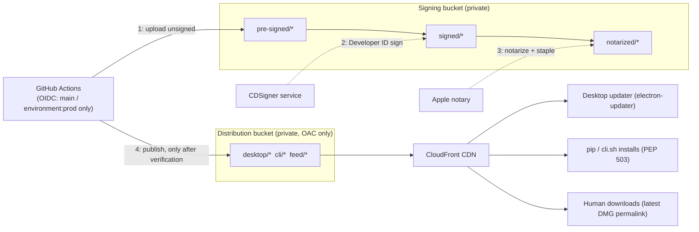

# KiroCrew Release Process Design

| | |
|---|---|
| Author | Zezhen Xu (GitHub: CrysisDeu) |
| Status | As-built design record |
| Date | 2026-07-23 |
| Scope | Channel model, versioning, CI builds, distribution infrastructure, client auto-update, platform-lane contract |
| Out of scope | Signing/notarization operations (separate doc, TBD); bootstrap installers; app-store app updates |

> Statuses in this doc are as of 2026-07-28, cross-checked against the
> merged PR record of this repo. `docs/release-automation.md` is the
> operational companion (workflow details, feed structure, CLI/EC2
> distribution); this doc records the design and its rationale.

## TL;DR

KiroCrew ships through a channel-based release pipeline that only ever
publishes signed builds. GitHub Actions builds every artifact (a Python
wheel plus desktop apps for macOS (universal) and Linux x64) and uploads
them to a private S3 staging area using short-lived OIDC credentials.
macOS bundles go to CDSigner for Developer ID signing and Apple
notarization, and CI publishes the update-feed pointer only after signing
succeeds. A private S3 bucket behind CloudFront (Origin Access Control)
serves artifacts and feeds to the public. The Electron client updates
itself through electron-updater against that feed (on macOS still
installing through Squirrel.Mac underneath; on Linux replacing the
AppImage in place), and it stops its embedded Python gateway before the
bundle swap so an update can never corrupt a running install. Every trust
boundary fails closed: without a verified signature there is no feed entry,
CI holds no static cloud credentials, and pull requests cannot assume the
signing or publishing roles.

## 1. What we set out to build

KiroCrew started as a source checkout: installing meant cloning the repo,
creating a venv, and running a CLI. Going public meant real users, and
these are the outcomes we wanted from a release system.

### Product requirements

Each requirement below traces to merged PRs whose descriptions state it;
the strongest quotes are cited so the provenance is checkable.

| # | Requirement | Status | Stated in |
|---|---|---|---|
| P1 | The user gets an easy-to-install, packaged, signed and notarized native application, for macOS and Linux and in the future Windows, without needing a terminal or a Python setup | macOS: done, all Macs (Developer-ID-signed universal DMG, "ready for distribution" per `syspolicy_check`). Linux: packaged (AppImage) with signed SLSA provenance; not code-signed by design, since Linux has no Gatekeeper equivalent. Windows: source install only | #108 ("DMG for the first install, zip feed for every update after"), #137/#139/#144 (the DMG must survive Gatekeeper on a real user machine), #152 ("Every Intel-Mac user is locked out", which led to the universal app), #162 ("a link a human can click or paste into docs"), #63 (install must fail closed or auto-provision, never produce a broken install) |
| P2 | Multiple release channels, so contributors get the latest build while normal users get a stable, tested build | Done: nightly, insider, and stable all live (insider 2026-07-22 18:47 UTC, stable v0.1.0 2026-07-22 19:36 UTC, each with 7 verified public surfaces). Nightly ships as a separate side-by-side app; insider/stable are two update lanes of one app | #132 ("pip/cli.sh users could never track insider or stable"), #176 (tag releases must be able to publish), #193 ("a nightly and the production app can be installed together"), #224 (in-place channel opt-in, "the Slack-beta model") |
| P3 | Users self-update directly from the app, without ever touching the CLI or terminal, and nothing downloads or installs without explicit consent | macOS: done, macOS Software Update semantics (a check only discovers; update card with explicit Download & Install; nudge is inform-only). Linux: done — the desktop AppImage self-updates through the electron-updater feed (`latest-linux.yml`), and the CLI lane self-updates (channel-sticky, sha256-verified via `latest-cli.json`) | #98 (close the gaps so auto-update "actually delivers bytes publicly"), #125 ("explicit user consent… Nothing downloads automatically"), #241 ("inform only — download and install stay in Settings > About"), #224 ("Switching never downloads or installs by itself") |
| P4 | A bad release can be pulled back quickly, so users are not stranded on a broken build | Partial: pullback exercised once for real (#137 withdrew the Gatekeeper-broken DMG from every public surface); the pointer mechanics exist (mutable latest aliases + immutable versioned keys), but rollback automation and force-update (`blocked-versions`) remain unbuilt | #137 (the one live pullback event), #162/#132/#133 (mutable-pointer + never-republish discipline a rollback would flip) |
| P5 | Users behind a minimum required version can be forced to update: a critical security patch must have a guaranteed propagation path | Designed, not built: pairs with P4's rollback design (the feed serves a minimum-version floor; clients below it force-trigger the update flow) | Design articulated alongside rollback and the update nudge; no dedicated PR yet |

### Engineering requirements

Constraints we imposed on the implementation to deliver the above safely.
These are split out per review feedback because they are engineering
decisions, not product requirements.

| # | Requirement | Status | Stated in |
|---|---|---|---|
| T1 | Only signed and notarized artifacts can surface in an update feed or the distribution bucket. The pipeline fails closed: no verified signature, no feed entry | Done, later extended to notarization ("an un-notarized build is exactly what Gatekeeper blocks") and to the DMG itself, with fail-closed `spctl`/`syspolicy_check` gates | #80 ("unsigned artifacts must never appear in the update feed"), #133 ("un-notarized bytes have no path to the distribution bucket or the feed"), #139/#144 |
| T2 | No static cloud credentials in CI; short-lived OIDC only, with trust pinned so pull requests can never assume the signing or publishing roles | Done: role trust accepts only `main` / `environment:prod` subjects; tag releases carry `environment: prod` | #89, #176 |
| T3 | Distribution is private by default: no public S3, artifacts served only through the CDN | Done: BLOCK_ALL buckets + CloudFront OAC; live CDN `d28nxu9if70cmc.cloudfront.net` | #98 (artifacts were 403 in the private bucket; copied to the public CDN bucket instead of opening it) |
| T4 | One pipeline builds every platform lane and every channel, so adding one means adding a matrix entry instead of building a new system. Lanes fail independently ("a macOS signing failure never blocks a CLI release") | Done: reusable build/sign/publish workflows shared by nightly and tag releases | #132, #133 |
| T5 | An update must never corrupt a running install: versioned CDN keys are immutable (never republished), and the embedded Python gateway stops gracefully before the bundle swap | Done: `--if-none-match` never-republish discipline + unique per-build versions (minute, later seconds precision) after live cache-mismatch incidents; gateway stop before `quitAndInstall` | #62 (edge-cache sha256 mismatch observed live), #95, #98 |

## 2. Channel model

All three channels are live (insider and stable since 2026-07-22, stable
at v0.1.0).

| Channel | Who it is for | Cadence | How it is published | Version |
|---|---|---|---|---|
| nightly | Like pulling the latest code from `main` once a day. Mostly internal: us and contributors | Daily, sometimes more | Scheduled 06:00 UTC run + manual dispatch, from `main` HEAD | `{base}-nightly.{YYYYMMDDHHMMSS}` |
| insider | Beta versions customers test for us: power users who want new versions 1 to 2 weeks earlier | When a candidate is cut, typically every 1 to 2 weeks | Pushing a `v{x.y.z}-insider.{N}` tag | `{x.y.z}-insider.{N}` |
| stable | All users (client default) | After the insider bake and bug-bash (~2 weeks) | Pushing a bare `v{x.y.z}` tag on the validated insider commit | `{x.y.z}` |

Why the versions look like this:

- Nightly carries a full seconds-precision timestamp because a timestamp
  makes every build's version unique without any coordination: there is
  no counter to allocate and no state to store, and that uniqueness is
  what lets versioned CDN keys stay immutable. It also sorts
  chronologically and dates the build at a glance.
- Insider is a pre-release suffix on a frozen base. The base (`0.1.0`)
  names the release being stabilized, and `{N}` counts candidate
  iterations as hotfixes land; "insider.3" is something a human can say
  in a bug report. Pre-release semantics do the isolation work on the pip
  lane: PEP 440 sorts every `-insider.{N}` below the bare `{x.y.z}`, so a
  stable consumer never resolves an insider build and installing insider
  requires an explicit `--pre`.
- Stable is the bare `{x.y.z}` because it is the release's final
  identity. The same string names the git tag, the GitHub Release, the
  wheel metadata, and the artifact paths.

Changes ride nightly continuously. An insider tag freezes a candidate;
hotfixes increment `-insider.{N}`. After the bake and bug-bashing period
on insider, stable is cut by tagging the exact commit the last green
insider run validated (v0.1.0 was tagged on the insider.3 commit,
deliberately excluding three unvalidated commits that had landed on
`main` since). Every future stable release is another bare `v{x.y.z}`
tag.

How the channels present to users (PRs #193, #224): nightly ships as a
separate installable app (KiroCrew Nightly.app, its own icon, shared
bundle id) so a nightly and the production app can be installed side by
side; insider and stable are two update lanes of one production app, with
an in-place Stable/Insider switcher in Settings, the Slack-beta model.
Switching channels never downloads or installs by itself; the consent
flow (section 6) is unchanged.

## 3. Versioning

The source of truth is `src/kiro_crew/__init__.py`, specifically
`__version__` (currently `0.1.0`). The formats per channel:

- nightly: `{base}-nightly.{YYYYMMDDHHMMSS}`, seconds precision, so no
  two builds can ever share a version and versioned CDN keys are never
  republished
- insider: `{x.y.z}-insider.{N}`, tagged `v{x.y.z}-insider.{N}` (maps to
  PEP 440 for the pip lane)
- stable: `{x.y.z}`, tagged `v{x.y.z}`

For nightly, the `version` job derives the stamp and each build job stamps
both `__init__.py` (the runtime `--version` string) and `pyproject.toml`
(which drives the wheel's metadata version). The desktop build reads the
stamp and passes it to electron-builder, and the Electron `package.json`
version is stamped as well so the updater's version compare works. Tag
builds carry the tag's version; there is no auto-bump.

## 4. CI build pipeline

We release for more than macOS. One pipeline builds every lane. (The
authoritative operational reference is `docs/release-automation.md` in the
repo; it carries the as-built workflow details, feed structure, and the
CLI/EC2 distribution design, while this section covers the design shape.)

| Workflow | Trigger | Builds | Notes |
|---|---|---|---|
| `ci.yml` | push/PR to `main` | nothing | Quality gates: backend lint (isort/flake8/mypy blocking) + pytest (py3.10, 3.12), frontend tsc/eslint-ratchet/jscpd + vitest |
| `build.yml` | push/PR to `main` | wheel + desktop (both platforms) | Build validation including a `pip install dist/*.whl` smoke test |
| `nightly.yml` | cron + dispatch | wheel + desktop matrix | Full publish path (section 5); concurrency-guarded |
| `release.yml` | `v*` tag | wheel + sdist + desktop matrix | GitHub Release with generated notes |
| `pages.yml` | push to `main` (`site/**`) | landing site | GitHub Pages; the build job runs unprivileged by design because npm lifecycle scripts run untrusted code |
| review workflows | PR | nothing | LLM review gates (Claude via a Bedrock role, Codex via an isolated Bedrock role), Semgrep, dependency audit; all fail closed |

The platform matrix today: `macos-14` builds the universal macOS app
(DMG + zip), and `ubuntu-22.04` builds `linux-x64` (AppImage). The wheel is
`py3-none-any`; KiroCrew is pure Python, so the same wheel serves every OS.
Windows x64 builds a Squirrel.Windows `Setup.exe` as a CI artifact
(installer-only; not yet published to the CDN), Linux arm64 remains TODO,
and the supported Windows install path is still source
(`docs/windows-install.md`).

Desktop packaging runs through `make desktop`, which calls
`packaging/build-desktop.sh`. It embeds a python-build-standalone
interpreter and a uv-built venv into the Electron app, then electron-builder
produces the installers. This replaced PyInstaller (PR #11) so the app
ships a real, ABI-consistent CPython and the gateway runs unmodified.
The macOS app is universal via a fat Electron shell plus two single-arch
backend trees selected at launch (#152); a true lipo-merged `universal2`
backend stays off the table because not all native dependencies publish
universal2 wheels (details in `docs/desktop-app.md`).

## 5. Distribution infrastructure

The flow reads left to right: CI builds and stages unsigned artifacts,
the signing service and Apple notary transform them inside the private
signing bucket, and only verified output gets published to the
distribution bucket, which CloudFront serves to the three consumer types.
All infrastructure is managed as code (CDK).

### Download and feed URL design

One CloudFront distribution serves everything. The advertised homes are
`updates.crew.kiro.dev` for pointers and `download.crew.kiro.dev` for
artifact bytes (one hostname per URL class below, host-scoped inside the
`crew.kiro.dev` zone so the apex stays free for the product site); the
auto-assigned `d28nxu9if70cmc.cloudfront.net` keeps serving as an alias.
Every public URL is one of exactly two classes:

- Immutable versioned keys: long-cached, written once, never republished.
  A version's bytes can never change after publish, so edge caches can
  hold them forever and sha256 checks are stable.
- Mutable channel pointers: uncached or 5-minute cache. Flipping a
  pointer is the go-live action, and repointing it at an older version is
  the rollback action.

| Surface | URL shape | Class |
|---|---|---|
| Human download permalink | `/desktop/{channel}/latest/KiroCrew.dmg` | Pointer (max-age=300) |
| Versioned desktop artifacts | `/desktop/{channel}/{version}/…` (zip + DMG) | Immutable |
| Desktop update feed | `/feed/{channel}/latest-mac.yml`, `/feed/{channel}/latest-linux.yml` | Pointer (uncached) |
| CLI update feed | `/feed/{channel}/latest-cli.json` (signed manifest: version + URL + sha256 + key id) | Pointer (uncached) |
| pip index (PEP 503) | `/feed/{channel}/simple/` | Pointer |
| GitHub Releases | `github.com/kirodotdev/KiroCrew/releases/tag/v…` | Immutable |

Rules that make the scheme work:

1. The channel is a path segment, so every surface is
   channel-parameterized for free. Insider and stable got permalinks,
   feeds, and pip indexes the day they launched, with no new code.
2. Published filenames are pinned to `KiroCrew.*` on every channel. CDN
   keys and the permalink are a public contract; docs and the landing
   page link to them, so app-name changes must never leak into URLs.
3. Feed writes happen strictly after the artifacts they point to are
   publicly downloadable (feed-before-artifact would hand clients a 403).
4. Desktop feed contract: electron-updater channel files
   (`latest-mac.yml` / `latest-linux.yml`) carrying `version`,
   `files[].url` + base64 `sha512`, `path`, `sha512`, and `releaseDate`.
   The client fetches the static file and compares versions client-side;
   the yml sits on the pointer host while `files[].url` points
   absolutely at the byte host. The CLI feed is a backward-compatible
   RSA-signed artifact manifest. Its canonical payload authenticates the
   channel, wheel version and URL, sha256, Python requirement, publication
   date, schema, algorithm, and key id. The installer verifies that signature
   against its offline pin before consuming artifact metadata, then verifies
   the downloaded wheel against the authenticated digest. Both checks fail
   closed.
5. pip installs use `--extra-index-url` against the channel's simple
   index, keeping PyPI available for dependency resolution.

Worked example, stable channel: a human installs from
`https://download.crew.kiro.dev/desktop/stable/latest/KiroCrew.dmg`;
a server installs with `pip install kirocrew --extra-index-url
https://updates.crew.kiro.dev/feed/stable/simple/`.

### Buckets and CDN

The signing bucket is the private working area. Unsigned uploads land in
`pre-signed/{channel}/{version}/` (30-day lifecycle), CDSigner output
lands in `signed/{channel}/{version}/` (365-day lifecycle), and stapled
notarization output lands in `notarized/*`. The bucket is versioned,
SSL-enforced, and BLOCK_ALL.

The distribution bucket is the public-facing origin. It holds
`cli/*` (wheels; `cli/nightly/` expires after 30 days, pinned
insider/stable wheels never expire) and `feed/*` (update pointers). It is
BLOCK_ALL and served exclusively through the CloudFront distribution
`UpdatesCdn` with Origin Access Control. Immutable versioned paths use
CACHING_OPTIMIZED, while `feed/*` uses CACHING_DISABLED because mutable
pointers must never be served stale. The distribution speaks HTTP/2 and 3,
redirects to HTTPS, allows GET/HEAD only, and writes access logs to a
dedicated bucket with an IA/Glacier/expiry lifecycle.

The advertised hostnames are `updates.crew.kiro.dev` (pointers) and
`download.crew.kiro.dev` (artifact bytes), following the convention
Kiro's other distribution surfaces use (`cli.kiro.dev` is the closest
analog). KiroCrew owns the `crew.kiro.dev` hosted zone and iterates on
its records freely; the kiro.dev apex carries a one-line NS delegation
to the zone's nameservers, and a DNS-validated certificate covering the
zone's apex and wildcard is attached to the distribution. Splitting the
two URL classes across hostnames means future protective policy on the
byte surface (rate rules, geo/redirect layers) or a physical origin
split can never touch the availability-critical feed path, with no
client-visible migration. The scheme stays base-URL-agnostic (the
client's feed base is configurable and CI reads its artifact base from
the `CLI_CDN_BASE` variable), so no path shape ever changed and the
auto-assigned `*.cloudfront.net` URLs keep working as aliases.

### Identity and trust boundaries

`kirocrew-signing-invoker` is the only role CI publishes with. Its OIDC
trust is pinned to `refs/heads/main` and `environment:prod` per trusted
repo, so pull requests cannot assume it. It can put `pre-signed/*`,
`notarized/*`, `feed/*`, and `cli/*`, read `signed/*`, invoke CDSigner
(`StartSignTask`/`GetSignTask`), and `iam:PassRole` the access role.

`kirocrew-cdsigner-access` is assumed only by the CDSigner service
principal. It reads `pre-signed/*` and writes `signed/*`. CI cannot write
`signed/*` itself, which means signed artifacts can only originate from the
signer.

The reviewer roles (`kirocrew-github-actions-bedrock` and its GPT 5.6
counterpart) are deliberately split so the PR-facing GPT 5.6 role has no
access to main/prod subjects. That keeps the blast radius of a compromised
PR workflow small.

The Apple notary secret (`kirocrew/signing/apple-notary`) is referenced by
CDK but never created by it; a human injects the value once.

### Publish flow (nightly, as built)

1. Build jobs produce the wheel and the DMG/zip/AppImage with the stamped
   version.
2. The publish job assumes the invoker role via OIDC and uploads everything
   to `pre-signed/nightly/{version}/`.
3. CI extracts the macOS `.app`, tars it with entitlements, submits a
   CDSigner v2 sign task, and synchronously polls at a 30-second interval
   with a 15-minute ceiling (`packaging/signing/sign.sh`). Output lands in
   `signed/nightly/{version}/`. CI verifies it with `codesign --verify` and
   `spctl`, then notarizes and staples into `notarized/*`. Signing
   mechanics are detailed in the separate signing doc.
4. Only after a verified signed artifact exists does CI write
   `feed/nightly/latest-mac.yml` (electron-updater metadata: `version`,
   `files[].url` + base64 `sha512`, `path`, `sha512`, `releaseDate`). If
   CDSigner is not configured, the workflow deliberately stops after
   step 2 and leaves the feed untouched.

The original design had a Feed Lambda writing `latest-*.json` on S3 PUT
events. It was superseded one day after the nightly pipeline landed
(`c1c7db05`, 2026-07-09): CI now writes the feed synchronously, after signing
verification. The reason is ordering. The feed write must happen after
signature verification passes, and an event-driven writer fires on object
creation, which cannot express "and verification passed." The synchronous
model also removes a Lambda and an S3-event surface entirely. No feed
Lambda exists in the deployed CDK.

## 6. Client auto-update

The updater is `electron-updater` (`website/electron/auto-update.js`). It
runs in packaged macOS and Linux builds and is disabled in dev builds. On
macOS, electron-updater still drives Squirrel.Mac underneath, so the
proven atomic bundle swap is unchanged; what the migration from
Electron's built-in `autoUpdater` replaced is the hand-rolled wrapper
around it (feed fetching, version compare, and publish-metadata authoring
are now the library's). On Linux it replaces the AppImage in place, a new
capability — the AppImage previously had no desktop update path. Windows
is not migrated: its packaging is still Squirrel.Windows, which
electron-updater's NSIS-based win32 path cannot drive, so win32 is
excluded from the client's supported platforms until the NSIS migration
lands (#598).

The feed contract: the client resolves `{feedBase}/{channel}/` as a
directory and fetches the static electron-updater channel file from it —
`latest-mac.yml` on macOS, `latest-linux.yml` on Linux — carrying
`version`, `files[].url` + base64 `sha512`, `path`, `sha512`, and
`releaseDate`. The yml sits on the pointer host
(`updates.crew.kiro.dev`); the `files[].url` entries are absolute and
point at the byte host (`download.crew.kiro.dev`), which is what
preserves the pointer/bytes host split (the provider ignores the feed
base when a file URL is absolute). Version compare is client-side and
difference-based, not greater-than. The feed base is overridable through
the `KIROCREW_UPDATE_FEED` environment variable (HTTPS-enforced; plain
HTTP is allowed only on loopback, for local update-harness testing
against `website/electron/scripts/local-feed-server.js`). The first check
runs 30 seconds after launch, then every 4 hours.

Four policy flags are set deliberately, each differing from the
electron-updater default:

- `autoDownload=false` — consent-first: discovery must never download;
  the default would pull megabytes on a background check with no user
  action (P3).
- `autoInstallOnAppQuit=false` — the default would swap the bundle on
  quit without stopping the Python gateway, exactly the
  half-replaced-app race T5 exists to prevent; the deferred-install path
  stops the gateway first.
- `allowDowngrade=true` — the update gate is difference-based: a feed
  repointed at an older version must be offered, which is what makes
  version retraction (P4) and the channel switch-back (#224) work.
- `allowPrerelease=true` — every nightly (`-nightly.<stamp>`) and
  insider (`-insider.N`) version is a semver prerelease and would
  otherwise be invisible to its own channel.

Install ordering is the KiroCrew-specific part. The app supervises a
bundled Python gateway child, so before `quitAndInstall` the client stops
the gateway gracefully (`POST /api/shutdown`, then SIGTERM/SIGKILL). That
way the bundle swap (Squirrel's ShipIt on macOS, the AppImage replacement
on Linux) never races a live child process. Choosing "Later" defers
installation to natural quit via a `before-quit` hook, in the same
stop-gateway-first order.

Downloaded updates are verified fail-closed by electron-updater against
the feed's `sha512` before install, and on macOS Squirrel.Mac
additionally validates the code signature of the swapped bundle — which
is why the feed may only ever point at signed artifacts (T1).

The renderer surface is four IPC calls (`update:check`,
`update:download`, `update:install`, `update:get-info`) feeding an
in-app update modal and the About panel.

Source installs (non-packaged) update via git instead
(`handlers/updates.py`): fetch and compare, `git pull`, frontend rebuild,
`pip install -e .`, then an in-place `execv` restart.

Known client gaps (section 8): there is no blocked-version handling. The
consent contract (PR #125): a check only discovers an update and
surfaces a card in Settings > About (version, notes, date); nothing
downloads without an explicit Download & Install, background polls
included. The channel switcher (#224) and the inform-only nudge (#241)
build on that same contract.

## 7. Adding a platform lane

### 7.1 How the existing lanes work

A "platform lane" is the end-to-end path for one OS/arch: a CI matrix entry
builds installers, the artifacts flow through staging, signing, and the
feed, and a platform updater consumes that feed.

macOS is the complete lane. The `macos-14` matrix entry builds a universal
DMG (for first install) and a zip (the update archive), which flow through
`pre-signed/`, CDSigner signing plus notarization, `signed/` and
`notarized/`, and finally `feed/{channel}/latest-mac.yml`, which the
electron-updater client consumes (installing through Squirrel.Mac
underneath).

Linux x64 is a desktop lane without code signing. The `ubuntu-22.04`
matrix entry builds an AppImage that ships with signed SLSA provenance
but no code signature (deliberate, since Linux has no Gatekeeper
equivalent), and `feed/{channel}/latest-linux.yml` gives the AppImage the
same electron-updater self-update path as macOS, with the feed's `sha512`
as the fail-closed integrity gate on the download. The CLI lane also
serves Linux: `latest-cli.json` plus the PEP 503 index give
sha256-verified, channel-sticky install and self-update.

The wheel is the pip lane. KiroCrew is pure Python, so one `py3-none-any`
wheel serves every OS; it is published under `cli/*` on the CDN and through
GitHub Releases.

### 7.2 Platform-lane contract

A new platform lane (Windows, say) is supported when all of the following
hold. These are the invariants; the per-OS mechanics are free.

1. CI matrix entry: in `nightly.yml` and `release.yml`, with a stable
   platform id of the form `{os}-{arch}` (e.g. `win32-x64`), an
   OS-appropriate runner, and named artifacts.
2. Two artifact roles per build: an installer for first install and an
   update archive the platform updater consumes (macOS uses DMG + zip;
   define the analog for the new OS). Both come out of the standard desktop
   packaging path (embedded interpreter, venv, electron-builder target).
3. Version fidelity: artifacts MUST carry the stamped `__version__` from
   `src/kiro_crew/__init__.py`, the single version source of truth.
4. Staging: unsigned artifacts upload only to
   `pre-signed/{channel}/{version}/`, only via the signing-invoker role
   (OIDC from `main`/`environment:prod`, never from PRs, never with static
   credentials).
5. Signing fails closed: the platform's native signing/trust mechanism (per
   the signing doc) MUST complete and verify before the lane's artifacts
   become client-visible. A lane with no signing integration ships no feed
   entry; Linux today is the worked example.
6. Feed entry: `feed/{channel}/latest-{platform}.yml` in the
   electron-updater shape (`version`, `files[].url` + base64 `sha512`,
   `path`, `sha512`, `releaseDate`), where the file URLs point absolutely
   at the signed artifact behind the CDN byte host. Feed pointers live
   under the uncached `feed/*` behavior; artifacts live under immutable
   versioned paths.
7. Client updater: consumes the lane's electron-updater channel file
   (difference-based compare, sha512-verified download) and honors the
   gateway-graceful-stop before install, the "Later" deferral to app
   quit, and platform-native signature validation of downloaded updates.
8. Client platform gate: electron-updater resolves the per-OS channel
   file itself, but the client enables updates only for platforms with a
   working publish lane (`SUPPORTED_PLATFORMS` in `auto-update.js`);
   adding the lane means adding the platform there.
9. Roll-forward: a new version published to the lane MUST reach clients
   through the same feed + updater path, since **rolling forward is the only
   recovery mechanism** — there is no rollback. A lane whose updater cannot
   pick up a newer version has no recovery story and is not supported.
10. Retention: the lane's artifacts follow the channel lifecycle (nightly
    expiring, stable pinned), so no lane accumulates unbounded nightly
    artifacts.

## 8. Known gaps and roadmap

Open as of 2026-07-28:

| Item | Type | Notes |
|---|---|---|
| Rollback automation (P4) | **dropped** | Superseded by process decision: **there is no rollback — we roll forward by cutting a new version.** The `rollback.yml` + `blocked-versions` design described in P4/P5 above is not being built. The client-side capability remains (`allowDowngrade=true`, so a repointed feed *would* be offered), but the operational answer to a bad release is a new version cut from the release branch, not a feed rewind |
| Forced minimum version (P5) | roadmap | Unbuilt and independent of rollback: a feed-served minimum-version floor that force-triggers the update flow for a critical security patch |
| S3 lifecycle rules | roadmap | Designed (intermediates 7d, nightly 30d, insider 180d, stable forever); unmanaged growth is ~1 TB/year |
| Windows lane | roadmap | CI builds a Squirrel.Windows `Setup.exe` (installer-only, unpublished); win32 auto-update stays disabled in the client until the NSIS migration (#598); the supported install path is still source |
| Update-consent nudge polish, custom icon setting | roadmap | Nudge dots shipped; Settings card for custom icons deliberately deferred |

## 9. Design history and authorship

The release system was designed and built incrementally in public, so its
provenance is the commit and PR record. The history spans two repos: the
pre-migration repo, cited below by commit hash because its PR numbers do
not carry over, and the public repo github.com/kirodotdev/KiroCrew, cited
by PR number. The release system (channels, versioning, distribution,
URL design, update flow, and their implementation) is authored by Zezhen
Xu (GitHub: CrysisDeu).

Pre-migration era (commit hashes from the pre-rename history):

| Date | Ref | Milestone |
|---|---|---|
| 2026-06-30 | `68cc8f72` | First GitHub Actions workflows: CI, build, release, code review |
| 2026-07-08 | `21259fcf` | Desktop build reworked: PyInstaller replaced with python-build-standalone + uv |
| 2026-07-08 | `9503f1b4` | Nightly pipeline + the original `release-automation.md` design doc |
| 2026-07-09 | `c1c7db05` | Feed writes moved into CI, strictly after signing verification (supersedes the Feed-Lambda model) |

Infrastructure (internal CDK package): `875849c` CI granted `feed/*` +
`cli/*` publish (2026-07-17), `d242a6e` CloudFront + OAC public
distribution stack (2026-07-18), `35af4a3`/`47770c9`/`fc16fbe`
idempotent publish retries, notary-secret read, `notarized/*` stage
(2026-07-19 to 20).

Public repo era (kirodotdev/KiroCrew, all merged):

| Date | PR | Milestone |
|---|---|---|
| 07-20 | #62, #95 | Never-republish discipline: unique wheel versions after a live edge-cache sha256 incident; later seconds-precision desktop stamps |
| 07-20 | #63 | Installer fails closed or auto-provisions Python 3.10+ (no more broken installs) |
| 07-20 | #74, #80 | Full nested Mach-O signing manifest; notarize + staple on every channel, feed write moved after stapling |
| 07-21 | #89 | Tag releases can assume the signing role (`environment: prod`) |
| 07-21 | #98 | Notarized builds published to the public CDN + working desktop auto-update (real feed, version gate) |
| 07-21 | #108 | First-install DMG published ("DMG for the first install, zip feed for every update after") |
| 07-21 | #125 | Update consent contract: macOS Software Update semantics, a check only discovers |
| 07-21 | #132, #133 | Reusable build/sign/publish workflows; publish split into its own job after sign and notarize ("un-notarized bytes have no path to the distribution bucket or the feed") |
| 07-22 | #137, #139, #144 | The DMG trust arc: withdraw the Gatekeeper-broken DMG, reinstate with Developer ID signature, fix the CDSigner manifest against the live API; `syspolicy_check` verdict "ready for distribution" |
| 07-22 | #152 | Universal arm64+x86_64 app; Intel Macs no longer locked out |
| 07-22 | #162 | Human-clickable per-channel latest-DMG permalinks |
| 07-22 | #176 | Tag-triggered CLI publish fixed (first-ever tag publish had failed on OIDC trust) |
| 07-22 | (launch) | Insider channel live (v0.1.0-insider.3) and stable channel live (v0.1.0, promote-what-you-tested), each with 7 verified public surfaces |
| 07-22 | #193, #215 | Nightly as a side-by-side app with its own identity and in-app branding |
| 07-23 | #224, #241 | In-place stable/insider channel switcher; inform-only update nudge |

## Appendix: related docs

- `docs/release-automation.md`: authoritative as-built operational doc
  (workflows, feed structure, CLI/EC2 distribution)
- Signing/notarization process doc: separate, TBD
- `docs/desktop-app.md`: desktop packaging details
- `docs/windows-install.md`: current Windows source-install path
